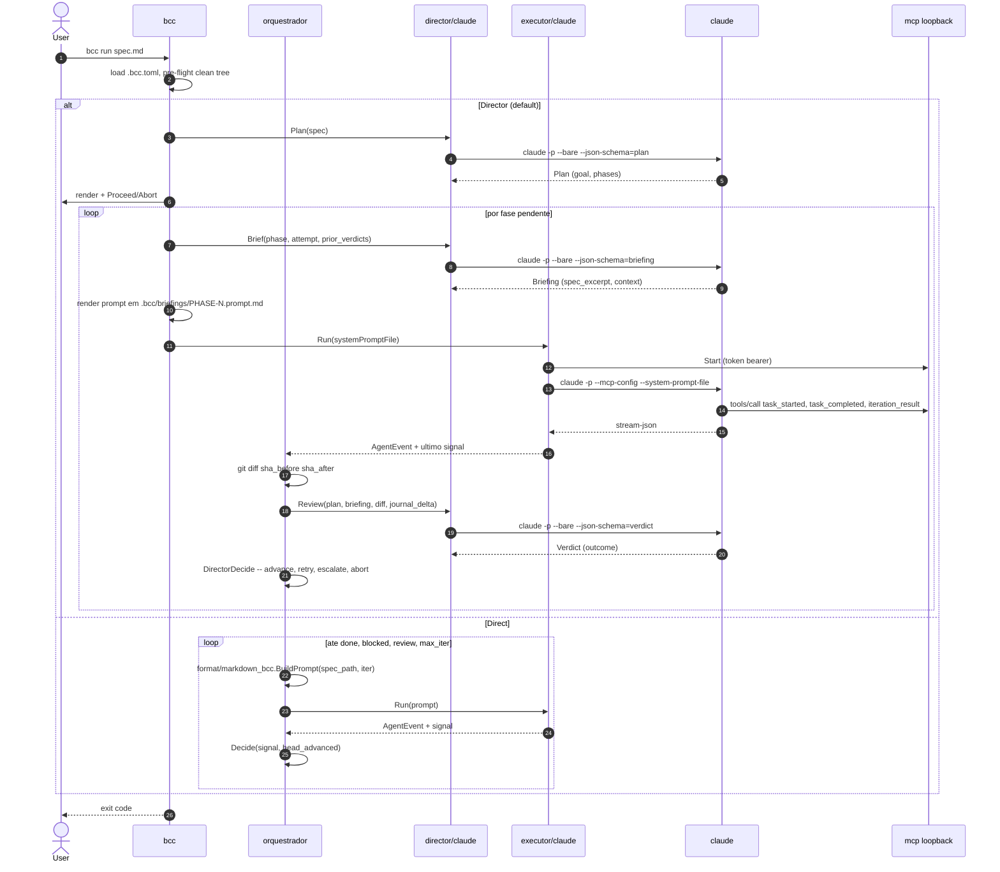
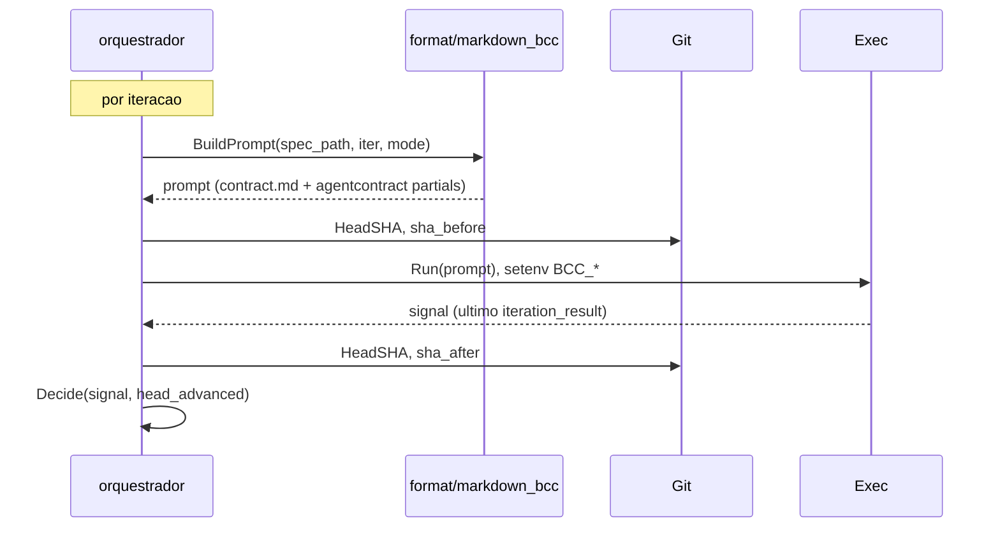
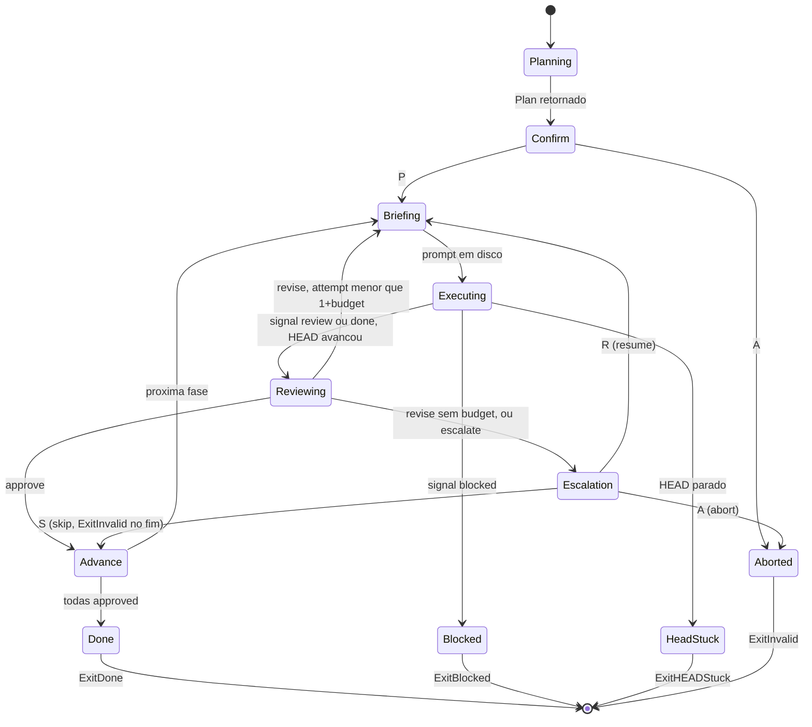

# Workflow de execução do `bcc`

Documento de referência para revisar o flow. Big-picture, depois
detalhes das chamadas concretas (subprocessos + payloads).

## Modos

Dois modos, controlados por `[director].enabled` (default: `true`).
Mesmo wire protocol nos dois.

| Modo | Papéis cognitivos |
|---|---|
| **Direct** (`--no-director`) | só Executor |
| **Director** (default) | Planner + Briefer + Executor + Reviewer |

## Big-picture



## Direct mode: o decider



Tabela em `internal/loop/decider.go`:

| HEADAdvanced | Signal     | Ação     | ExitCode          |
|--------------|------------|----------|-------------------|
| `false`      | qualquer   | Stop     | `ExitHEADStuck=3` |
| `true`       | `Unknown`  | Stop     | `ExitInvalid=2`   |
| `true`       | `Blocked`  | Stop     | `ExitBlocked=1`   |
| `true`       | `Review`   | Stop     | `ExitReview=6`    |
| `true`       | `Done`     | Stop     | `ExitDone=0`      |
| `true`       | `Continue` | Continue | n/a               |

HEAD checado primeiro: sem commit, nada importa.

## Wire protocol (MCP)

Três tools registrados no servidor MCP loopback que o Executor sobe.

| Tool                         | Input            | Quando |
|------------------------------|------------------|--------|
| `mcp__bcc__task_started`     | `id`, `summary`  | início de unit; pareado com `task_completed` |
| `mcp__bcc__task_completed`   | `id`             | fim do unit |
| `mcp__bcc__iteration_result` | `value`, `summary` | exatamente uma vez antes de sair |

`value` ∈ {`continue`, `review`, `done`, `blocked`}. Outro valor →
`SignalUnknown` → `ExitInvalid`.

**Dois canais para o mesmo evento**: cada `tools/call` MCP é
respondido `ok` stub, mas o claude também emite o mesmo nome+input
no stream-json como `tool_use`. `bcc` extrai o sinal **só** do
stream-json (`internal/executor/claude/claude.go::parseAssistant`),
roteando `mcp__bcc__*` → `KindBccEvent`. O servidor MCP existe para
**registrar** os tools; não para transportar sinal.

## Comando do Executor

```bash
claude -p \
  --output-format stream-json --verbose \
  --mcp-config /tmp/bcc-mcp-XXX/mcp-config.json --strict-mcp-config \
  [--system-prompt-file <briefing.prompt.md>]   # Director only
  [--dangerously-skip-permissions]              # default true
  [--model <m>] [extra args] \
  [<prompt-inline>]                             # Direct only
```

Env injetado por iteração: `BCC_RUNNING=1`, `BCC_ITERATION`,
`BCC_MAX_ITERATIONS`, `BCC_SPEC_PATH`, `BCC_BRANCH`.

## Director mode: estado da fase



Decider de fase (`director_decider.go`):

| HEADAdvanced | Verdict   | Attempt vs budget       | Ação           |
|--------------|-----------|-------------------------|----------------|
| `false`      | qualquer  | n/a                     | Abort/HEADStuck|
| `true`       | `nil`     | n/a                     | Abort/Invalid  |
| `true`       | approve   | n/a                     | AdvancePhase   |
| `true`       | revise    | `attempt < 1+budget`    | RetryPhase     |
| `true`       | revise    | `attempt == 1+budget`   | Escalate       |
| `true`       | escalate  | n/a                     | Escalate       |

Budget: `attempt=1` é primeira tentativa, retries são `2..1+budget`.

## Chamadas concretas aos papéis cognitivos

Comando comum (todos): `claude -p --bare --no-session-persistence
--output-format stream-json --verbose --json-schema <tmp> [--model]
[--max-budget-usd N] <prompt>`. Stateless, sem MCP, sem tools, sem
`--dangerously-skip-permissions`. O Director nunca toca o working
tree.

Cada chamada compõe seu prompt = `prompts/<role>.md` +
`agentcontract.Partials()` (apenas `absolute_restrictions`) + payload
JSON appendado.

### Planner (1x por run)

**Payload**:
```json
{ "spec_path": "...", "spec_hash": "abc...", "spec_content": "..." }
```

**Output** (validado vs. `plan.schema.json`):
```json
{
  "goal": "...",
  "success_criteria": ["..."],
  "phases": [{
    "id": "",                              // bcc preenche depois
    "title": "...", "intent": "...",
    "depends_on": [], "parallelizable": false,
    "scope_in": [], "scope_out": [],
    "acceptance": [{"id":"a1","description":"...","evidence":"diff|test|build|manual"}],
    "retry_budget": 0
  }],
  "spec_hash": "abc...", "planned_at": "RFC3339"
}
```

`bcc` deriva `id` de `(spec_hash, intent)[:16hex]` → estável entre
re-plans com mesmo intent. Persiste em `.bcc/plan.json`.

### Briefer (1x por tentativa)

**Payload**:
```json
{
  "plan": {...}, "spec_content": "...",
  "phase_id": "...", "attempt": 2,
  "prior_verdicts": [...],     // attempts 1..attempt-1
  "prior_feedback": {...}      // do verdict revise mais recente
}
```

**Output** (vs. `briefing.schema.json`):
```json
{
  "phase_id": "...", "attempt": 2,
  "spec_excerpt": "```markdown\n...trecho literal...\n```",
  "context_summary": "...",
  "prior_feedback": "Change X because Y. Do not touch path P..."
}
```

`bcc` então gera o **prompt do Executor** com `RenderBriefingPrompt`
(template `prompts/briefing.md` + 3 partials: wire_protocol +
absolute_restrictions + working_tree). Grava em
`.bcc/briefings/<phase>-<n>.prompt.md`.

### Reviewer (1x por tentativa, após Executor)

**Payload**:
```json
{
  "plan": {...}, "briefing": {...},
  "diff": "diff --git ...",                // git diff sha_before..sha_after
  "journal_delta": "### YYYY-MM-DD ...",   // delta da seção journal
  "acceptance_evidence": {}                // hoje sempre vazio
}
```

**Output** (vs. `verdict.schema.json` + `ValidateVerdict`):
```json
{
  "phase_id": "...", "attempt": 2,
  "outcome": "approve|revise|escalate",
  "acceptance_results": [{"id":"a1","passed":true,"note":"..."}],
  "feedback": null,                        // obrigatório em revise
  "reasoning": "..."                       // obrigatório em escalate
}
```

Invariantes (impostos por `ValidateVerdict`):
- `approve` → todo `passed=true` e `feedback=null`
- `revise` → `feedback.required_changes` não vazio
- `escalate` → `reasoning` não vazio

## Persistência (`.bcc/`)

```
.bcc/
├── plan.json
├── briefings/
│   ├── <phase>-<attempt>.json          # input do Reviewer
│   └── <phase>-<attempt>.prompt.md     # prompt final do Executor
└── verdicts/
    └── <phase>-<attempt>.json
```

`--resume` lê só `plan.json` + `verdicts/`. Fases com
`LatestVerdict.outcome=approve` são puladas.

| `--resume` + estado | Comportamento |
|---|---|
| plan + spec_hash igual | reusa, pula confirmação |
| plan + spec_hash divergente | replan, `PlanDiff`, prompt `[D]/[P]/[A]` |
| sem plan | cai no caminho fresh |

## Exit codes

`internal/loop/exitcodes.go`:

| Código | Constante           | Significado |
|--------|---------------------|-------------|
| 0      | `ExitDone`          | spec entregue |
| 1      | `ExitBlocked`       | falha técnica irrecuperável |
| 2      | `ExitInvalid`       | sinal Unknown, abort, skip, config inválida |
| 3      | `ExitHEADStuck`     | iteração não fez commit |
| 4      | `ExitMaxIterations` | cap atingido |
| 6      | `ExitReview`        | gate observer-driven |

`Review` é recoverable (humano edita e re-triggera); `Blocked` é
fix-técnico.

## Pontos para revisar

Onde a complexidade é real e talvez mereça discussão:

1. **Dois canais para o sinal** (MCP stub + stream-json). Funciona,
   confunde leitor.
1. **4 chamadas `claude` por fase** no Director (plan 1x/run, brief +
   exec + review por tentativa). Latência domina p99.
1. **`PhaseID` derivado de `intent`**: editar intent invalida verdicts
   antigos sem aviso visível.
1. **`os.Setenv` em loop** muta estado global do processo. Single-loop
   por process protege, mas é frágil para testes concorrentes.
1. **Briefings persistidos mas não lidos em resume** (só verdicts são).
   Auditoria humana, não estado do loop. Assimetria com `verdicts/`.
1. **Escalation com 3 caminhos** (TUI modal / stdin gate / nil →
   abort). Lógica espalhada entre `cli/run_director.go` e
   `loop/director_run.go`.
1. **`SignalUnknown` mistura "agente sumiu" com "agente emitiu valor
   errado"**. `BccEvent.RawValue` distingue o segundo caso, o primeiro
   fica silencioso.

## Onde ler em ordem

1. `cmd/bcc/main.go` → `internal/cli/run.go::runSpec`
1. Direct: `internal/loop/loop.go::Loop.Run`
1. Director: `internal/cli/run_director.go::runDirectorWith` →
   `internal/loop/director_run.go::runDirector`
1. Wire: `internal/loop/agentcontract/{agentcontract.go,wire_protocol.md}`
1. Format adapter: `internal/format/markdown_bcc/contract.md`
1. Director prompts: `internal/director/prompts/{plan,brief,review,briefing}.md`
1. Tipos: `internal/director/types.go`
1. Adapter claude: `internal/executor/claude/claude.go`,
   `internal/director/claude/claude.go`
1. MCP: `internal/mcp/server.go`
