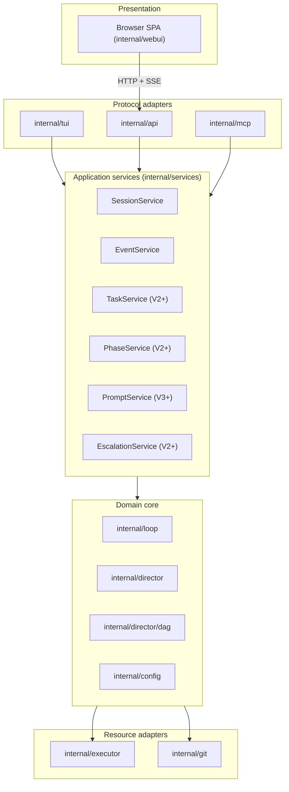

# PRD: bcc HTTP API

## Summary

The bcc HTTP API is a versioned HTTP service that exposes session state and, in later versions, session control. It is a protocol-layer adapter, peer of the MCP server. Both consume the application services layer (`internal/services/`); neither reaches into the domain core directly.

V1 is read-only: GET endpoints for sessions, DAG snapshots, briefings, prompts, plus a Server-Sent Events stream of `loop.Event`. V2 introduces mutating endpoints (task approval, escalation reply, phase skip) over the same services that the TUI uses today. V3+ extends to plan editing and prompt overrides.

The API is the foundation that all non-terminal presentations stand on. The web dashboard, curl, integration tests, and future bcc subcommands that introspect a running session all consume the same contract.

## Layering



### Rules

1. The domain core has no knowledge of any adapter. It exposes types, ports, and pure functions.
2. The application services layer is the **only** caller of the core from above. It owns business operations: read state, mutate state, validate transitions, enforce invariants, log audit entries.
3. Protocol adapters (TUI, API, MCP) **must** route every read and every mutation through application services. They do not import the core for behavior; they import the core only for the typed value objects passed across the services boundary.
4. Presentation adapters (browser SPA) consume protocol adapters. They never reach the services or the core.
5. Resource adapters are outbound from the core; they do not interact with services or protocol adapters.

These rules are normative. Code review rejects any import that violates them.

## Position in the architecture

`internal/api/` is a top-level package, peer to `internal/mcp/` and `internal/tui/`. Each protocol adapter:

- Receives an `internal/services/` handle at construction time.
- Exposes an `http.Handler` (API, MCP) or a bubbletea `Program` (TUI) so the composition root mounts it on the chosen runtime.
- Imports no other protocol adapter and no presentation adapter.
- Has no direct dependency on `internal/loop/`, `internal/director/`, `internal/director/dag/`, beyond the typed value objects exchanged via services.

The composition root in `internal/cli/` constructs the services from core handles, then constructs protocol adapters from the services handle.

V1 listener layout: MCP keeps its current listener; the API gets its own listener; the dashboard, when enabled, contributes an `http.Handler` that the API server mounts at `/` on the API's listener.

## Package layout

```
internal/services/
├── services.go        # Services struct: aggregates all service handles
├── sessions.go        # SessionService: List, Get, Snapshot
├── events.go          # EventService: Subscribe, Replay
├── tasks.go           # TaskService: Get; Approve, Reject (V2)
├── phases.go          # PhaseService: Get; Skip (V2)
├── prompts.go         # PromptService: Get; Edit (V3)
├── escalations.go     # EscalationService: Get; Resolve (V2)
├── briefings.go       # BriefingService: Get
├── audit.go           # cross-cutting audit log of mutating calls
└── errors.go          # canonical service-layer error codes

internal/api/
├── server.go          # New(svc *services.Services) *Server; Routes() http.Handler
├── routes.go          # mux setup for /api/v1/*
├── handlers/          # one file per resource
│   ├── root.go        # GET /api/v1
│   ├── openapi.go     # GET /api/v1/openapi.json
│   ├── schemas.go     # GET /api/v1/schemas/{name}
│   ├── sessions.go    # GET /api/v1/sessions, GET /api/v1/sessions/{id}
│   ├── snapshot.go    # GET /api/v1/sessions/{id}/snapshot
│   ├── dag.go         # GET /api/v1/sessions/{id}/dag
│   ├── events.go      # GET /api/v1/sessions/{id}/events (SSE)
│   ├── briefings.go   # GET /api/v1/sessions/{id}/briefings/{phase}/{attempt}
│   └── prompts.go     # GET /api/v1/sessions/{id}/prompts/{role}
├── sse.go             # SSE writer, Last-Event-ID resume, heartbeat
├── auth.go            # token validation; cookie + bearer
├── errors.go          # protocol-level error envelope; maps services.Error to HTTP
├── encode.go          # response encoders
├── version.go         # API version constants, deprecation policy
├── schemas/           # JSON schemas, embedded
├── openapi.json       # OpenAPI 3.1 description, generated, embedded
└── cmd/gen-openapi/   # build-time generator
    └── main.go
```

`internal/api/` depends on `internal/services/`, the typed value objects from `internal/loop/` and `internal/director/`, the JSON Schema validator already used by `internal/director/dag/`, and stdlib. It imports nothing from `internal/tui/`, `internal/webui/`, `internal/mcp/`, or any executor/git adapter.

## CLI and configuration

### Flag

| Flag | Short | Argument | Default |
| --- | --- | --- | --- |
| `--api` | `-a` | optional `[host]:port` | off |

Valid forms:

- `--api` (alone, default bind `127.0.0.1:0`, ephemeral port)
- `--api=:8080`
- `--api=127.0.0.1:8080`
- `--api=0.0.0.0:8080` (LAN bind, prints loud stderr warning)

When the API is enabled, `bcc run` prints the listener URL plus the session token on stderr at startup:

```
api: http://127.0.0.1:54322/api/v1
api: token: 8f3a7b1c4d2e9f0a...
```

### `.bcc.toml`

```toml
[api]
enabled = true            # default false
bind    = "127.0.0.1:0"   # default 127.0.0.1:0 when enabled
```

CLI flag overrides TOML.

### Combinations

- Neither set: API does not start. MCP runs as today.
- `--api` set, `--webui` not set: API listens, `/api/v1/*` responds, `/` returns `404`.
- `--webui` set: implicitly enables `--api`. SPA mounts at `/` on the API's listener.
- Both set explicitly: honored as configured.

### Compatibility with `--output`

Orthogonal. `--output` selects foreground rendering; the API runs in parallel without writing to stdout/stderr beyond the startup banner.

## API contract

### Versioning

All endpoints live under `/api/v1/`. Breaking changes ship under `/api/v2/`. The server runs both versions concurrently for one minor bcc release. Deprecation policy lives in `internal/api/version.go`.

The API version is independent of the bcc binary version. Every response carries `Server: bcc/<binary-version>`. The API root response carries both.

### Authentication

A 32-byte hex token is minted per `bcc run`. Two equivalent credentials:

- **`Cookie: __bcc_api=<token>`**, set automatically when a browser visits the API root with `?t=<token>`. The cookie is `HttpOnly; SameSite=Strict; Path=/`. The redirect strips the token from the URL.
- **`Authorization: Bearer <token>`**, for programmatic clients.

Requests without a valid credential receive `401 Unauthorized` with the canonical error envelope. There is no anonymous tier.

### Error envelope

Every non-2xx response has the shape validated against `schemas/error.schema.json`:

```json
{
  "error": {
    "code": "session_not_found",
    "message": "Session 20260504-093217-abc not found.",
    "details": { "session_id": "20260504-093217-abc" },
    "request_id": "01HF3ZX..."
  }
}
```

`code` is from a closed enum: `unauthorized`, `forbidden`, `session_not_found`, `phase_not_found`, `task_not_found`, `gone`, `not_implemented`, `invalid_request`, `conflict`, `internal`. Each `services.Error` maps deterministically to one HTTP code and one envelope code.

### Common headers

Every response includes:

- `Server: bcc/<binary-version>`
- `X-Request-Id: <ulid>`
- `Cache-Control: no-store` for dynamic resources, `Cache-Control: public, max-age=31536000, immutable` for hashed UI assets served by the dashboard mount.

### Endpoint catalog (V1, read-only)

| Method | Path | Service call |
| --- | --- | --- |
| `GET` | `/api/v1` | (none; static catalog response) |
| `GET` | `/api/v1/openapi.json` | (none; embedded asset) |
| `GET` | `/api/v1/schemas/{name}` | (none; embedded asset) |
| `GET` | `/api/v1/sessions` | `SessionService.List` |
| `GET` | `/api/v1/sessions/{id}` | `SessionService.Get` |
| `GET` | `/api/v1/sessions/{id}/snapshot` | `SessionService.Snapshot` |
| `GET` | `/api/v1/sessions/{id}/dag` | `SessionService.Snapshot` (DAG fragment) |
| `GET` | `/api/v1/sessions/{id}/events` | `EventService.Subscribe` (live), `EventService.Replay` (archived) |
| `GET` | `/api/v1/sessions/{id}/briefings/{phase}/{attempt}` | `BriefingService.Get` |
| `GET` | `/api/v1/sessions/{id}/prompts/{role}` | `PromptService.Get` |
| `GET` | `/api/v1/sessions/{id}/spawns/{spawnId}/prompt` | `PromptService.GetSpawn` — Fetches the resolved prompt a spawn received (Markdown, `text/plain`) |

### Endpoint roadmap (V2, mutating)

Added in V2 over the same services that the TUI consumes:

| Method | Path | Service call |
| --- | --- | --- |
| `POST` | `/api/v1/sessions/{id}/tasks/{phase}/{task}/approve` | `TaskService.Approve` |
| `POST` | `/api/v1/sessions/{id}/tasks/{phase}/{task}/reject` | `TaskService.Reject` (with feedback) |
| `POST` | `/api/v1/sessions/{id}/escalations/{eid}/resolve` | `EscalationService.Resolve` |
| `POST` | `/api/v1/sessions/{id}/phases/{phase}/skip` | `PhaseService.Skip` |
| `POST` | `/api/v1/sessions/{id}/abort` | `SessionService.Abort` |

### Endpoint roadmap (V3+, extended)

| Method | Path | Service call |
| --- | --- | --- |
| `PATCH` | `/api/v1/sessions/{id}/prompts/{role}` | `PromptService.Edit` |
| `PATCH` | `/api/v1/sessions/{id}/tasks/{phase}/{task}` | `TaskService.Edit` |
| `POST` | `/api/v1/sessions/{id}/replan` | `SessionService.Replan` |

Mutating endpoints carry an `If-Match: <etag>` header for optimistic concurrency. The server returns `409 Conflict` when the resource has changed since the client read it.

### Response shapes

Each resource has a JSON schema under `schemas/`, embedded via `//go:embed`. Schemas are exposed at `/api/v1/schemas/{name}` so clients validate without bundling. The OpenAPI document references schemas via `$ref`.

DAG payloads are the shape `internal/services/SessionService.Snapshot` returns; the API serializes through a stable schema and does not depend on the in-memory representation.

### Server-Sent Events

`GET /api/v1/sessions/{id}/events` streams `loop.Event` records as Server-Sent Events. `Content-Type: text/event-stream`. Each record:

```
id: 4172
event: TaskCompleted
data: {"seq":4172,"kind":"TaskCompleted","phase_id":"P3","task_id":"T7","at":"2026-05-04T09:34:11Z"}

```

- **Sequence numbers.** Every event carries a monotonic `seq` integer assigned by `EventService`. The same number is the SSE `id:` field.
- **Resume.** Clients pass `Last-Event-ID: <seq>` on reconnect (EventSource sets this automatically). The server replays from that sequence forward, drawing from a 1024-event in-memory ring. If the requested id has fallen out, the server returns `410 Gone`; the client refetches `/snapshot` and resubscribes.
- **Heartbeat.** A `:heartbeat` SSE comment every 15 seconds.
- **Reconnect hint.** `retry: 5000` directive once on connect.
- **Termination.** When a live session ends, the server flushes `event: LoopFinished` and closes the response. Subsequent connections to the same session id serve the archived replay path: `EventService.Replay` reads the persisted event log and walks it from sequence 0 (or `Last-Event-ID + 1`).

### OpenAPI

`/api/v1/openapi.json` is an OpenAPI 3.1 document describing every endpoint, parameter, response code, and error envelope. It is generated at build time from a Go-side declaration and embedded into the binary. The dashboard's TypeScript API client is regenerated from this document at the dashboard's build time.

### No WebSocket

The contract is HTTP request/response and Server-Sent Events. WebSocket is out of scope. Mutating endpoints in V2+ use plain `POST` and `PATCH`.

## Build pipeline

`make api-openapi` runs `go run ./internal/api/cmd/gen-openapi` and writes `internal/api/openapi.json`. The file is committed in git as a stub (a minimal valid OpenAPI 3.1 document) so a fresh clone builds without first running the generator. CI regenerates it before every release. JSON schemas under `internal/api/schemas/*.json` are committed by hand.

`make build` chains: `api-openapi → webui → go build`. Contributors only working on the API can build with `make api-openapi && go build ./...`.

## Persistence and state

The API owns no persistent state. All reads delegate to `internal/services/`. The services layer reads from in-process state for live sessions and from `.bcc/sessions/<id>/` for archived ones. The API never writes to disk.

## Risks and mitigations

| Risk | Mitigation |
| --- | --- |
| API contract drifts from clients | OpenAPI is generated from a single Go-side declaration and embedded. Clients regenerate at their build time; drift fails compilation. External clients validate against `/api/v1/openapi.json`. |
| Breaking API changes hurt scripted clients | Breaking changes ship under `/api/v2/`; the prior version stays mounted for at least one minor release. |
| API bypassed in favor of direct core access | Code review enforces import rules: `internal/api/` may not import `internal/loop/`, `internal/director/`, `internal/director/dag/` for behavior. The Go module's internal layout is the architectural control. |
| Mutation logic duplicated between TUI and API | All mutations live in `internal/services/`. Protocol adapters call the services; they do not implement business logic. Code review rejects any handler that contains domain logic. |
| SSE drops events under load | 1024-event ring keyed by sequence number. Slow clients reconnect with `Last-Event-ID` and resume. If their last id is out of the ring, server returns `410` and the client refetches `/snapshot`. |
| Token in URL persists in browser history | First browser request swaps the query token for an `HttpOnly` cookie and redirects to a clean URL. Programmatic clients use `Authorization: Bearer`. |
| LAN bind exposes the run | `--api=0.0.0.0:port` prints loud stderr warning. Token still required. No TLS in V1: LAN bind is trusted-network-only; documented. |
| OpenAPI stub goes stale | `make api-openapi` regenerates before every binary build. Stub committed in git only to satisfy `//go:embed` on a fresh clone. |

## Open questions

1. **OpenAPI generator choice.** Hand-written, generated from struct tags via `kin-openapi`/`swaggo`, or driven by code generation from a hand-written YAML. Decide at implementation time.
2. **SSE ring depth.** 1024 events is a baseline. Revisit once metrics from real runs are available.
3. **Concurrent client cap.** No hard limit in V1. Soft cap (e.g., reject the 11th connection with `429`) added if real use breaks the assumption.
4. **MCP and API on a single listener.** V1 keeps two listeners. A future change may collapse them onto one with path-based routing (`/mcp/*`, `/api/v1/*`).

## Out of scope (V1)

- **Mutating endpoints.** Ship in V2 over the services already used by the TUI: task approval, escalation reply, phase skip, abort.
- **Plan editing.** Ships in V3+: task edits, prompt overrides, replan-from-here.
- **Multi-tenant or multi-session servers.** One `bcc run` invocation serves one live session and read-only views of archived ones.
- **External persistence.** The loop owns all persisted state.
- **TLS.** No HTTPS. Loopback bind avoids the question. LAN bind is documented as trusted-network-only.
- **Rate limiting.** No quotas or throttling.
- **Outbound webhooks.** The API does not push to external endpoints. Integrations poll or subscribe via SSE.

## References

- `docs/specs/director/index.md`: Director initiative.
- `docs/specs/director/2026-05-02-executable-plan-dag.md`: normative DAG model the API serializes.
- `docs/specs/webui/2026-05-04-embedded-web-dashboard.md`: web dashboard PRD, primary client of this API.
- `internal/services/`: application services layer the API consumes.
- `internal/loop/events.go`: `loop.Event` union the API streams.
- `internal/director/dag/handler.go`: `Handler.Snapshot()`, source of DAG state for `SessionService.Snapshot`.
- `internal/director/schemas/`: existing pattern for embedded JSON schemas, mirrored by `internal/api/schemas/`.
- `internal/mcp/server.go`: peer protocol adapter, agent-facing.
- `internal/director/embed.go`: `//go:embed` pattern.
- `internal/cli/run.go`: composition root for `bcc run`.
- `internal/config/config.go`: `[api]` block.
- OpenAPI 3.1 specification.
- Server-Sent Events (W3C / WHATWG), including `Last-Event-ID` resume.
