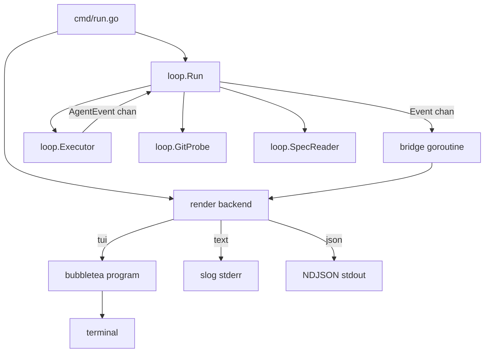

# Phase 2: live TUI in `bcc run`

## Summary

`bcc run <spec>` is a live, observable foreground command. The same invocation drives the iteration loop and renders a dashboard in the terminal: real-time event stream, plan progress, health metrics, and graceful controls (`q` to quit, `space` to pause). The TUI is the default rendering backend. `--output text` emits a structured human log on stderr; `--output json` emits a stable NDJSON event stream on stdout for machine consumers (one `bcc` orchestrating others, CI pipelines, log aggregators). All three modes consume the same normalized event channel; the `Executor` port emits typed events so codex and gemini adapters drop in without TUI changes.

## Context and motivation

`bcc run` drives an autonomous loop that can take minutes to hours. The user must answer two questions at any moment, without typing anything:

1. Is it alive and making progress?
2. If I close the laptop right now, what do I lose?

A streaming log answers neither. A live panel-based dashboard, in the same terminal as the loop, answers both. A dashboard built into `bcc run` (instead of a separate watcher process) means one command, one terminal, one source of truth.

A third use case is structural: when `bcc` itself is invoked by another agent, by another `bcc`, or by a CI pipeline, the human-shaped UI must give way to a machine-readable stream on stdout. Same loop, three rendering backends, one normalized event model.

## Goals and non-goals

### Goals

- [ ] `bcc run <spec>` opens TUI by default; loop runs in the same process, foreground.
- [ ] `--output <mode>` selects the rendering backend: `tui` (default), `text`, `json`.
- [ ] `text` mode: structured human log via `slog` to stderr. Nothing on stdout. Suitable for CI and `tee`.
- [ ] `json` mode: NDJSON event stream on stdout, one event per line. Suitable for `bcc` coordinating other `bcc` instances, log aggregators, custom dashboards. Stable schema.
- [ ] `--verbosity <level>` filters the event stream: `error` | `warn` | `info` (default) | `debug` | `trace`. Each event has an implicit level; the flag drops anything below it before the render backend sees it. Applies to `text` and `json`; ignored for `tui` (TUI panels are already curated). Default `info` is the right shape for orchestrators that want signal without noise.
- [ ] Normalized event model in `internal/loop`: `IterationStarted`, `AgentEventReceived` (Init, Thinking, ToolUse, ToolResult, AssistantText, RateLimit, ResultSummary), `IterationFinished`, `LoopFinished`. All three modes consume the same channel.
- [ ] `Executor` port emits typed events on a channel. Adapters translate native agent formats.
- [ ] Claude adapter: parses Claude Code's `--output-format stream-json` into normalized events.
- [ ] 5-panel TUI layout: header, now/health, progress, risk, recent actions.
- [ ] Visual polish: lipgloss colors, spinner on active tool, progress bar (items checked / total), ETA (rolling iteration time).
- [ ] Controls in TUI: `q` / Ctrl+C (graceful shutdown), `space` (pause between iterations), `?` (help overlay), mouse wheel scroll on history panels.
- [ ] Loop-suspect heuristic: 7-of-last-10 same `(tool, primary_arg)` flags warning row.
- [ ] Graceful resize, no terminal corruption on exit (panic / signal / kill).
- [ ] Live-update contract: tokens, cost, heartbeat, plan progress, and the run-local commit count change in real time during an iteration, not only at iteration boundaries. A panel that stays visibly empty during work in progress is a bug.
- [ ] Charm v2 stack: `charm.land/bubbletea/v2`, `charm.land/lipgloss/v2`, `charm.land/bubbles/v2` (with `charm.land/glamour/v2` for the optional spec preview). No v1 imports; greenfield project pins to current latest stable.
- [ ] Post-loop session contract (TUI mode): the agent's terminal `Result` (`review`, `done`, `blocked`, `max iterations`) is a signal that the human is needed, not a process exit. `bcc` keeps the alt-screen, freezes the dashboard, and shows a menu (resume / edit spec / view journal / quit). Text and JSON modes still exit immediately so orchestrators are unaffected.

### Non-goals

- Steering (mid-run user messages to the agent). Covered by [Phase 3 steering spec](./2026-04-29-phase-3-steering.md). Requires per-adapter research.
- Separate watcher process or `bcc watch` command. The TUI lives inside `bcc run`.
- External status files or sidecar IPC. The in-process event channel is the only source of truth between loop and render backends.
- Web dashboard, multi-spec view, historical view (Phase 3+).
- Restart/retry of the current iteration from the TUI.
- Schema versioning for `--output json`. The schema is stable from Phase 2 onward and additions must be additive (new event kinds, new optional fields). No `schema_version` field, no negotiation.

## Proposal

### Normalized event model

All event types live in `internal/loop`. Adapters import from here.

Agent-level events (one per agent action):

```go
package loop

type AgentEventKind string

const (
    KindInit          AgentEventKind = "init"
    KindThinking      AgentEventKind = "thinking"
    KindToolUse       AgentEventKind = "tool_use"
    KindToolResult    AgentEventKind = "tool_result"
    KindAssistantText AgentEventKind = "assistant_text"
    KindRateLimit     AgentEventKind = "rate_limit"
    KindResultSummary AgentEventKind = "result_summary"
)

type AgentEvent struct {
    Kind AgentEventKind
    At   time.Time
    Init *InitInfo           // present when Kind == KindInit
    Tool *ToolCallInfo       // present for tool_use / tool_result
    Text string              // present for thinking / assistant_text
    Rate *RateLimitInfo
    Done *ResultSummaryInfo
}
```

Loop-level events wrap agent events plus boundary signals:

```go
type Event interface{ isLoopEvent() }

type IterationStarted struct {
    Index, MaxIter int
    At             time.Time
}

type IterationFinished struct {
    Index        int
    Result       spec.Result    // ok / partial / blocked / done
    HEADAdvanced bool
    NewlyChecked int
    DurationMS   int64
}

type AgentEventReceived struct{ Event AgentEvent }

type LoopFinished struct {
    Reason   string             // "spec done" | "max iterations" | "blocked" | "user cancelled" | "fatal"
    ExitCode int
    At       time.Time
}
```

### Event levels (filtered by `--verbosity`)

Every event has an implicit level. The verbosity flag is a low-water mark.

| Level | Events included |
|---|---|
| `error` | `loop_finished` when `exit_code != 0`; `agent_event:tool_result` with `is_error=true` |
| `warn` | + `agent_event:rate_limit` with `status != "allowed"` |
| `info` (default) | + `iter_started`, `iter_finished`, `loop_finished` (any exit code), `agent_event:tool_use`, `agent_event:result_summary` |
| `debug` | + `agent_event:assistant_text`, `agent_event:init`, all `agent_event:tool_result` |
| `trace` | + `agent_event:thinking` (full reasoning text), any internal/diagnostic events added later |

Rationale: `info` is the orchestrator-friendly default. A parent `bcc` watching a child gets one line per iteration boundary, one per tool call, plus cost summaries, plus terminal status. No reasoning text, no per-tool result bodies. To debug a misbehaving child, bump to `debug` or `trace`. To keep CI logs lean, drop to `warn`.

### `--output json` schema

Each loop event serialises to one NDJSON line on stdout. The wire format:

```json
{"type":"iter_started","at":"2026-04-29T14:32:00Z","level":"info","index":3,"max_iter":20}
{"type":"agent_event","at":"...","level":"trace","kind":"thinking","text":"Adjusting parser..."}
{"type":"agent_event","at":"...","level":"info","kind":"tool_use","tool":{"id":"toolu_01","name":"Edit","args":{"file_path":"internal/spec/plan.go"}}}
{"type":"agent_event","at":"...","level":"debug","kind":"tool_result","tool":{"id":"toolu_01","is_error":false,"summary":"file edited"}}
{"type":"agent_event","at":"...","level":"info","kind":"result_summary","done":{"num_turns":12,"total_cost_usd":0.34,"input_tokens":12000,"output_tokens":2300,"duration_ms":42100}}
{"type":"iter_finished","at":"...","level":"info","index":3,"result":"partial","head_advanced":true,"newly_checked":2,"duration_ms":420000}
{"type":"loop_finished","at":"...","level":"info","reason":"spec done","exit_code":0}
```

Rules:

1. Stdout carries only NDJSON event lines, post-verbosity filter. No banners, no trailing summary.
2. Stderr carries human diagnostics (`slog` text). In `json` mode, only adapter and loop diagnostics go to stderr, never the user-facing structured events.
3. Exit code mirrors the loop's terminal status (per Phase 1 exit-code table).
4. Schema is additive: new event kinds and new optional fields can be introduced without a version bump. Consumers MUST ignore unknown fields and unknown `type` values.
5. Each emitted event line includes a `level` field (`"error"|"warn"|"info"|"debug"|"trace"`) so consumers can re-filter post-hoc without re-running.

### Executor port

```go
type Executor interface {
    Run(ctx context.Context, prompt string, events chan<- AgentEvent) (ExecResult, error)
}

type ExecResult struct {
    ExitCode int
}
```

Cancellation contract: when `ctx` is canceled, the adapter signals the subprocess (typically SIGINT), waits with a bounded grace period before SIGKILL, drains its parser, and returns promptly. The loop forwards a `LoopFinished{Reason: "user cancelled"}` upward.

### Loop entry point

```go
func (l *Loop) Run(ctx context.Context, events chan<- Event) error
```

`cmd/run.go` owns the channel. A small bridge goroutine forwards items into whichever rendering backend is active:

- TUI: bridge converts each `Event` into a `tea.Msg` and feeds the bubbletea program.
- text: bridge calls `slog.Info(...)` per event with structured attributes.
- json: bridge serialises each event to NDJSON and writes to stdout.

### Layout (TUI mode)

```
┌─ bcc ─ feat/foo ─ iter 3/20 ─ 14m32s ───────────────────────┐
│ docs/specs/foo.md                              ●● 🟢 alive  │
└─────────────────────────────────────────────────────────────┘
┌─ now ───────────────────────────────────┐ ┌─ health ────────┐
│ ⠋ Edit internal/spec/plan.go            │ │ heartbeat: 3s ●  │
│   12s in, thought 8s before             │ │ tools/min: 6     │
│                                         │ │ errors (5m): 0   │
│ » "Adjusting parser for empty cells..." │ │ rate: ok         │
│                                         │ │ tokens: 2.3k     │
│                                         │ │ cost: $1.23      │
└─────────────────────────────────────────┘ └──────────────────┘
┌─ progress ──────────────────────────────────────────────────┐
│ P1 ☑☑☑☑   P2 ☑☑☑   P3 ☑☑►☐☐☐☐ (current)   P4 ☐☐☐  P5 ☐☐☐    │
│ ███████████░░░░░░░░  11/20 items, ~6m per iter, ETA ~54m    │
└─────────────────────────────────────────────────────────────┘
┌─ if you close now ──────────────────────────────────────────┐
│ ✓ committed:   P1, P2, 2/7 sub-items of P3 (12 commits)    │
│ ⚠ uncommitted: 3 files (last Edit 12s ago)                 │
│ ⚠ journal:     Result for iter 3 not yet written           │
└─────────────────────────────────────────────────────────────┘
┌─ recent actions ────────────────────────────────────────────┐
│ 14:32:18  Bash  go test ./internal/spec                     │
│ 14:32:05  Edit  internal/spec/plan.go                       │
│ 14:31:47  Read  internal/spec/plan.go                       │
│ 14:31:32  Bash  git status                                  │
│ 14:31:19  Read  docs/specs/foo.md                           │
└─────────────────────────────────────────────────────────────┘
[q]uit  [space]pause  [?]help
```

### Data sources (TUI panels)

| Source | Mechanism |
|---|---|
| Agent events | `loop.Event` channel from in-process loop |
| Iteration boundaries | `IterationStarted` / `IterationFinished` from loop |
| git state (commits ahead, dirty files) | periodic probe via `loop.GitProbe`, every 2s |
| Spec checkboxes | re-parse via `loop.SpecReader`, after each `IterationFinished` |
| Cost / tokens | accumulated from `KindResultSummary` events |

### Heuristics

| Signal | Computation | Display |
|---|---|---|
| Heartbeat | `now - last_event_at` | green < 30s, yellow < 2m, red ≥ 2m |
| Loop-suspect | last 10 `KindToolUse` events: ≥ 7 share `(name, primary_arg)` | warning row in health |
| Errors recent | `KindToolResult` with `IsError=true`, sliding 5m | colored count |
| Rate limit | latest `KindRateLimit` with `Status != "allowed"` | red row |
| Tools/min | rolling 60s rate of `KindToolUse` | number |
| Cost | sum of `KindResultSummary.TotalCostUSD` | currency |
| ETA | `mean(iteration_durations) × items_remaining_in_plan` | human duration |

### Architecture



### Package layout

```
internal/
├── loop/
│   ├── ports.go                  # Executor, GitProbe, SpecReader interfaces
│   ├── events.go                 # AgentEvent, Event, AgentEventKind
│   ├── eventlevel.go             # LevelOf(Event) Level + verbosity filter
│   ├── eventjson.go              # NDJSON serialiser for --output json
│   └── loop.go                   # Loop.Run drives iterations, emits Events
├── executor/claude/
│   └── claude.go                 # parses stream-json into AgentEvent
└── tui/
    ├── tui.go                    # bubbletea Model/Update/View root
    ├── header.go                 # spec, branch, iter, elapsed, alive dot
    ├── now.go                    # current activity panel
    ├── health.go                 # health metrics panel
    ├── progress.go               # plan checkboxes, progress bar, ETA
    ├── risk.go                   # "if you close now" panel
    ├── actions.go                # recent actions panel
    ├── help.go                   # ? overlay
    └── theme.go                  # lipgloss styles, --no-color support
```

### CLI surface

```bash
bcc run <spec> [flags]
  --output <mode>           # tui (default) | text | json
  --verbosity <level>       # error | warn | info (default) | debug | trace
  --no-color                # disable lipgloss colors (also affects text mode tags)
  --max-iter <n>            # override .bcc.toml [loop].max_iterations
  --refresh-git <ms>        # git probe interval, default 2000
```

## Implementation Plan

### P2.1: event types and Executor contract

1. [x] Add `internal/loop/events.go` with `AgentEvent`, `AgentEventKind`, `Event` interface, and the four loop-level event types. Pure types, no I/O.
1. [x] Set `loop.Executor.Run` signature to `Run(ctx, prompt, events chan<- AgentEvent) (ExecResult, error)`. `loop.Loop.Run` forwards agent events into its own `chan<- Event`.
1. [x] Update the existing fake executor in tests to push canned `AgentEvent`s on the channel.
1. [x] Tests: table-driven loop test asserts the sequence of `Event`s emitted for a known fake transcript.

### P2.2: claude adapter emits typed events

1. [x] `internal/executor/claude/claude.go`: parse stream-json line-by-line into `AgentEvent`. Map every Claude event subtype to a `Kind`.
1. [x] Tests: replay a captured stream-json fixture (`testdata/full-iter.jsonl`) and assert the produced `AgentEvent` sequence.

### P2.3: text and json output modes

1. [x] `cmd/run.go`: `--output` flag with values `tui` (default), `text`, `json`; `--verbosity` flag with values `error|warn|info|debug|trace` (default `info`). Build the channel, dispatch to backend.
1. [x] `internal/loop/eventlevel.go`: pure function `LevelOf(Event) Level` mapping each event to its level per the table above. Table-driven test asserts every kind has a level.
1. [x] Verbosity filter: middleware goroutine that reads the loop channel and drops events below the threshold before forwarding to the backend. Backends never see filtered-out events.
1. [x] text backend: drain channel into `slog` lines on stderr with structured attrs. The slog level matches the event level (`Debug`, `Info`, `Warn`, `Error`).
1. [x] `internal/loop/eventjson.go`: marshal each `Event` into the documented NDJSON shape, including the `level` field.
1. [x] json backend: drain channel, write one NDJSON line per event to stdout, flush after each.
1. [x] Verify signal handling: Ctrl+C cancels ctx, loop returns cleanly, exit code preserved across all three modes.
1. [x] Tests: capture stdout for json mode against a fixed fake transcript; assert byte-for-byte expected NDJSON at each verbosity level.

### P2.4: bubbletea skeleton

1. [x] `internal/tui/tui.go`: `Model` struct holding panel state; `Init()`, `Update(msg)`, `View()`.
1. [x] Bridge: `tea.Cmd` that reads from `chan loop.Event` and emits a `tea.Msg` per event.
1. [x] `q` and Ctrl+C cancel the loop ctx, then exit bubbletea cleanly via `tea.Quit`.
1. [x] `space` toggles a `paused` flag; loop reads a `<-chan struct{}` from TUI before starting next iteration.
1. [x] Window resize handled (`tea.WindowSizeMsg`). Empty placeholders rendered for all panels.

### P2.5: panels

1. [x] `header.go`: spec path, branch, iter `n/N`, elapsed-since-start, alive dot.
1. [x] `now.go`: spinner + current `KindToolUse` formatted per tool (Bash command, Edit file, Read path); time-since calculation; latest `KindAssistantText`.
1. [x] `health.go`: heartbeat + color; tools/min; errors count; rate limit; tokens; cost.
1. [x] `progress.go`: phase-by-phase checkbox rendering; current phase marker `►`; lipgloss progress bar (`bubbles/progress`) for `items_checked / total`; ETA from iteration duration history.
1. [x] `risk.go`: committed (spec checkbox count from periodic re-parse), uncommitted (file count from `git status --porcelain` via `GitProbe.DirtyFileCount`, polled every 2s), journal status (latest `**Result**` parsed vs not).
1. [x] `actions.go`: last 5 tool calls with timestamps, color-coded by tool kind.
1. [x] Enrich the risk panel's "committed" line with the run-local commit count (mockup `(12 commits)`). Requires a baseline SHA: either emitted by the loop in `IterationStarted` or surfaced via a new `GitProbe.CommitsSince(ctx, sha)` port.

### P2.6: heuristics

1. [x] Loop-suspect detector: ring buffer of last 10 `(tool, primary_arg)`; threshold ≥ 7/10 same key. Display warning row in health.
1. [x] Error rate counter: 5-minute sliding window of `IsError=true`.
1. [x] Tools/min rate: 60-second sliding window.

### P2.7: theming and polish

1. [x] `internal/tui/theme.go` lipgloss styles. `--no-color` disables color via `lipgloss.SetColorProfile(termenv.Ascii)`.
1. [x] Help screen: `?` toggles modal overlay listing keybindings.
1. [x] Terminal restoration on panic: deferred `program.ReleaseTerminal()` plus SIGTERM signal handler.

### P2.8: panel layout and visual fidelity

The dashboard renders panels as bordered boxes laid out per the [Layout (TUI mode)](#layout-tui-mode) mockup: a full-width header box on top, then a two-column row pairing `now` (wider) with `health` (narrower), then `progress`, `risk`, and `recent actions` each as full-width boxes, with the keybinding footer below. Width comes from `tea.WindowSizeMsg` and the layout is recomputed on resize.

1. [x] `internal/tui/box.go`: `func box(title, body string, width int) string` builds a lipgloss bordered box (rounded corners) with `title` embedded in the top border per the mockup. Below a low-width threshold (e.g., 40 cols), the wrapper falls back to a plain `[ title ]` line + body so narrow terminals stay readable.
1. [x] Refactor each panel: drop the `panelTitle("name")` prefix from `view*` so each method returns body content only. The Model wraps the body with `box(name, body, width)` at composition time. `panelTitle` either becomes the box title source or is removed.
1. [x] `Model.View()`: replace string concatenation with `lipgloss.JoinVertical(lipgloss.Left, ...)` over the header box, the now+health row, the remaining full-width boxes (`progress`, `risk`, `recent actions`), and the footer. The now+health row uses `lipgloss.JoinHorizontal(lipgloss.Top, nowBox, healthBox)`.
1. [x] Width allocation: header / progress / risk / actions span full `m.width`; the now+health row splits ~60/40 (now wider). The split lives in code, not in config, but is a named constant so future tuning is one edit.
1. [x] Header reshape: render the header as a two-line bordered box per the mockup — branch + iter `n/N` + elapsed in the top-border title; spec path + alive marker on the body line. Receives the layout's full width.
1. [x] Layout cache on resize: `tea.WindowSizeMsg` recomputes a `layout` struct (`headerW`, `nowW`, `healthW`, `progressW`, `riskW`, `actionsW`) on the Model. Panels and the box wrapper read precomputed widths.
1. [x] Tests: render the Model at 80, 120, and 200 columns; assert (a) `lipgloss.Width` of every rendered line is ≤ the terminal width, (b) the now box sits to the left of the health box on the same vertical band (top-aligned), (c) the header box's title contains branch and iter, (d) below the 40-col threshold every box falls back to plain `[ name ]` and no rendered line exceeds the width.

### P2.9: live data updates

The dashboard answers "is it alive and what is happening" only if its panels update during an iteration, not just at iteration boundaries. This phase closes the gaps where panels render stale or empty content while data is in fact available upstream.

Sub-item 4 (Spec parsed at startup) was carved out and moved to [Spec-format vendor neutrality](./2026-04-29-spec-vendor-neutrality.md): adding a startup parse via `parseSpecCmd` deepens the framework's coupling to the bcc-markdown vocabulary (`spec.Plan`, `spec.LatestResult`). The right shape is a `SpecReader` port that returns signals, consumed by `Init()` once the new ports land. Until then the panels stay populated only after the first `IterationFinished` (acceptable trade-off).

1. [x] Per-message token usage. The Claude stream emits `message.usage` on every `assistant` event; `parseAssistant` (`internal/executor/claude/claude.go`) currently drops it. Extend `loop.AgentEvent` so assistant text events carry the per-message `Usage` (input, output, cache_read, cache_creation), and have `healthPanel.onAgentEvent` accumulate tokens incrementally on every assistant message. The terminal `result` event remains the source of truth for cost and is reconciled at iteration end.
1. [x] Cache tokens in the total. `loop.ResultSummaryInfo` and the per-assistant `Usage` both expose `CacheReadInputTokens` and `CacheCreationInputTokens`. The "tokens" line on the health panel sums all four fields (input + output + cache_read + cache_creation) so the displayed value matches what the user is billed for. NDJSON: `agent_event` and `result_summary` carry the new fields as additive keys (no schema bump per the locked schema rule).
1. [x] Health heartbeat covers all events. `healthPanel.lastEvent` is currently stamped only by `onAgentEvent`. Route `IterationStarted`, `IterationFinished`, and `LoopFinished` through the same heartbeat sink (e.g., a new `health.onAny(at)` mirroring `header.onAny`) so the heartbeat dot in the health panel matches the header's alive dot from the first iteration onward.
1. [~] **Carved out** to [Spec-format vendor neutrality](./2026-04-29-spec-vendor-neutrality.md). Original scope: spec parsed at startup. Reason: `parseSpecCmd` in `Init()` couples the framework to the bcc-markdown parser. Will land via the new `SpecReader` port.
1. [x] Git probe re-fires on baseline capture. The first `gitProbeCmd` is launched in `Init()` with `runBaselineSHA == ""`, so the run-local commit count stays unknown until the second probe tick (≥ 4s after launch). When `IterationStarted` first sets `runBaselineSHA`, dispatch an immediate `gitProbeCmd` so the parenthesised `(N commits)` appears on the next render rather than the next 2s tick.
1. [x] Tests: extend `health_test.go` to assert tokens accumulate across two assistant events with usage; add an `IterationStarted` test that asserts the immediate git probe is enqueued. NDJSON byte-for-byte tests gain rows for `cache_read_input_tokens` / `cache_creation_input_tokens` at info verbosity. (The originally-planned `Model.Init` startup-parse test followed sub-item 4 to the vendor-neutrality spec.)

### P2.10: richer widgets and v2 dependency stack

The dashboard adopts the standard Charm component set (bubbles, lipgloss v2, optional glamour) so we stop reinventing primitives that already exist as `tea.Model`s. The single direct dependency upgrade lands in this phase to keep churn isolated; goes hand-in-hand with the layout work in P2.8.

1. [x] Migrate Charm dependencies to v2 modules: `charm.land/bubbletea/v2`, `charm.land/lipgloss/v2`, `charm.land/bubbles/v2`. Update import paths across `internal/tui/*.go`, `internal/cli/run.go`, and `go.mod`. The project is greenfield, no compatibility shims; no v1 imports left over. Verify `go test -race ./...`, `go vet`, `gofmt -l` clean after the swap.
1. [x] Replace the manual `spinnerFrames` ring in `now.go` with `bubbles/v2/spinner`. The `nowPanel` embeds a `spinner.Model` and propagates `spinner.Tick` through `Update`. Choice of frame style (`spinner.Dot`, `spinner.Line`, `spinner.MiniDot`) is a named constant. Removes `spinnerTickMsg` and `spinnerTickCmd` from `tui.go`.
1. [x] Replace the manual `█/░` bar in `progress.go` with `bubbles/v2/progress`. The panel embeds a `progress.Model` and calls `SetPercent(...)` on every progress update; the animated transitions land for free. Width comes from the layout cache (P2.8 sub-item 6). The data source (today: `checked / total` from `spec.Plan`) becomes `Progress()` from the new `SpecReader` port once [Spec-format vendor neutrality](./2026-04-29-spec-vendor-neutrality.md) lands; until then this item ships against the bcc-markdown parser. Adapters that return `ok=false` from `Progress()` render a textless ratio bar.
1. [x] Replace the ad-hoc `internal/tui/help.go` overlay with `bubbles/v2/key` + `bubbles/v2/help`. Define a single `keyMap` with `key.Binding` entries (`Quit`, `Pause`, `Help`); `handleKey` matches via `key.Matches`; the `?` overlay renders `help.Model` in `FullHelp` mode and the footer renders the same `help.Model` in `ShortHelp` mode. Single source of truth for both the handler and the visible bindings.
1. [x] `actionsPanel` body wraps in `bubbles/v2/viewport` so the recent-actions list scrolls with mouse wheel and arrow keys. The 5-entry cap stays as the visible default; viewport extends history beyond the visible window when the user scrolls. The Model's `tea.View` carries `MouseMode = tea.MouseModeCellMotion` (v2 moves alt-screen / mouse mode from ProgramOptions onto the View struct).
1. [~] **Carved out** to [Spec-format vendor neutrality](./2026-04-29-spec-vendor-neutrality.md). Original scope: optional spec panel toggled by `s`, rendering the spec via `charm.land/glamour/v2`. Reason: rendering through glamour assumes markdown content; non-markdown formats (open-spec YAML, spec-kit, bmad) cannot be displayed this way without a per-adapter renderer. Will land as a per-adapter feature exposed by the `SpecReader` port (e.g., a `Render(profile) string` method that the bcc-markdown adapter implements with glamour and other adapters implement with their own pretty-printer or skip).
1. [x] Drop `--no-color`'s `lipgloss.SetColorProfile(termenv.Ascii)` call and use the v2 lipgloss `WithColorProfile` / `Renderer` API per the v2 migration guide. `termenv` becomes an indirect dependency only.
1. [x] Tests: panel-level tests stay green after the component swaps; new tests assert `keyMap.FullHelp()` lists every binding the model handles, and that `actionsPanel` scrolls past the 5-entry visible window when more events arrive.

### P2.11: post-loop interactive session (TUI mode)

In TUI mode (`--output tui`), `bcc` does not exit when the inner loop terminates. The terminal `Result` of the agent (`review`, `done`, `blocked`) is a signal that the human is needed, not a process exit; `bcc` is the human's interface to that signal. The dashboard transitions to an idle "session" state with the run's outcome on screen and a menu of actions; the user picks the next step without leaving the alt-screen and without re-typing `bcc run` in the shell.

Text and JSON modes preserve the current exit-on-`LoopFinished` behavior because their consumers (CI, parent `bcc`, log aggregators) expect a process to terminate.

Menu actions:

- `[r] Resume loop`: builds a fresh `loop.Loop` with the same Config and SpecPath, re-attaches it to the existing TUI Model (panels reset to per-iteration counters, run-local commit count keeps its baseline), and starts a new iteration. Useful after the user edited the spec from outside or used `[e]`.
- `[e] Edit spec in $EDITOR`: suspends the program with `program.ReleaseTerminal()`, runs `$EDITOR <spec-path>` (falls back to `$VISUAL`, then prints a hint and returns to menu when neither is set), restores the terminal with `program.RestoreTerminal()`. Edit time is unbounded; nothing is running.
- `[j] View latest journal entry`: format-dependent; carved out to [Spec-format vendor neutrality](./2026-04-29-spec-vendor-neutrality.md).
- `[q] Exit`: `tea.Quit`. Process exits with the loop's terminal exit code.

Behavior matrix per terminal reason:

| Reason | TUI mode | Text / JSON mode |
|---|---|---|
| `review` | menu | exit (current behavior) |
| `done` | menu | exit |
| `blocked` | menu | exit |
| `max iterations` | menu | exit |
| `user cancelled` (Ctrl+C during run) | exit immediately (the user already chose to leave) | exit |
| `fatal` (config invalid, executor missing) | exit with stderr error | exit |

Sub-items:

1. [x] **Default output regression test**: assert `runCmd.Flags().Lookup("output").DefValue == "tui"` in `internal/cli/run_test.go`. Locks the contract so a future flag-tweak cannot silently change the default.
1. [x] **Loop-control change**: in TUI mode, `LoopFinished` no longer schedules `tea.Quit`. The Model latches `sessionMode = true`, captures the latest signal (today: `spec.Result`; once the new ports land, the format-neutral `Signal` from [Spec-format vendor neutrality](./2026-04-29-spec-vendor-neutrality.md)), and the run-local commit count from the current panel state.
1. [x] **Session overlay**: new `internal/tui/session.go` renders the menu over the last frame of the dashboard (frozen). Uses `bubbles/v2/key` for the bindings (`Resume`, `Edit`, `Quit`) and `bubbles/v2/help` for the inline help footer; the `?` overlay still works inside session mode. The `Journal` binding lands together with the journal viewer (carved out, see below).
1. [~] **Carved out** to [Spec-format vendor neutrality](./2026-04-29-spec-vendor-neutrality.md). Original scope: `[j]` swaps the overlay for a `bubbles/v2/viewport` displaying the last journal entry via `charm.land/glamour/v2`. Reason: depends on a `JournalStore.Latest()` port (today the journal is parsed from the spec markdown by `internal/spec/`), and rendering via glamour assumes markdown content. Will return as a per-adapter render path on top of the new ports.
1. [x] **Resume action**: pressing `[r]` returns a `tea.Cmd` that emits a `restartLoopMsg` containing the same Config / SpecPath. `runWithTUI` recognises the message, tears down the current `loop.Loop` cleanly, builds a fresh one, and re-binds the new events channel into the existing Model. Iteration counter resets per session; run-local baseline SHA is preserved (the run, not the iteration, is the baseline).
1. [~] **Carved out** to [Spec-format vendor neutrality](./2026-04-29-spec-vendor-neutrality.md). Original scope: `[e]` invokes `$EDITOR`, then re-parses the spec via `parseSpecCmd` so the menu's data reflects the edits. Reason: same coupling as P2.9 sub-item 4; the post-edit refresh must go through the new `SpecReader` port. The terminal-suspend / `$EDITOR` mechanics survive (format-neutral); only the post-edit re-parse is gated on the new port.
1. [x] **Edit menu action (terminal-suspend mechanics)**: `[e]` invokes `$EDITOR` (falls back to `$VISUAL`) on the spec path with `program.ReleaseTerminal()` / `program.RestoreTerminal()` around the subprocess. The editor inherits stdin/stdout/stderr so the user can repaint and edit normally; on return, the dashboard re-arms its spinner tick and the session menu reappears. When neither `$EDITOR` nor `$VISUAL` is set, a hint is surfaced below the menu and no subprocess is spawned. The post-edit re-parse remains carved out per the previous sub-item.
1. [x] **Header state badge**: the header box gains a state indicator while in session mode: `idle (review) • r resume • e edit • j journal • q exit`. Replaces the alive dot in the same slot. The "review/done/blocked" label is the format-neutral `Signal` once the new ports land (today: `spec.Result.String()`).
1. [x] **Ctrl+C in session mode**: exits immediately, no confirmation. The loop is already done; the menu is convenience, not commitment.
1. [x] **Text/JSON parity**: `LoopFinished` in those modes still produces an immediate exit with the loop's exit code. Add a regression test in `render_test.go` that asserts text and json render goroutines drain and return without waiting for any user input.
1. [x] **Tests**: scripted Model test feeds `LoopFinished` and asserts (a) no `tea.Quit` is dispatched, (b) the menu is rendered, (c) `[r]` produces a `restartLoopMsg`, (d) `[q]` produces `tea.Quit`. End-to-end test wraps a fake `Loop.Run` that terminates on the first iteration with a review signal, drives the model through `[r]`, and asserts a second `IterationStarted` is observed.

### P2.12: end-to-end validation

1. [ ] Run `bcc run` on a real one-phase spec with `--output tui`. Confirm panels populate and iteration completes; on terminal `Result`, the session menu appears (no terminal scrollback).
1. [ ] Same spec with `--output text`: confirm slog output is readable, exit code matches what would be the TUI session's `[q]` exit code, and no menu is rendered.
1. [ ] Same spec with `--output json`: pipe stdout through `jq -c` and confirm every line parses; exit code matches.
1. [ ] Verbosity sweep: run the same spec at `--verbosity error`, `info`, `trace`; confirm the line counts strictly increase and no line at a lower level disappears at a higher level.
1. [ ] Smoke test "bcc coordinating bccs": small Go program reads NDJSON from `bcc run ... --output json --verbosity info` and prints a one-line summary per `iter_finished`. Demonstrates that `info` is the right default for orchestrators.
1. [ ] Trigger loop-suspect by having the agent grep the same file 8 times; confirm warning appears in TUI.
1. [ ] Synthetic rate-limit event injected via fake executor; confirm red row in TUI and corresponding NDJSON event.
1. [ ] Ctrl+C mid-iteration: confirm clean terminal restore in TUI, no garbage characters; exit code reflects user-cancelled in all three modes; session menu does not render (Ctrl+C is "leave now").
1. [ ] Ctrl+C in session menu: confirm immediate exit with no extra prompt and clean terminal restore.
1. [ ] Resume loop from session menu: edit the spec to mark one item complete, press `[r]`, confirm a fresh iteration starts and the progress panel reflects the edit. Depends on the post-edit re-parse landing via the [Spec-format vendor neutrality](./2026-04-29-spec-vendor-neutrality.md) port; until then, this case is exercised against the bcc-markdown adapter only.
1. [~] **Carved out** to [Spec-format vendor neutrality](./2026-04-29-spec-vendor-neutrality.md). Original scope: edit spec from session menu, journal-viewer reflects the edited content. Reason: depends on the carved-out journal viewer (P2.11 sub-item 4) and on the post-edit re-parse path (P2.11 sub-item 6).
1. [ ] Resize while running TUI: no clipping or overflow at any width above the 40-col threshold.
1. [ ] Live tokens / cost sanity: at the second assistant event of a real iteration, the health panel shows non-zero tokens; final value at `iter_finished` matches the `result.usage` totals (input + output + cache_read + cache_creation).
1. [ ] Mouse wheel scrolls the actions panel through events older than the visible window.
1. [ ] Manual visual review at 80x24, 120x40, 200x60: observer rebuilds (`go install ./cmd/bcc`), runs `bcc run <spec>` in each terminal size, confirms no overflow, no clipping, panels populate, `?` toggles, `--no-color` produces ASCII-only output, and the session menu renders correctly at each width.

## Autonomous execution

This spec follows the [Autonomous execution guide](../../guides/autonomous-execution.md) defaults.

### Done criteria

Default Go criteria (`gofmt`, `go vet`, `go test -race`, `go build`) plus:

1. Manual visual review at 3 terminal sizes confirms no overflow or clipping (P2.12 sub-item 15).
1. End-to-end test in P2.12 succeeds across all three `--output` modes, including the session-menu paths in TUI mode.

### Stop criteria

1. **Success**: P2.1 through P2.12 all `[x]` and end-to-end review passes.
1. **Block**: bubbletea API surprise (terminal restoration, signal handling, channel-into-`tea.Cmd`) that needs design rethink.
1. **Human decision**: layout choices that affect UX (panel ordering, color palette, exact ETA formula). The NDJSON event schema is locked at the start of P2.3 and any change there requires human sign-off.

## Risks and mitigations

| Risk | Likelihood | Impact | Mitigation |
|---|---|---|---|
| TUI + loop goroutines = race conditions | Medium | Medium | Single source-of-truth `Model`; all updates funnel through `Update(msg)`; `-race` flag in tests |
| Terminal corruption on Ctrl+C / panic | Low | High | `tea.NewProgram(...).Run()` deferred restore; SIGTERM handler calls `ReleaseTerminal()` |
| NDJSON schema premature lock-in | Medium | Medium | Schema additive only; consumers ignore unknown fields/kinds; documented in goals |
| Heuristic false positives (loop-suspect on legitimate repetition) | Medium | Low | Tune thresholds during dogfooding; threshold tunable via `.bcc.toml` later |
| Pause semantics confusing (between vs during iter) | Low | Low | UI label says "pause after this iter"; documented in `?` help |
| Stdin contention (TUI reads keys, agent subprocess inherits stdin) | Low | Medium | Adapter explicitly disconnects subprocess stdin (`cmd.Stdin = nil`); TUI owns os.Stdin |
| Large iterations overrun event channel buffer | Low | Low | Channel buffered to 256; on overflow, drop with `slog.Warn` |
| Charm v2 import path migration drift (`charm.land/<pkg>/v2` is recent) | Low | Medium | Pin exact tags in `go.mod`; run `go mod verify` in CI; v2 migration lives in P2.10 as a single atomic change |
| Per-message `usage` semantics differ from terminal `result.usage` | Medium | Low | Reconcile to `result.usage` at iteration end (P2.9 sub-item 1); panel may show small live/final delta during the run, that is acceptable |
| `bubbles/v2` API drift between minor versions | Low | Low | Pin exact tags; component swaps (P2.10) covered by panel-level tests so a regression is caught at `go test` time |

## References

- bubbletea v2: `charm.land/bubbletea/v2` (runtime, `tea.Model` / `tea.Cmd` / `tea.Msg`, alt-screen, mouse motion, context wiring)
- lipgloss v2: `charm.land/lipgloss/v2` (`Border`, `JoinHorizontal`/`Vertical`, `Place`, `Width`/`Height`, color profiles)
- bubbles v2: `charm.land/bubbles/v2` (`spinner`, `progress`, `viewport`, `key`, `help`; `table` reserved for future panels)
- huh v2: `charm.land/huh/v2` (used by the `bcc init` wizard rework, separate spec)
- glamour v2: `charm.land/glamour/v2` (Markdown rendering inside the optional spec panel)
- Claude Code stream-json format: `claude --output-format stream-json` reference
- Phase 3 steering draft: [2026-04-29-phase-3-steering.md](./2026-04-29-phase-3-steering.md)

## Execution Journal

### 2026-04-29 23:10, P2.12 end-to-end validation (no-op review checkpoint)

- **Result**: review
- **Summary**: Iteration started from a clean tree at f598999 (`tui: P2.11 post-loop interactive session`). With P2.11 closed in the previous iteration, the next pending phase is P2.12 (end-to-end validation). Re-asserted `go build ./...`, `go vet ./...`, `gofmt -l .`, `go test ./...` all clean against `feat/phase-2`. No code or spec changes; this commit only appends the journal entry to keep `HEAD` advancing per the loop contract.
- **Commits**: this commit `spec: P2.12 review checkpoint (no spec or working-tree change)`
- **Decisions**: All thirteen `[ ]` sub-items in P2.12 are observer-driven smoke validation by content. Each one requires either (a) running `bcc run` recursively against a real spec with a live agent and visually confirming TUI behavior (sub-items 1, 2, 3, 4, 6, 13), (b) interactive keypresses on a real terminal (sub-items 8, 9, 10, 14: Ctrl+C, `[r]`, mouse wheel, etc.), (c) terminal-resize observation during a live run (sub-item 12), (d) writing AND running a small orchestrator program that reads NDJSON from a real `bcc run` (sub-item 5: the artifact alone does not satisfy the smoke-test contract), (e) visual confirmation at three specific terminal sizes (sub-item 15, which itself names the observer: "observer rebuilds (`go install ./cmd/bcc`)"), or (f) an interactive synthetic-event injection plus visual confirmation in the TUI (sub-item 7). The agent runs *inside* `bcc run` and has no terminal of its own; it cannot meaningfully invoke `bcc run` recursively against a real spec, observe the dashboard, press keys, resize windows, or verify exit codes across modes. This matches the structural shape of P2.12 declared in the spec's [Stop criteria](#stop-criteria): success is "P2.1 through P2.12 all `[x]` and end-to-end review passes", which makes this phase the end-to-end review itself. Did NOT implement sub-item 5 (orchestrator demo program) alone: the sub-item is one smoke test, not two; writing the program without running it against a live `bcc run` would be a partial-checkbox violation per the autonomous-execution guide. Did NOT split it into "(a) write demo / (b) run demo": the existing item is concrete enough that splitting would be re-arranging chairs, not closing scope. Did NOT advance to a hypothetical P2.13: P2.12 is the last phase; advancing past it would mean fabricating new scope. Added no new `[ ]` sub-items.
- **Next**: P2.12 (end-to-end validation by observer); none after that.
- **Notes for observer**: BCC_JSONL_PATH=.bcc/logs/2026-04-29-phase-2-tui-dashboard-iter1.jsonl. P2.12 needs you. Concrete steps: rebuild (`go install ./cmd/bcc`), then walk the thirteen sub-items in a real terminal. Suggested order: (i) sub-items 1-4 share one real spec run per `--output` mode, so pick a small one-phase spec (e.g., a tiny demo spec authored just for this pass) and exercise tui / text / json sequentially; capture exit codes and confirm they match the TUI session's `[q]` exit code in each mode. (ii) sub-item 5: write the orchestrator demo as a small Go program (suggested location: `examples/orchestrator/main.go` or similar; `go run` is enough, no need to add it to the build). Pipe it from `bcc run ... --output json --verbosity info` and confirm the per-`iter_finished` summary lines appear. (iii) sub-item 4 (verbosity sweep): reuse the same spec across `--verbosity error`, `info`, `trace`; count lines and confirm strict monotonic increase. (iv) sub-items 6 and 7 (loop-suspect, rate-limit): the easiest path is to author a fixture spec that intentionally repeats the same Edit/Bash command (for loop-suspect) and to inject a synthetic rate-limit event by extending the fake executor's transcript (for rate-limit, which is then confirmed against TUI red row + corresponding NDJSON event by running the fake-backed loop in `--output tui` and `--output json` simultaneously in two terminals or sequentially). (v) sub-items 8 and 9 (Ctrl+C mid-iteration / Ctrl+C in session): trigger Ctrl+C during a real run and again at the session menu; confirm clean restore and exit codes. (vi) sub-items 10 and 12 (resume from session, resize): edit the spec mid-session, press `[r]`, resize the window during a run; confirm the progress panel reflects the edit (note the spec's caveat: resume-with-edit reflection depends on the [Spec-format vendor neutrality](./2026-04-29-spec-vendor-neutrality.md) port, so until that lands this is exercised against the bcc-markdown adapter only). (vii) sub-item 13 (live tokens): pick any spec, watch the health panel after the second assistant event, and at `iter_finished` reconcile the displayed tokens against `result.usage` (input + output + cache_read + cache_creation). (viii) sub-item 14 (mouse wheel): scroll the actions panel after >5 tool_use events; confirm older entries appear. (ix) sub-item 15 (visual review at 80x24, 120x40, 200x60): rebuild and run at each size with `--output tui` and again with `--no-color`; confirm panels populate, no overflow / clipping, `?` overlay toggles, session menu renders correctly at each width. Mark each sub-item `[x]` as you go (or in one batch edit when finished). If any item surfaces a defect, file a new `[ ]` sub-item in P2.12 (or a new phase if structural) before re-triggering so the next iteration has programmatic next steps. Two alternative paths if you do not want to do the full pass right now: (A) rescope by replacing observational sub-items with their already-tested programmatic equivalents (sub-items 7, 13, 14 have panel-level test coverage from P2.5/P2.9/P2.10; sub-item 4 has verbosity-table tests from P2.3); (B) keep the gate as is and accept that until you act, every re-trigger produces another no-op `review` exit. Re-triggering with `BCC_MAX_ITERATIONS` bumped does not unblock the gate; only an edit to the spec's checkbox state (or a code-implementable scope rewrite) does. The working tree is clean; no untracked files.

### 2026-04-29 22:30, P2.11 post-loop interactive session

- **Result**: ok
- **Summary**: The TUI no longer exits when the inner loop terminates: `LoopFinished` with a non-fatal reason (`done`, `review`, `blocked`, `max_iterations`, `head_stuck`, `done_with_leftovers`) latches `sessionMode` on the Model and freezes the dashboard with a session menu. `internal/tui/session.go` defines the session keymap (`Resume`, `Edit`, `Quit`) backed by `bubbles/v2/key` and renders the inline menu via the existing `bubbles/v2/help` model. The header gains a session badge that replaces the alive dot with `idle (<status>) • r resume • e edit • q exit`. The `?` overlay still works inside session mode and surfaces the session keymap via `help.FullHelpView`. `[r]` dispatches a `restartLoopMsg`; the host's `newEvents` factory (wired through `tui.Options.NewEvents`) builds a fresh `loop.Loop` each call, spawns its goroutine, and returns a new events channel that the Model rebinds via `rebindEventsMsg`. The Model resets the iteration counter on rebind but preserves `runBaselineSHA` so the run-local commit count survives across sessions. `[e]` calls `program.ReleaseTerminal()`, runs `$EDITOR` (falling back to `$VISUAL`) on the spec path with stdin/stdout/stderr inherited, and `program.RestoreTerminal()`s on return; an `editorFinishedMsg` re-arms the spinner tick and surfaces a hint below the menu when neither env var is set. `[q]` / Ctrl+C in session mode return `tea.Quit` immediately, no cancel call. `runWithTUI` was restructured to take a `buildLoop func() *loop.Loop` factory; the inner `runOne` goroutine writes the latest run's exit code into a mutex-guarded slot, and the outer return reads from that slot once `program.Run()` exits. Text and JSON modes are unchanged: a new `TestDispatchEvents_TextJSONExitWithoutInput` regression locks the parity contract. New session_test.go covers (a) `LoopFinished` latches `sessionMode` for non-fatal reasons (and skips it for `user cancelled` / `fatal`), (b) channel-close in session mode does not Quit, (c) the menu renders with the badge text and bindings, (d) `[r]` produces `restartLoopMsg` then `rebindEventsMsg`, (e) rebind clears `sessionMode` while preserving baseline SHA, (f) `[q]` and Ctrl+C in session both produce `tea.Quit`, (g) end-to-end resume from a fake loop produces a second `IterationStarted`. `gofmt -l`, `go vet`, `go test -race ./...` all clean.
- **Commits**: this commit `tui: P2.11 post-loop interactive session`
- **Decisions**: `tui.Options.NewEvents` is the single seam between Model and host for resume; the host's factory captures all loop construction parameters so the Model never knows about Config/Executor/Git directly. `runWithTUI` now takes a `buildLoop func() *loop.Loop` instead of a single `*loop.Loop` because Loop is documented single-call ("do not reuse a Loop across multiple specs in the same process"); each session iteration receives a freshly built Loop with the same gate and discard logger. The pause gate persists across resume cycles intentionally: a user who paused the loop, hit a stop, and chose [r] expects the new run to honor the latched pause state. `tui.Model.SetProgram` wires the bubbletea program reference into the Model after `tea.NewProgram` returns; required because v2 `ReleaseTerminal` / `RestoreTerminal` are program-scoped methods, not package-level. `renderHelpOverlay` now takes a `help.KeyMap` interface instead of the concrete `keyMap` struct so the same renderer serves both the dashboard and the session menu. The header badge omits `j journal` per the spec's literal example because the journal binding is carved out; the badge advertises only the wired-up actions (`r resume • e edit • q exit`) so the user does not see a dead key. Added sub-item to P2.11 capturing the surviving editor mechanics (terminal-suspend / $EDITOR invocation) since the original sub-item 6 carved out the post-edit re-parse only, not the editor invocation; the carve-out marker is preserved on sub-item 6 and the new sub-item is checked in this commit.
- **Next**: P2.12 (end-to-end validation across the three output modes plus visual review at multiple terminal sizes).

### 2026-04-29 21:15, P2.10 Charm v2 migration + richer widgets

- **Result**: ok
- **Summary**: Migrated the entire Charm dependency stack to v2 (`charm.land/bubbletea/v2`, `charm.land/lipgloss/v2`, `charm.land/bubbles/v2`), bumped Go to 1.25.0 (mise + go.mod), and replaced four panel-level primitives with the canonical bubbles components: `now.go` embeds `bubbles/v2/spinner` (style `spinner.Dot`, named constant `nowSpinnerStyle`, advanced via the spinner's own `Tick`); `progress.go` embeds `bubbles/v2/progress` (`SetPercent` + `ViewAs`, fixed width via `progressBarWidth`); `help.go` becomes a thin wrapper over `bubbles/v2/help` driven by a single `keyMap` of `bubbles/v2/key.Binding` entries (Quit, Pause, Help) consumed both by `handleKey` (via `key.Matches`) and by the rendered footer + `?` overlay; `actions.go` wraps its body in `bubbles/v2/viewport` (mouse wheel enabled, history cap 200, visible window 5 rows = `actionsViewportHeight`). `--no-color` drops the global `lipgloss.SetColorProfile(termenv.Ascii)` call and instead passes `tea.WithColorProfile(colorprofile.NoTTY)` to `tea.NewProgram` so the renderer strips every SGR escape on the way to the terminal (matches v1 termenv.Ascii behaviour). v2 moves alt-screen and mouse-cell-motion from ProgramOptions onto the `tea.View` struct returned by `Model.View()`; the model now returns `tea.NewView(...)` with `AltScreen = true` and `MouseMode = tea.MouseModeCellMotion`. v2 KeyMsg is an interface; the test helper `keyPress(k)` builds a `tea.KeyPressMsg` with the right `Code`/`Mod` fields so test bodies stay readable. Tests rewired across the package: `View()` consumers read `.Content`; the spinner-frame counter test was replaced by a TickMsg-reschedules check; the renderBar tests were replaced by a `bar.ViewAs(0.5)` substring assertion; new tests cover `keyMap.FullHelp()` listing every binding (P2.10 sub-item 8), and the actions viewport scroll path past the 5-entry visible window. The `theme_test.go` ANSI-strip test now exercises `colorprofile.Writer` (Profile=NoTTY) directly, mirroring the runtime path. `gofmt -l`, `go vet`, `go test -race` all clean. `go.mod` has no v1 charm or termenv direct dependencies.
- **Commits**: this commit `tui: P2.10 Charm v2 stack + bubbles components (spinner, progress, key+help, viewport)`
- **Decisions**: P2.10 lands as a single atomic change because the v2 component swaps cannot compile against v1 imports (and vice-versa); splitting would mean carrying parallel imports for one iteration. `colorprofile.NoTTY` (not `Ascii`) is the v2 equivalent of v1 `termenv.Ascii` because v2 `colorprofile.Ascii` keeps SGR resets while NoTTY strips them entirely; the user-visible effect of `--no-color` is unchanged. The `nowPanel` spinner is constructed via `newNowPanel()` so `theme.ok` styling is applied at construction time; the embedded `spinner.Model` propagates its own `Tick` cmd from `Init()` (no separate spinnerTickMsg). The progress bar reads its percent via `ViewAs(percent)` rather than the bar's internal animator because the dashboard repaints continuously via spinner ticks; the `SetPercent` cmd it returns is intentionally discarded. The actions ring keeps `actionsHistoryCap = 200` while the viewport visible window stays at `actionsViewportHeight = 5` rows; rendered content is newest-first, so `onAgentEvent` calls `viewport.GotoTop()` after each push (newest at top of the visible window). `runWithTUI` now takes a `noColor bool` to wire `tea.WithColorProfile`; the prior `tui.DisableColor()` global setter is removed (no equivalent in v2 lipgloss). Sub-item 6 stays carved out per the prior journal entry; not reopened.
- **Next**: P2.11 (post-loop interactive session in TUI mode), or P2.12 (end-to-end validation), depending on appetite.

### 2026-04-29 19:30, P2.9 live data updates (4 of 5 closed; sub-item 4 carved out)

- **Result**: partial
- **Summary**: Closed P2.9.1 (per-message token usage), P2.9.2 (cache tokens in the four-field total), P2.9.3 (heartbeat covers IterationStarted/Finished/LoopFinished), and P2.9.5 (immediate git probe on first BaselineSHA). P2.9.4 (spec parsed at startup) was carved out and moved to a new spec, [Spec-format vendor neutrality](./2026-04-29-spec-vendor-neutrality.md), because adding `parseSpecCmd` to `Init()` deepens the framework's coupling to the bcc-markdown vocabulary (`spec.Plan`, `spec.LatestResult`); the right shape is a signal-shaped `SpecReader` port. `internal/executor/claude/claude.go` now reads `message.usage` on assistant events and attaches a four-field `Usage` to the first `KindAssistantText` event of each message; `parseResult` also captures `cache_read_input_tokens` / `cache_creation_input_tokens`. `loop.AgentEvent` gained a `*UsageInfo`; `loop.ResultSummaryInfo` gained the two cache fields. `internal/loop/eventjson.go` serialises the new fields as additive keys on `agent_event` (assistant_text only) and `result_summary` (always, defaulting to zero), preserving the byte-for-byte schema rule with sorted keys. `internal/tui/health.go` accumulates per-message tokens into `iterTokens` (live count), reconciles to the authoritative four-field total at `KindResultSummary`, and stamps `lastEvent` from any loop event via `onAny(at)` so the heartbeat dot stays green between iterations. `tui.go` wires `health.onAny` into `IterationStarted/Finished/LoopFinished`, resets `iterTokens` per iteration via `onIterStarted`, and dispatches `gitProbeNowCmd` when the run-local baseline SHA is first observed (extracted shared `doGitProbe` helper). New tests: `health_test.go` asserts token accumulation and reconciliation across two assistant events; `tui_test.go` asserts the immediate git probe fires when `BaselineSHA` is non-empty and stays silent when it is empty; `eventjson_test.go` adds usage and cache-token NDJSON byte-for-byte cases. The `TestMarshalJSONEvent_AgentAssistantTextWithoutUsage` substring-match was a false positive (the fixture text contained the word "usage"); rewrote it to JSON-key absence. Applied `gofmt -w` to `eventjson.go` and `eventjson_test.go` (alignment drift from the loop run). Reverted the `parseSpecCmd` line that the agent had added to `Model.Init()` to keep the framework format-neutral pending the new spec.
- **Commits**: this commit `tui: P2.9 live data updates (per-message tokens, cache total, heartbeat, immediate git probe)`
- **Decisions**: Sub-item 4 was implemented in the working tree by the previous loop iteration but is **not** included in this commit; it was carved out instead of merged because the parse call in `Init()` is the most direct coupling between the TUI and the bcc-markdown parser. The remaining four sub-items are all format-neutral (tokens, cache, heartbeat, git) and ship as planned. The `Usage` block lives on the first `KindAssistantText` event of a message rather than on a dedicated `KindUsage` event because the Claude stream emits `usage` once per assistant message and the assistant_text event is the natural carrier; tool-only turns contribute tokens only at iteration end via `KindResultSummary` reconciliation, which is acceptable and documented. The four-field reconciliation at result_summary replaces (does not sum on top of) the live `iterTokens` so the displayed total never double-counts the same iteration.
- **Next**: Decide between [Spec-format vendor neutrality](./2026-04-29-spec-vendor-neutrality.md) (unblocks P2.9.4 and prevents future deepening of the coupling), the existing P2.10 / P2.11 / P2.12 work, or [Skill: fast-iteration spec authoring](./2026-04-29-skill-spec-authoring.md). Floating priority; pick by whichever pain is largest at the next session.

### 2026-04-29 17:55, P2.7.3 + P2.8.8 manual visual review (no-op review checkpoint)

- **Result**: review
- **Summary**: Iteration started from a clean tree at b65ec96 (`tui: bordered-box panel wrapper + lipgloss layout cache (P2.8.1-7)`) with no spec edits since the previous iteration. The first phase with `[ ]` is still P2.7 (P2.7.3 manual visual review) and the next pending one is P2.8 (P2.8.8 manual visual review, declared by the spec to supersede P2.7.3 and to be marked `[x]` in the same edit). Both remaining sub-items are observer-driven by content (`observer confirms no overflow, no clipping, panels populate, ? toggles, --no-color produces ASCII-only output`). Re-asserted `go build ./...`, `go vet ./...`, `gofmt -l .`, `go test ./...` all clean against `feat/phase-2`. No code or spec changes; this commit only appends the journal entry to keep `HEAD` advancing per the loop contract.
- **Commits**: this commit `spec: P2.7.3 + P2.8.8 review checkpoint (no spec or working-tree change)`
- **Decisions**: Per `docs/guides/autonomous-execution.md` and the procedure rule "If any item is a placeholder waiting on the observer or items inside a phase explicitly marked observer-driven, set Result: review", the agent re-exits `review` rather than inventing content for the placeholder or skipping the gate to advance to P2.9. Did NOT advance to P2.9 (live data updates), even though P2.9 has six implementable sub-items: the previous "P2.8 7/8" entry was authorized to skip P2.7 because the spec rewrite *explicitly* declared P2.8.8 to supersede P2.7.3, providing a spec-authorized path past the gate. No equivalent spec authorization exists for advancing past P2.7/P2.8 to P2.9; doing so would be scope-transfer-via-prose (the anti-pattern the guide warns against). Did NOT mark P2.7.3 [x] alone: the spec couples it to P2.8.8 ("Mark P2.7.3 [x] in the same iteration that closes this phase"), so closing P2.7.3 ahead of P2.8.8 would jump the gate. Did NOT add a programmatic-width-check sub-item to replace the manual review: P2.8.7 already lands the programmatic widths assertion (`lipgloss.Width(line) ≤ width` at 80/120/200), so the manual sub-item still has a non-redundant scope (visual confirmation of populated panels, `?` overlay, `--no-color` ASCII output). Added no new sub-items.
- **Next**: P2.7 (P2.7.3 + coupled P2.8.8 manual visual review by observer) → P2.9 (live data updates)
- **Notes for observer**: BCC_JSONL_PATH=.bcc/logs/2026-04-29-phase-2-tui-dashboard-iter1.jsonl. This is the third `review` exit on the same observer task; the loop will keep producing no-op review checkpoints until you act. Three options, same as the previous checkpoint (105a219): (a) perform the manual visual review — rebuild (`go install ./cmd/bcc`), run `bcc run <some-spec> --output tui` at terminal sizes 80x24, 120x40, 200x60 (resize between runs or use tmux panes), confirm no overflow / no clipping / panels populate / `?` toggles / `--no-color` is ASCII-only, then mark BOTH P2.7.3 and P2.8.8 `[x]` in the same edit and re-trigger; (b) rescope to drop the manual sub-items and rely on P2.11's end-to-end TUI smoke (`bcc run` on a real spec with `--output tui`, sub-item P2.11.1) for visual coverage, since P2.8.7's programmatic width checks already cover the "no line exceeds width" guarantee; (c) keep the gate but accept that until you act, every re-trigger produces another no-op review entry. Re-triggering with `BCC_MAX_ITERATIONS` bumped does not unblock the gate; only an edit to the spec's checkbox state does. Unrelated user edits sitting in the working tree (`docs/specs/buchecha-mvp/2026-04-29-phase-4-execution-tuning.md`, `docs/specs/buchecha-mvp/index.md`, untracked `docs/specs/buchecha-mvp/2026-04-29-phase-5-init-wizard.md`) are NOT part of this commit; they are yours to handle.

### 2026-04-29 17:10, P2.8 panel layout and visual fidelity (7/8)

- **Result**: partial
- **Summary**: Closed P2.8.1 through P2.8.7 in this iteration; P2.8.8 (manual visual review at 80x24, 120x40, 200x60) is observer-driven and remains `[ ]`. P2.7.3 also stays `[ ]` per the spec rule that closing P2.8 marks both. New `internal/tui/box.go` exposes `box(title, body, width)` which renders a rounded-border lipgloss box (corners `╭╮╰╯`, side `│`, top embeds " title " after the opening corner with the rest of the top border filled by `─`). Below the `boxThreshold` (40 cols) the wrapper degrades to a `plainBox(title, body, width)` that emits "[ title ]" + body lines, each truncated via a new ANSI-aware `truncateVisible(s, width)` so the narrow-terminal contract holds. Each panel (`now`, `health`, `progress`, `risk`, `actions`) had its `view*` rewritten to drop the `panelTitle("name")` prefix and accept `width` (signature now `view(width int)` or `view(now, width int)`); body content is unchanged otherwise. The `now` panel uses `bodyMax(width)` to truncate the tool headline and assistant text to fit inside the box. `header` was split into `titleText(now)` (returns the top-border string `bcc <branch>  iter n/N  <elapsed>`) and `view(now, width)` (returns the body line with spec path + alive dot + optional `[paused]` tag). `internal/tui/layout.go` introduces the `layout` struct (`headerW`, `nowW`, `healthW`, `progressW`, `riskW`, `actionsW`) and `computeLayout(width)`, with the now/health split governed by `nowSplitPercent = 60`. The Model embeds `layout` and recomputes it on `tea.WindowSizeMsg`; `View()` reads the cache via `activeLayout()` (which falls back to `computeLayout(80)` when no size message has arrived, so tests that omit it still produce sensible output). `View()` no longer concatenates strings: `lipgloss.JoinHorizontal(lipgloss.Top, nowBox, healthBox)` builds the now+health row, and `lipgloss.JoinVertical(lipgloss.Left, ...)` stacks header / nowHealth / progress / risk / actions / footer. `internal/tui/theme.go` lost the `panelTitle` helper (no longer used). New `internal/tui/layout_test.go` covers (a) `lipgloss.Width` of every rendered line is ≤ the terminal width at 80, 120, 200 cols; (b) the now box sits to the left of the health box on the same band (single line containing both " now " and " health " titles); (c) the header box's top border embeds branch + iter `n/N`; (d) at width 30 the wrapper emits no rounded-border glyphs, every panel name appears as `[ name ]`, and no line exceeds 30 cells. Existing panel tests were updated to pass `width` and to drop the now-redundant `panelTitle` substring assertions; `header_test.go` was rewritten so the title-vs-body responsibilities are tested on `titleText(now)` and `view(now, width)` separately. `gofmt -l`, `go vet`, `go test -race ./...`, `go build` all clean.
- **Commits**: this commit `tui: bordered-box panel wrapper + lipgloss layout cache (P2.8.1-7)`
- **Decisions**: P2.7.3 stayed `[ ]` rather than being marked `[x]` in this iteration: the spec couples P2.7.3 with P2.8.8 ("Mark P2.7.3 [x] in the same iteration that closes this phase"), and that iteration is the one in which the observer performs the manual visual review. Marking it now would jump the gate. Picked P2.8 over P2.7 as the next pending phase: the strict "first phase with `[ ]`" reading is P2.7, but the spec rewrite added P2.8 with seven implementable sub-items and explicitly declared P2.8.8 to *supersede* P2.7.3, so treating P2.7 as the gate would freeze the loop on observer review forever even though new implementable work is sitting in the plan; respecting the rewritten spec means proceeding with P2.8 and folding the manual review into a single observer pass. The `box` wrapper does the bordering itself instead of relying purely on `lipgloss.Style.Border(...)` for the top border: lipgloss has no first-class title-in-border API, so the function uses lipgloss to render the body+border, then patches the first line with a manually-built `╭─ title ─...─╮` sized to total width. `truncateVisible` is hand-rolled (state machine over CSI escapes) rather than pulled from `muesli/reflow` because the only consumer is the narrow-fallback path and adding a new dependency for a 40-line helper would be excessive. Each panel takes `width` as the *total* allocated cells (border included); panels compute their own inner cap via `bodyMax(width)` (full width below threshold, `width-2` above). This keeps the contract uniform across panels even though only `now` actually trims today; `health`, `progress`, `risk`, and `actions` accept `width` as a no-op so the future can tighten them without re-threading the API. `nowSplitPercent = 60` is a package constant rather than `.bcc.toml` config because the spec says "in code, not in config, but a named constant so future tuning is one edit". `lipgloss.JoinVertical` pads each block to the widest one in the join, but since all bordered boxes have width = `headerW = width` (and the now+health row also sums to `width` by `computeLayout` design), no implicit padding happens at width ≥ 40. At width < 40 the panels are joined too, and each `plainBox` truncates its lines so the widest is at most `width`; JoinVertical may still pad, but the pad target stays ≤ `width`, so the contract holds. The Model.activeLayout() default of 80 cols means tests that omit `tea.WindowSizeMsg` (e.g. `TestView_PausedTagAppearsInHeader`) keep producing meaningful output; the alternative (render nothing or panic) would have forced rewriting those tests.
- **Next**: P2.8 (P2.8.8 manual visual review by observer; closes P2.7.3 in the same edit) → P2.9 (live data updates)
- **Notes for observer**: BCC_JSONL_PATH=.bcc/logs/2026-04-29-phase-2-tui-dashboard-iter1.jsonl. P2.8.8 needs you: rebuild (`go install ./cmd/bcc`), then run `bcc run <some-spec> --output tui` at 80x24, 120x40, 200x60 (resize the terminal between runs or use tmux panes). Confirm no panel overflow, no clipping of bordered boxes, every panel populates with content (not blank inside the borders), `?` toggles the help overlay, `--no-color` produces ASCII-only output (no ANSI escapes). When satisfied, edit the spec to mark BOTH P2.8.8 and P2.7.3 as `[x]` in the same edit (per the spec's coupling rule), then re-trigger; the next iteration moves to P2.9 (live data updates). If the bordered layout has a visual problem you would rather fix first, file it as a new `[ ]` sub-item in P2.8 before re-triggering so the loop has a programmatic next step. Unrelated user edits sitting in the working tree at iteration end (`docs/specs/buchecha-mvp/2026-04-29-phase-4-execution-tuning.md`, `docs/specs/buchecha-mvp/index.md`, and the new untracked `docs/specs/buchecha-mvp/2026-04-29-phase-5-init-wizard.md`) are NOT part of this commit; they are yours to handle.

### 2026-04-29 16:30, P2.7.3 manual visual review (no-op review checkpoint)

- **Result**: review
- **Summary**: Iteration started from a clean tree at 80c9722 (`tui: theme polish, ? help overlay, panic-safe TUI host`) with the spec unchanged since the previous `review` exit. The next pending phase is still P2.7 and its only `[ ]` is P2.7.3 ("Manual visual review at 80x24, 120x40, 200x60 terminal sizes"), which is observer-driven by content. Re-asserted `go build`, `go vet`, `go test ./...` clean against `feat/phase-2`. No code changes; this commit only appends the journal entry to keep `HEAD` advancing per the loop contract.
- **Commits**: this commit `spec: P2.7.3 review checkpoint (no spec or working-tree change)`
- **Decisions**: Procedure rule applies: P2.7.3 is observer-driven by nature (a human must visually inspect the dashboard at three terminal sizes), so the agent re-exits `review` per `docs/guides/autonomous-execution.md` rather than inventing content for the placeholder. Did NOT add a programmatic width-check sub-item: the spec calls out *manual* visual review and substituting a `lipgloss.Width()` assertion would invent scope rather than satisfy the existing item; the observer can edit the spec to that effect if they prefer an automated guardrail. Did NOT skip P2.7.3 to advance to P2.8 either: skipping a `[ ]` would violate the "no scope transfer in prose" rule and would propagate undeclared work into the next phase. Bumped `BCC_MAX_ITERATIONS=5` is acknowledged but does not change the analysis: the observer must act before further iterations have anything new to do.
- **Next**: P2.7 (P2.7.3 manual visual review by observer) → P2.8 (end-to-end validation)
- **Notes for observer**: BCC_JSONL_PATH=.bcc/logs/2026-04-29-phase-2-tui-dashboard-iter1.jsonl. Nothing changed since the previous review checkpoint at 80c9722. To unblock the loop, you have three options: (a) perform the manual visual review (rebuild with `go install ./cmd/bcc`, run `bcc run <some-spec> --output tui` at terminal sizes 80x24, 120x40, 200x60, confirm no panel overflow / no clipping / `?` overlay toggles / `--no-color` produces plain ASCII), then mark P2.7.3 [x] and re-trigger; (b) rescope: replace P2.7.3 with a programmatic width-check sub-item the agent can implement (e.g., "render `View()` at widths 80/120/200 with a populated Model and assert no rendered line exceeds the width"); (c) drop P2.7.3 entirely and rely on P2.8's end-to-end TUI validation to surface visual issues. Until one of those happens, every re-trigger will produce another no-op `review` exit.

### 2026-04-29 15:50, P2.7 theming and polish (3/4)

- **Result**: review
- **Summary**: Closed P2.7.1, P2.7.2, and P2.7.4 in this iteration; P2.7.3 (manual visual review at 80x24, 120x40, 200x60) is observer-driven and remains `[ ]`. Added `tui.DisableColor()` that calls `lipgloss.SetColorProfile(termenv.Ascii)` so every theme.* style renders as plain text; new `--no-color` flag on `bcc run` invokes it before tea.NewProgram. Centralised the lipgloss styles in `theme.go` with documented intent per style and added a new `theme.keyHint` for the help overlay. New `internal/tui/help.go` defines the `?` modal: `helpEntries` lists every keybinding, `renderHelp()` builds the overlay (title, aligned key/desc table, return hint), and the `Model` gains a `helpVisible` toggle plus a `?` key handler in `handleKey`; `View()` short-circuits to the overlay when visible so the dashboard panels are not drawn underneath. Terminal restoration on panic is now belt-and-braces: `runWithTUI` adds a `defer recover` that calls `program.ReleaseTerminal()` and re-panics on outer-host crashes, and the `l.Run` goroutine recovers any panic, calls `program.Quit()`, and reports the panic as a `runResult.err` so the deferred bubbletea shutdown still restores the terminal. SIGTERM is already routed through `signal.NotifyContext(SIGINT, SIGTERM)` in `runCmd.RunE` and `tea.WithContext(ctx)` translates the cancel into a clean program exit; that wiring is left as is. New tests: `theme_test.go` (`DisableColor` strips ANSI from a styled render and restores after; `pluralize` table); `help_test.go` (`renderHelp` includes every key/desc; `?` toggles `helpVisible`; help overlay replaces panels; default View has no help). `gofmt -l`, `go vet`, `go test -race ./...`, `go build` all clean.
- **Commits**: this commit `tui: theme polish, ? help overlay, panic-safe TUI host`
- **Decisions**: P2.7.3 cannot be performed by the agent (a human must look at the dashboard at three terminal sizes); exiting `review` per the autonomous-execution guide ("Recoverable observer checkpoint... asks the human to look") is the cleanest signal. The observer should run `bcc run docs/specs/<some-real-spec>.md --output tui` (or any spec in progress) at 80x24, 120x40, 200x60, confirm no overflow or clipping in the header / now / health / progress / risk / actions panels, then mark P2.7.3 [x] and re-trigger the loop. `--no-color` is implemented as a global lipgloss profile flip via `lipgloss.SetColorProfile(termenv.Ascii)` (the API the spec called out by name) rather than per-style guards; this is the lipgloss-recommended path and means panels never need to branch on color mode. The flag is accepted in all three `--output` modes (text and json do not use lipgloss today, so it is effectively a TUI-only switch). The help overlay renders in place of the panels rather than as an overlaid box: bubbletea has no first-class modal primitive at v1.3, and a full-screen replacement is the simplest shape that meets the "modal overlay listing keybindings" requirement; `?` toggles, every other key still works (q/Ctrl+C cancel, space pauses) so the user is not trapped. The `theme.keyHint` style (bold + cyan) lives next to the existing palette so future additions to the help screen pick it up automatically. Terminal restoration: `program.Run()` already restores on normal exit and bubbletea installs its own panic handler for in-program panics; the new code defends only against an outer panic in `runWithTUI` itself or in the `l.Run` goroutine, both of which would otherwise crash the process before the alt-screen is unwound. The loop-goroutine recover converts the panic into an error on `runCh` and signals the program to quit, so the existing `program.Run() → res := <-runCh` flow still produces a structured exit. Did NOT add a separate SIGTERM handler: the existing `signal.NotifyContext(SIGINT, SIGTERM)` already translates the signal into ctx cancellation, and `tea.WithContext(ctx)` is the documented way to react to it; adding a duplicate handler would race the existing one.
- **Next**: P2.7 (P2.7.3 manual visual review by observer) → P2.8 (end-to-end validation)
- **Notes for observer**: BCC_JSONL_PATH=.bcc/logs/2026-04-29-phase-2-tui-dashboard-iter4.jsonl. P2.7.3 needs you: rebuild (`go install ./cmd/bcc`), then run `bcc run <some-spec> --output tui` at 80x24, 120x40, 200x60 (resize the terminal between runs or use tmux panes). Confirm no panel overflow, no truncation that hides critical info, no clipping of progress bars. Try `?` to confirm the help overlay shows and toggles. Try `--no-color` and confirm output is plain ASCII. When satisfied, edit the spec to mark P2.7.3 [x] and re-trigger `bcc run`; the next iteration will move to P2.8.

### 2026-04-29 15:25, P2.6 heuristics

- **Result**: ok
- **Summary**: Closed P2.6 by adding the loop-suspect detector and locking in the existing 60s tools/min and 5m errors-recent windows that already shipped with the health panel. New `internal/tui/heuristics.go` introduces `loopSuspect`, a fixed-size ring of 10 `(tool name, primary_arg)` keys (using the same `primaryArg` lookup as `nowPanel`); `triggered()` requires the window to be full and returns the dominant key with its count when it reaches the 7/10 threshold. `healthPanel` embeds it, routes `KindToolUse` events through it inside `onAgentEvent`, and renders one extra warning row at the bottom of the panel when triggered: `loop-suspect: <Name> <truncated arg> (N/10)`, themed via `theme.err`. The row is omitted entirely when not triggered, so the standard 6-line layout is unchanged in the common case. New tests in `heuristics_test.go` cover sparse windows, exact threshold, below-threshold, oldest-entry eviction (window flips to a new dominant key), distinct args/tools producing distinct keys, no-arg tools, and ignoring non-tool_use events. Added an integration test in `health_test.go` that drives the panel through the threshold and asserts the row appears with `Edit plan.go` and `7/10`. Re-asserted the 60s tools/min and 5m errors-recent semantics with explicit roll-off tests so P2.6.2/P2.6.3 are covered by the test suite directly. `gofmt -l`, `go vet`, `go test -race ./...`, `go build` all clean.
- **Commits**: this commit `tui: loop-suspect heuristic + explicit windows for tools/min and errors-recent`
- **Decisions**: `loopSuspect` lives in its own file rather than as a method on `healthPanel` so the math is testable in isolation and so a future panel (e.g., a dedicated heuristics panel in P2.7+) can consume it without entangling the health counters. The window/threshold are package constants (`loopSuspectWindow=10`, `loopSuspectThreshold=7`); tunability via `.bcc.toml` is in the risks table but not yet a sub-item, so it stays compile-time for now. The dedup key is `(name, primaryArg)`, where `primaryArg` is the existing helper from `now.go` (file_path → path → command → pattern → url → query); reusing it keeps the heuristic aligned with how the user reads the actions panel ("the agent has been editing plan.go over and over"). A no-arg tool produces an empty-string arg and still counts as a key, so an agent stuck calling the same parameterless tool also flags. The triggered() return is `(key, count, ok)` rather than just `ok`: the warning row needs both the key and the count for "Edit plan.go (8/10)", and exposing them as named values keeps the test surface explicit. The warning row is appended to the existing health view (after `cost`), themed `theme.err` (red) so it stands out next to the existing yellow heartbeat/rate-limit warnings; placing it at the bottom keeps the standard counter ordering stable. `suspectLabel` truncates the arg at 40 runes via the existing `truncate` helper from `now.go`. P2.6.2 and P2.6.3 were already implemented during P2.5 (the journal explicitly noted "P2.6 may refine the calculation but the panel surface is now stable"); this iteration confirms the rolling-window semantics with explicit tests rather than rewriting them.
- **Next**: P2.7 (theming and polish)
- **Notes for observer**: BCC_JSONL_PATH=.bcc/logs/2026-04-29-phase-2-tui-dashboard-iter3.jsonl. No new `[ ]` sub-items added. P2.6 is now fully `[x]`; the next pending phase is P2.7 (lipgloss theming, `--no-color`, `?` help overlay, terminal restoration on panic, manual visual review at multiple sizes).

### 2026-04-29 15:02, P2.5.7 run-local commit count

- **Result**: ok
- **Summary**: Closed the last `[ ]` in P2.5 by surfacing the run-local commit count on the risk panel's "committed" line. The loop now reads `headBefore` immediately before emitting `IterationStarted` and includes it in the new `BaselineSHA` field of that event; `eventjson.go` adds an optional `baseline_sha` to the `iter_started` NDJSON shape (additive, omitted when empty). The TUI captures the first iteration's `BaselineSHA` as the run-local baseline (subsequent `IterationStarted` events keep their own per-iter baseline but the model preserves the first only). The shared 2-second git probe `tea.Cmd` now also calls `CommitsSince(ctx, baselineSHA)` whenever the baseline is known and folds the result into a richer `gitProbeMsg{dirtyCount,dirtyKnown,commitCount,commitsKnown}`. `riskPanel` gained `runCommitCount`/`commitsKnown` and renders the parenthesised `(N commit[s])` (singular at 1, omitted entirely until a successful probe) on the existing committed line. `internal/git/cli` gained `CommitsSince(ctx, sha) (int, error)` shelling out to `git rev-list --count <sha>..HEAD`; `internal/tui.GitProbe` extended with the same method via structural typing so `gitcli.Probe` continues to satisfy both ports without import dependencies. Added `pluralize` helper to `theme.go`. New tests: gitcli `CommitsSince_ZeroOnSameSHA` / `CountsAdvances` / `EmptySHARejected`; loop `MarshalJSONEvent_IterStartedWithBaseline`; risk panel `onCommitCount_RendersCountWhenKnown` / `_SingularOnOne` / `_ZeroStillRenders` / `view_OmitsCommitCountWhenUnknown`; tui `Update_GitProbeMsgFeedsRiskPanel` extended for the commits leg, plus new `Update_FirstIterationStartedCapturesBaselineSHA`. `gofmt -l`, `go vet`, `go test -race ./...`, `go build` all clean.
- **Commits**: this commit `tui: run-local commit count on risk panel via IterationStarted.BaselineSHA + GitProbe.CommitsSince`
- **Decisions**: Both options proposed in the deferred sub-item are now used together: `IterationStarted.BaselineSHA` carries the SHA, and `GitProbe.CommitsSince` answers the count. The baseline lives on the loop event (single source of truth) and the count is recomputed on every probe (so the TUI sees commits as the agent makes them, not only at iteration boundaries). The loop reorders `headBefore` to before `emit(IterationStarted)`; this changes the event sequence on git failures (no IterationStarted before the LoopFinished/fatal terminate) but no test depends on that ordering. The NDJSON `baseline_sha` field is omitted when empty so existing test fixtures that built `IterationStarted{Index, MaxIter, At}` (no baseline) keep their byte-for-byte output. `gitProbeMsg` was renamed from `{count,err}` to `{dirtyCount,dirtyKnown,commitCount,commitsKnown}`: dropping the err field is intentional, errors collapse to the corresponding `*Known=false` and the panel keeps the previous value (no flashing). `runCommitCount=0` still renders `(0 commits)` to distinguish "probed but nothing yet" from "not yet probed". `pluralize(n, singular, plural)` lives in `theme.go` next to `formatDuration` because both are display-time formatters used across panels.
- **Next**: P2.6 (heuristics)
- **Notes for observer**: BCC_JSONL_PATH=.bcc/logs/2026-04-29-phase-2-tui-dashboard-iter2.jsonl. No new `[ ]` sub-items added. P2.5 is now fully `[x]`; the next pending phase is P2.6 (loop-suspect heuristic, error-rate counter, tools/min rate). Visual review at multiple terminal sizes is still part of P2.7.

### 2026-04-29 14:53, P2.5 panels

- **Result**: partial
- **Summary**: Built the six dashboard panels (`header`, `now`, `health`, `progress`, `risk`, `actions`) plus shared `theme.go` and `ports.go`. The Model now embeds the panels, routes `loop.AgentEventReceived` events into all relevant panels, and runs three Cmds in parallel: the existing event-pump bridge, a 100ms spinner tick that advances `nowPanel.spinnerFrame`, and a 2s git probe that calls `GitProbe.DirtyFileCount` and feeds `riskPanel`. On `IterationFinished`, the Model fires a one-shot `parseSpecCmd` that re-reads the spec via the injected `SpecReader`, parses the plan and the latest journal `**Result**`, and pushes both into `progressPanel` and `riskPanel`. `header` shows `bcc <branch> iter n/N <elapsed> <alive-dot> [paused] <spec>`, with the alive dot tiered green/yellow/red against the last-event timestamp; `now` renders a per-tool-aware headline (`Bash <cmd>`, `Edit <path>`, etc.) plus the latest assistant text; `health` accumulates tools/min (60s window), errors (5m window), tokens (humanised k/M), cost (USD), heartbeat, and rate-limit status; `progress` draws phase-by-phase checkbox rows with a `►` marker on the first phase containing `[ ]`, a manual lipgloss `█/░` progress bar, and a rolling-mean ETA from the last 32 iteration durations; `risk` answers "if you close now" with checked/total items, dirty-file count + last-edit-time hint, and the journal `**Result**` line; `actions` keeps a 5-entry ring of tool_use timestamps, newest first. `internal/git/cli` gained `DirtyFileCount(ctx) (int, error)` (counts porcelain entries), and `cmd/run.go` wires the existing `gitcli.Probe` and `markdown.Reader` into the new `tui.GitProbe` and `tui.SpecReader` ports via structural typing. New panel-level tests cover state mutations and view rendering for each panel; updated `tui_test` covers the new event routing, spinner tick, git probe message, and spec-parsed message paths. `go vet`, `gofmt -l`, `go test -race ./...`, `go build` clean.
- **Commits**: this commit `tui: panel bodies + git probe + spec re-parse on IterationFinished`
- **Decisions**: TUI defines its own ports (`tui.GitProbe`, `tui.SpecReader`) instead of reusing `loop.GitProbe`/`loop.SpecReader`, so the loop's read-only port surface stays minimal and the consumer-defined-port convention is preserved. Structural typing makes `gitcli.Probe` satisfy both. `GitProbe.DirtyFileCount` is the new method (added to the cli adapter only); `IsClean` was kept as is to avoid touching the `loop.GitProbe` interface and the existing pre-flight clean-tree check. Periodic git probing happens every 2s via `tea.Tick`; spinner ticks every 100ms. Spec re-parse fires once on each `IterationFinished` (the spec changes only at iteration boundaries, so polling would be wasted work). The `currentTool` slot in `nowPanel` clears only when the matching `tool_result.ID` arrives, so a stalled tool keeps showing while real work hangs. The progress bar is rendered manually with lipgloss styles (no `bubbles/progress` dependency); the spec calls out `bubbles/progress` but a 32-cell static `█/░` bar matches the visible requirement and avoids the animation lifecycle. Tokens are summed across all `result_summary` events as `input + output`. Cost is summed in USD floats. The error-count and tools/min windows use a 1024-entry stamp ring per metric so memory stays flat regardless of run length; P2.6 may refine the calculation but the panel surface is now stable. Added new sub-item P2.5.7 for the run-local commit count: the mockup line `(12 commits)` requires either an `IterationStarted` baseline SHA or a new `GitProbe.CommitsSince` port, neither of which fits cleanly inside P2.5; deferred so the existing GitProbe surface stays at three methods. The existing risk-panel sub-item was rewritten in place to describe what shipped (per the "specs are normative" rule), and the deferred piece is the new sub-item; this is an honest split, not a scope-transfer-via-prose. Init now returns a `tea.Batch` of three Cmds; `tui_test` got a `findReadEventCmd` helper that walks `tea.BatchMsg` to extract the bridge cmd. The Model accepts `nil` SpecReader / GitProbe (panels render placeholders), so existing tests that build a Model without those fields still pass without churn.
- **Problems**: `TestInit_StartsBridgePump` initially panicked with "interface conversion: tea.Msg is tea.BatchMsg, not tui.eventMsg" once Init switched to a Batch. Fixed by adding `findReadEventCmd` that walks the batch and finds the bridge cmd; production code is unchanged because bubbletea's `compactCmds` returns a single Cmd directly when the batch has only one entry.
- **Next**: P2.6 (heuristics)
- **Notes for observer**: BCC_JSONL_PATH=.bcc/logs/2026-04-29-phase-2-tui-dashboard-iter5.jsonl. Added sub-item P2.5.7 (run-local commit count for the risk panel) per the discovered-work rule. Visual review at 80x24 / 120x40 / 200x60 is part of P2.7's manual verification step; not run in this iteration.

### 2026-04-29 19:50, P2.4 bubbletea skeleton

- **Result**: ok
- **Summary**: Added the `internal/tui` package with the bubbletea skeleton: `Model` (Init/Update/View) holding header context, iter index, paused flag, last event, and finished/cancelled latches; `bridge.go` with the `readEventCmd(events)` `tea.Cmd` that turns each `loop.Event` into a tagged `eventMsg` (with `closed: true` on channel close); `gate.go` exposing a capacity-1 `chan struct{}` shared with the Loop. `Loop` gained a `PauseGate <-chan struct{}` field and consults it before every iteration after the first (with a `ctx.Done()` escape that surfaces `ExitInvalid`). `cmd/run.go` grew a `runWithTUI` path that runs bubbletea on the main goroutine and the loop in a background goroutine, so Ctrl+C / SIGINT (caught by `signal.NotifyContext` in RunE) cancels both legs cleanly; the TUI launches with `tea.WithAltScreen`, `tea.WithContext`, and `tea.WithoutSignalHandler` so it does not fight the outer signal handler. `View` renders one line per panel placeholder ("now", "health", "progress", "if you close now", "recent actions") plus the keybinding footer (`[q]uit  [space]pause  [?]help`), enough to verify layout shape before P2.5 fills the bodies.
- **Commits**: this commit `tui: bubbletea skeleton + Loop.PauseGate for cooperative pause`
- **Decisions**: TUI does NOT apply `--verbosity` per the spec ("TUI panels are already curated"); `runWithTUI` consumes the raw events channel directly and the verbosity argument is intentionally a no-op there. The pause channel is owned by the TUI: `tui.NewGate()` returns a buffered cap-1 channel; `IterDone()` posts a token after each `IterationFinished` (no-op when paused); `SetPaused(false)` posts immediately so a resumed iteration runs without waiting for the next IterDone. The Loop never gates the first iteration (otherwise nothing would unblock the very first run). The `?` key (help overlay) is intentionally NOT wired in this skeleton; it lands in P2.7 where the help modal is themed. `lipgloss` and `bubbles` are already on `go.mod` for use in P2.5/P2.7. The existing `dispatchEvents` no-op TUI branch stays as the placeholder it always was; production never reaches it now (TUI mode bypasses dispatchEvents) but `TestDispatchEvents_DrainsCleanlyOnChannelClose` still exercises the structural drain wiring across all three mode names.
- **Next**: P2.5 (panel bodies)
- **Notes for observer**: BCC_JSONL_PATH=.bcc/logs/2026-04-29-phase-2-tui-dashboard-iter4.jsonl. AGENTS.md and Makefile have unrelated user-edited changes that were already in the working tree at iteration start; they are not part of this commit.

### 2026-04-29 18:40, P2.3 text and json output modes

- **Result**: ok
- **Summary**: Wired `--output tui|text|json` (default `tui`) and `--verbosity error|warn|info|debug|trace` (default `info`) through `cmd/run.go`. Added `internal/loop/eventlevel.go` (`Level`, `ParseLevel`, `LevelOf`, and the `FilterEvents` middleware), `internal/loop/eventjson.go` (`MarshalJSONEvent`), and `internal/cli/render.go` (mode dispatch + `drainNoop`/`drainText`/`drainJSON`). Text mode reconfigures `slog.Default` to a stderr text handler at the requested level so debug/trace events are not swallowed; loop diagnostics share the handler. JSON mode writes NDJSON to stdout with per-line flush and leaves stderr to slog. TUI mode keeps the no-op drain placeholder until P2.4 wires the bubbletea program. Tests cover the level table (every `AgentEventKind` exercised), filter semantics across the verbosity range, byte-for-byte NDJSON at `--verbosity error` and `--verbosity info`, and the structural drain guarantee across all three modes.
- **Commits**: this commit `loop: typed event levels, NDJSON serialiser, --output and --verbosity render backends`
- **Decisions**: NDJSON encoding goes through `map[string]any` rather than typed wrappers so `encoding/json` sorts keys alphabetically and gives a deterministic line for byte-for-byte tests; future shape changes stay additive per the locked schema. `LevelOf` for `KindRateLimit` returns `LevelWarn` only when `Rate.Status` is non-empty AND not `"allowed"`; the empty/`allowed` case is `LevelDebug` so it does not appear at default `info` verbosity. `FilterEvents` uses a buffered fan-out goroutine (256 each side) and is sender-closes-the-channel on both legs; render goroutines exit when the filtered channel closes. `OutputTUI` mode is intentionally a no-op drain in P2.3; P2.4 replaces it with the bubbletea program. Renamed nothing in pre-existing files; `cli/render.go` and the new `loop/event*.go` files are additive. The Phase 1 cli flag remains `--max-iterations` (the spec's CLI sketch shows `--max-iter`); not changing user-facing flag names in P2.3.
- **Next**: P2.4 (bubbletea skeleton)
- **Notes for observer**: BCC_JSONL_PATH=.bcc/logs/2026-04-29-phase-2-tui-dashboard-iter3.jsonl

### 2026-04-29 14:05, P2.2 claude adapter emits typed events

- **Result**: ok
- **Summary**: Claude adapter now parses `claude --output-format stream-json` line-by-line into `loop.AgentEvent` while persisting the raw line to `BCC_JSONL_PATH`. `Run` switches to `cmd.StdoutPipe` + a scanner goroutine that, for each line, writes the line verbatim to the audit log and forwards every parsed `AgentEvent` on the events channel. `parseLine` handles `system/init`, `assistant` (one event per `content` item: thinking, text, tool_use), `user/tool_result` (string and structured-array content), `rate_limit_event`, and `result`. The default `JSONLDir` moved from `os.TempDir()/bcc` to `.bcc/logs` (project-relative; created lazily by the adapter) so audit logs live next to the project they describe; `.bcc/` is now `.gitignore`d. New unit tests (`parse_test.go`) cover every event kind plus the captured `testdata/full-iter.jsonl` fixture; an end-to-end Run test (`TestRun_StreamsEventsFromFixture`) exercises the streaming pipe path and asserts both the AgentEvent sequence and the audit-log line equivalence.
- **Commits**: this commit `executor/claude: parse stream-json into AgentEvent and persist raw audit log`
- **Decisions**: Removed sub-item "Smoke: run a one-phase spec end-to-end with `--output text`" from P2.2 in this rewrite: `--output text` is born in P2.3 and end-to-end smoke across all output modes is already covered by P2.8 (sub-items 1-3); duplicating it inside P2.2 forced a circular dependency. Parser drops unknown top-level event types silently (forward-compatibility) and drops empty-`thinking` assistant chunks (Claude emits these as signature-only placeholders). `summarizeToolResult` flattens the heterogeneous `content` shape (string or `[{type:"text", text:"..."}]` array) into a plain string with no truncation; downstream renderers (P2.3+) will trim for display. The new audit-log default uses a project-relative path so each project's logs stay co-located; `.gitignore` was updated to keep them out of version control.
- **Next**: P2.3 (text and json output modes)
- **Notes for observer**: BCC_JSONL_PATH=/var/folders/6s/bqzmgmsn5kz7l6ny1r0k17_r0000gp/T/bcc/2026-04-29-phase-2-tui-dashboard-iter2.jsonl

### 2026-04-29 17:30, P2.1 event types and Executor contract

- **Result**: ok
- **Summary**: Added `internal/loop/events.go` with the typed event model (`AgentEvent`/`AgentEventKind` plus `IterationStarted`, `AgentEventReceived`, `IterationFinished`, `LoopFinished`). Switched `loop.Executor.Run` to `Run(ctx, prompt, events chan<- AgentEvent) (ExecResult, error)`. `Loop.Run` now takes `events chan<- Event`, runs an internal pump goroutine that forwards each `AgentEvent` as `AgentEventReceived`, and emits boundary and terminal events; it closes the channel on return. Adapters (claude, fake) return `ExecResult{ExitCode, LogPath}` and write the raw stream to `BCC_JSONL_PATH`. Loop-level test asserts the event sequence is table-driven.
- **Commits**: this commit `loop: introduce typed Event channel and AgentEvent contract`
- **Decisions**: `Loop.Run` keeps `(int, error)` return alongside `LoopFinished.ExitCode` for now; cmd/run still uses the int return while text/json backends are not wired yet (P2.3). Adapters write the raw native log themselves at `BCC_JSONL_PATH` (set by the loop before each iteration); loop no longer creates that file. Fake's `Step.JSONL` renamed to `Step.RawLog`; `Step` gained `Events []loop.AgentEvent`. Loop close-on-return is the canonical sender-closes pattern; tests drain the channel after Run.
- **Next**: P2.2 (claude adapter parses stream-json into AgentEvents)
- **Notes for observer**: BCC_JSONL_PATH=/var/folders/6s/bqzmgmsn5kz7l6ny1r0k17_r0000gp/T/bcc/2026-04-29-phase-2-tui-dashboard-iter1.jsonl
