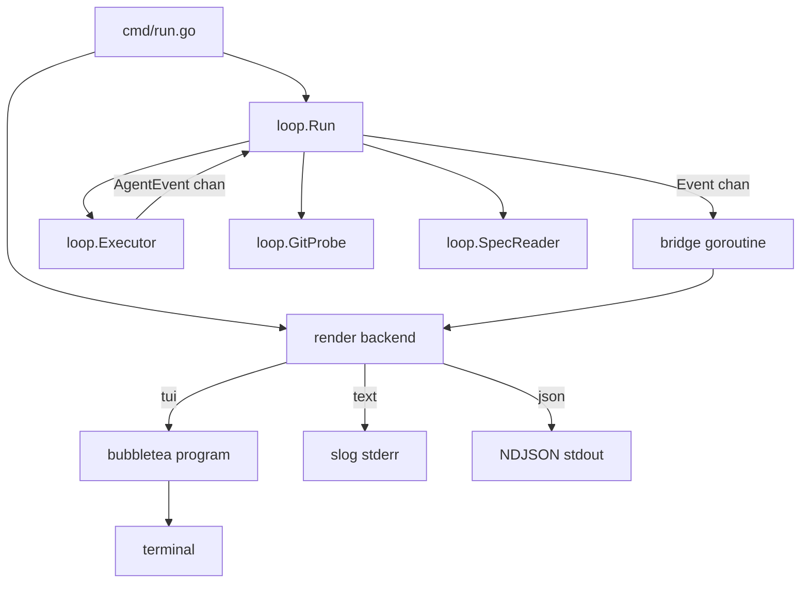

# Phase 2: live TUI in `bcc run`

## Summary

`bcc run <spec>` is a live, observable foreground command. The same invocation drives the iteration loop and renders a dashboard in the terminal: real-time event stream, plan progress, health metrics, and graceful controls (`q` to quit, `space` to pause). The TUI is the default rendering backend. `--output text` emits a structured human log on stderr; `--output json` emits a stable NDJSON event stream on stdout for machine consumers (one `bcc` orchestrating others, CI pipelines, log aggregators). All three modes consume the same normalized event channel; the `Executor` port emits typed events so codex and gemini adapters drop in without TUI changes.

## Context and motivation

`bcc run` drives an autonomous loop that can take minutes to hours. The user must answer two questions at any moment, without typing anything:

1. Is it alive and making progress?
2. If I close the laptop right now, what do I lose?

A streaming log answers neither. A live panel-based dashboard, in the same terminal as the loop, answers both. A dashboard built into `bcc run` (instead of a separate watcher process) means one command, one terminal, one source of truth.

A third use case is structural: when `bcc` itself is invoked by another agent, by another `bcc`, or by a CI pipeline, the human-shaped UI must give way to a machine-readable stream on stdout. Same loop, three rendering backends, one normalized event model.

## Goals and non-goals

### Goals

- [ ] `bcc run <spec>` opens TUI by default; loop runs in the same process, foreground.
- [ ] `--output <mode>` selects the rendering backend: `tui` (default), `text`, `json`.
- [ ] `text` mode: structured human log via `slog` to stderr. Nothing on stdout. Suitable for CI and `tee`.
- [ ] `json` mode: NDJSON event stream on stdout, one event per line. Suitable for `bcc` coordinating other `bcc` instances, log aggregators, custom dashboards. Stable schema.
- [ ] `--verbosity <level>` filters the event stream: `error` | `warn` | `info` (default) | `debug` | `trace`. Each event has an implicit level; the flag drops anything below it before the render backend sees it. Applies to `text` and `json`; ignored for `tui` (TUI panels are already curated). Default `info` is the right shape for orchestrators that want signal without noise.
- [ ] Normalized event model in `internal/loop`: `IterationStarted`, `AgentEventReceived` (Init, Thinking, ToolUse, ToolResult, AssistantText, RateLimit, ResultSummary), `IterationFinished`, `LoopFinished`. All three modes consume the same channel.
- [ ] `Executor` port emits typed events on a channel. Adapters translate native agent formats.
- [ ] Claude adapter: parses Claude Code's `--output-format stream-json` into normalized events. Persists raw stream to `.bcc/logs/<spec-slug>-<iter>.jsonl` for audit. (Raw agent log is per-adapter and distinct from the loop-level NDJSON of `--output json`.)
- [ ] 5-panel TUI layout: header, now/health, progress, risk, recent actions.
- [ ] Visual polish: lipgloss colors, spinner on active tool, progress bar (items checked / total), ETA (rolling iteration time).
- [ ] Controls in TUI: `q` / Ctrl+C (graceful shutdown), `space` (pause between iterations), `?` (help overlay).
- [ ] Loop-suspect heuristic: 7-of-last-10 same `(tool, primary_arg)` flags warning row.
- [ ] Graceful resize, no terminal corruption on exit (panic / signal / kill).

### Non-goals

- Steering (mid-run user messages to the agent). Covered by [Phase 3 steering spec](./2026-04-29-phase-3-steering.md). Requires per-adapter research.
- Separate watcher process or `bcc watch` command. The TUI lives inside `bcc run`.
- External status files or sidecar IPC. The in-process event channel is the only source of truth between loop and render backends.
- Web dashboard, multi-spec view, historical view (Phase 3+).
- Restart/retry of the current iteration from the TUI.
- Schema versioning for `--output json`. The schema is stable from Phase 2 onward and additions must be additive (new event kinds, new optional fields). No `schema_version` field, no negotiation.

## Proposal

### Normalized event model

All event types live in `internal/loop`. Adapters import from here.

Agent-level events (one per agent action):

```go
package loop

type AgentEventKind string

const (
    KindInit          AgentEventKind = "init"
    KindThinking      AgentEventKind = "thinking"
    KindToolUse       AgentEventKind = "tool_use"
    KindToolResult    AgentEventKind = "tool_result"
    KindAssistantText AgentEventKind = "assistant_text"
    KindRateLimit     AgentEventKind = "rate_limit"
    KindResultSummary AgentEventKind = "result_summary"
)

type AgentEvent struct {
    Kind AgentEventKind
    At   time.Time
    Init *InitInfo           // present when Kind == KindInit
    Tool *ToolCallInfo       // present for tool_use / tool_result
    Text string              // present for thinking / assistant_text
    Rate *RateLimitInfo
    Done *ResultSummaryInfo
}
```

Loop-level events wrap agent events plus boundary signals:

```go
type Event interface{ isLoopEvent() }

type IterationStarted struct {
    Index, MaxIter int
    At             time.Time
}

type IterationFinished struct {
    Index        int
    Result       spec.Result    // ok / partial / blocked / done
    HEADAdvanced bool
    NewlyChecked int
    DurationMS   int64
    LogPath      string         // raw agent log for this iteration
}

type AgentEventReceived struct{ Event AgentEvent }

type LoopFinished struct {
    Reason   string             // "spec done" | "max iterations" | "blocked" | "user cancelled" | "fatal"
    ExitCode int
    At       time.Time
}
```

### Event levels (filtered by `--verbosity`)

Every event has an implicit level. The verbosity flag is a low-water mark.

| Level | Events included |
|---|---|
| `error` | `loop_finished` when `exit_code != 0`; `agent_event:tool_result` with `is_error=true` |
| `warn` | + `agent_event:rate_limit` with `status != "allowed"` |
| `info` (default) | + `iter_started`, `iter_finished`, `loop_finished` (any exit code), `agent_event:tool_use`, `agent_event:result_summary` |
| `debug` | + `agent_event:assistant_text`, `agent_event:init`, all `agent_event:tool_result` |
| `trace` | + `agent_event:thinking` (full reasoning text), any internal/diagnostic events added later |

Rationale: `info` is the orchestrator-friendly default. A parent `bcc` watching a child gets one line per iteration boundary, one per tool call, plus cost summaries, plus terminal status. No reasoning text, no per-tool result bodies. To debug a misbehaving child, bump to `debug` or `trace`. To keep CI logs lean, drop to `warn`.

### `--output json` schema

Each loop event serialises to one NDJSON line on stdout. The wire format:

```json
{"type":"iter_started","at":"2026-04-29T14:32:00Z","level":"info","index":3,"max_iter":20}
{"type":"agent_event","at":"...","level":"trace","kind":"thinking","text":"Adjusting parser..."}
{"type":"agent_event","at":"...","level":"info","kind":"tool_use","tool":{"id":"toolu_01","name":"Edit","args":{"file_path":"internal/spec/plan.go"}}}
{"type":"agent_event","at":"...","level":"debug","kind":"tool_result","tool":{"id":"toolu_01","is_error":false,"summary":"file edited"}}
{"type":"agent_event","at":"...","level":"info","kind":"result_summary","done":{"num_turns":12,"total_cost_usd":0.34,"input_tokens":12000,"output_tokens":2300,"duration_ms":42100}}
{"type":"iter_finished","at":"...","level":"info","index":3,"result":"partial","head_advanced":true,"newly_checked":2,"duration_ms":420000,"log_path":".bcc/logs/foo-iter3.jsonl"}
{"type":"loop_finished","at":"...","level":"info","reason":"spec done","exit_code":0}
```

Rules:

1. Stdout carries only NDJSON event lines, post-verbosity filter. No banners, no trailing summary.
2. Stderr carries human diagnostics (`slog` text). In `json` mode, only adapter and loop diagnostics go to stderr, never the user-facing structured events.
3. Exit code mirrors the loop's terminal status (per Phase 1 exit-code table).
4. Schema is additive: new event kinds and new optional fields can be introduced without a version bump. Consumers MUST ignore unknown fields and unknown `type` values.
5. Each emitted event line includes a `level` field (`"error"|"warn"|"info"|"debug"|"trace"`) so consumers can re-filter post-hoc without re-running.

### Executor port

```go
type Executor interface {
    Run(ctx context.Context, prompt string, events chan<- AgentEvent) (ExecResult, error)
}

type ExecResult struct {
    ExitCode int
    LogPath  string  // raw native log, written by adapter
}
```

Cancellation contract: when `ctx` is canceled, the adapter signals the subprocess (typically SIGINT), waits with a bounded grace period before SIGKILL, drains its parser, and returns promptly. The loop forwards a `LoopFinished{Reason: "user cancelled"}` upward.

### Loop entry point

```go
func (l *Loop) Run(ctx context.Context, events chan<- Event) error
```

`cmd/run.go` owns the channel. A small bridge goroutine forwards items into whichever rendering backend is active:

- TUI: bridge converts each `Event` into a `tea.Msg` and feeds the bubbletea program.
- text: bridge calls `slog.Info(...)` per event with structured attributes.
- json: bridge serialises each event to NDJSON and writes to stdout.

### Layout (TUI mode)

```
┌─ bcc ─ feat/foo ─ iter 3/20 ─ 14m32s ───────────────────────┐
│ docs/specs/foo.md                              ●● 🟢 alive  │
└─────────────────────────────────────────────────────────────┘
┌─ now ───────────────────────────────────┐ ┌─ health ────────┐
│ ⠋ Edit internal/spec/plan.go            │ │ heartbeat: 3s ●  │
│   12s in, thought 8s before             │ │ tools/min: 6     │
│                                         │ │ errors (5m): 0   │
│ » "Adjusting parser for empty cells..." │ │ rate: ok         │
│                                         │ │ tokens: 2.3k     │
│                                         │ │ cost: $1.23      │
└─────────────────────────────────────────┘ └──────────────────┘
┌─ progress ──────────────────────────────────────────────────┐
│ P1 ☑☑☑☑   P2 ☑☑☑   P3 ☑☑►☐☐☐☐ (current)   P4 ☐☐☐  P5 ☐☐☐    │
│ ███████████░░░░░░░░  11/20 items, ~6m per iter, ETA ~54m    │
└─────────────────────────────────────────────────────────────┘
┌─ if you close now ──────────────────────────────────────────┐
│ ✓ committed:   P1, P2, 2/7 sub-items of P3 (12 commits)    │
│ ⚠ uncommitted: 3 files (last Edit 12s ago)                 │
│ ⚠ journal:     Result for iter 3 not yet written           │
└─────────────────────────────────────────────────────────────┘
┌─ recent actions ────────────────────────────────────────────┐
│ 14:32:18  Bash  go test ./internal/spec                     │
│ 14:32:05  Edit  internal/spec/plan.go                       │
│ 14:31:47  Read  internal/spec/plan.go                       │
│ 14:31:32  Bash  git status                                  │
│ 14:31:19  Read  docs/specs/foo.md                           │
└─────────────────────────────────────────────────────────────┘
[q]uit  [space]pause  [?]help
```

### Data sources (TUI panels)

| Source | Mechanism |
|---|---|
| Agent events | `loop.Event` channel from in-process loop |
| Iteration boundaries | `IterationStarted` / `IterationFinished` from loop |
| git state (commits ahead, dirty files) | periodic probe via `loop.GitProbe`, every 2s |
| Spec checkboxes | re-parse via `loop.SpecReader`, after each `IterationFinished` |
| Cost / tokens | accumulated from `KindResultSummary` events |

### Heuristics

| Signal | Computation | Display |
|---|---|---|
| Heartbeat | `now - last_event_at` | green < 30s, yellow < 2m, red ≥ 2m |
| Loop-suspect | last 10 `KindToolUse` events: ≥ 7 share `(name, primary_arg)` | warning row in health |
| Errors recent | `KindToolResult` with `IsError=true`, sliding 5m | colored count |
| Rate limit | latest `KindRateLimit` with `Status != "allowed"` | red row |
| Tools/min | rolling 60s rate of `KindToolUse` | number |
| Cost | sum of `KindResultSummary.TotalCostUSD` | currency |
| ETA | `mean(iteration_durations) × items_remaining_in_plan` | human duration |

### Architecture



### Package layout

```
internal/
├── loop/
│   ├── ports.go                  # Executor, GitProbe, SpecReader interfaces
│   ├── events.go                 # AgentEvent, Event, AgentEventKind
│   ├── eventlevel.go             # LevelOf(Event) Level + verbosity filter
│   ├── eventjson.go              # NDJSON serialiser for --output json
│   └── loop.go                   # Loop.Run drives iterations, emits Events
├── executor/claude/
│   ├── claude.go                 # parses stream-json into AgentEvent
│   └── log.go                    # raw stream persistence to .bcc/logs/
└── tui/
    ├── tui.go                    # bubbletea Model/Update/View root
    ├── header.go                 # spec, branch, iter, elapsed, alive dot
    ├── now.go                    # current activity panel
    ├── health.go                 # health metrics panel
    ├── progress.go               # plan checkboxes, progress bar, ETA
    ├── risk.go                   # "if you close now" panel
    ├── actions.go                # recent actions panel
    ├── help.go                   # ? overlay
    └── theme.go                  # lipgloss styles, --no-color support
```

### CLI surface

```bash
bcc run <spec> [flags]
  --output <mode>           # tui (default) | text | json
  --verbosity <level>       # error | warn | info (default) | debug | trace
  --no-color                # disable lipgloss colors (also affects text mode tags)
  --max-iter <n>            # override .bcc.toml [loop].max_iterations
  --refresh-git <ms>        # git probe interval, default 2000
```

## Implementation Plan

### P2.1: event types and Executor contract

1. [x] Add `internal/loop/events.go` with `AgentEvent`, `AgentEventKind`, `Event` interface, and the four loop-level event types. Pure types, no I/O.
1. [x] Set `loop.Executor.Run` signature to `Run(ctx, prompt, events chan<- AgentEvent) (ExecResult, error)`. `loop.Loop.Run` forwards agent events into its own `chan<- Event`.
1. [x] Update the existing fake executor in tests to push canned `AgentEvent`s on the channel.
1. [x] Tests: table-driven loop test asserts the sequence of `Event`s emitted for a known fake transcript.

### P2.2: claude adapter emits typed events

1. [x] `internal/executor/claude/claude.go`: parse stream-json line-by-line into `AgentEvent`. Map every Claude event subtype to a `Kind`.
1. [x] `internal/executor/claude/log.go`: persist raw stream to `.bcc/logs/<spec-slug>-<iter>.jsonl` as the parser reads it. `ExecResult.LogPath` returns the path.
1. [x] Tests: replay a captured stream-json fixture (`testdata/full-iter.jsonl`) and assert the produced `AgentEvent` sequence.

### P2.3: text and json output modes

1. [x] `cmd/run.go`: `--output` flag with values `tui` (default), `text`, `json`; `--verbosity` flag with values `error|warn|info|debug|trace` (default `info`). Build the channel, dispatch to backend.
1. [x] `internal/loop/eventlevel.go`: pure function `LevelOf(Event) Level` mapping each event to its level per the table above. Table-driven test asserts every kind has a level.
1. [x] Verbosity filter: middleware goroutine that reads the loop channel and drops events below the threshold before forwarding to the backend. Backends never see filtered-out events.
1. [x] text backend: drain channel into `slog` lines on stderr with structured attrs. The slog level matches the event level (`Debug`, `Info`, `Warn`, `Error`).
1. [x] `internal/loop/eventjson.go`: marshal each `Event` into the documented NDJSON shape, including the `level` field.
1. [x] json backend: drain channel, write one NDJSON line per event to stdout, flush after each.
1. [x] Verify signal handling: Ctrl+C cancels ctx, loop returns cleanly, exit code preserved across all three modes.
1. [x] Tests: capture stdout for json mode against a fixed fake transcript; assert byte-for-byte expected NDJSON at each verbosity level.

### P2.4: bubbletea skeleton

1. [ ] `internal/tui/tui.go`: `Model` struct holding panel state; `Init()`, `Update(msg)`, `View()`.
1. [ ] Bridge: `tea.Cmd` that reads from `chan loop.Event` and emits a `tea.Msg` per event.
1. [ ] `q` and Ctrl+C cancel the loop ctx, then exit bubbletea cleanly via `tea.Quit`.
1. [ ] `space` toggles a `paused` flag; loop reads a `<-chan struct{}` from TUI before starting next iteration.
1. [ ] Window resize handled (`tea.WindowSizeMsg`). Empty placeholders rendered for all panels.

### P2.5: panels

1. [ ] `header.go`: spec path, branch, iter `n/N`, elapsed-since-start, alive dot.
1. [ ] `now.go`: spinner + current `KindToolUse` formatted per tool (Bash command, Edit file, Read path); time-since calculation; latest `KindAssistantText`.
1. [ ] `health.go`: heartbeat + color; tools/min; errors count; rate limit; tokens; cost.
1. [ ] `progress.go`: phase-by-phase checkbox rendering; current phase marker `►`; lipgloss progress bar (`bubbles/progress`) for `items_checked / total`; ETA from iteration duration history.
1. [ ] `risk.go`: committed (parsed from spec checkboxes + git ahead count); uncommitted (`git status --porcelain` files); journal status (latest `**Result**` parsed vs not).
1. [ ] `actions.go`: last 5 tool calls with timestamps, color-coded by tool kind.

### P2.6: heuristics

1. [ ] Loop-suspect detector: ring buffer of last 10 `(tool, primary_arg)`; threshold ≥ 7/10 same key. Display warning row in health.
1. [ ] Error rate counter: 5-minute sliding window of `IsError=true`.
1. [ ] Tools/min rate: 60-second sliding window.

### P2.7: theming and polish

1. [ ] `internal/tui/theme.go` lipgloss styles. `--no-color` disables color via `lipgloss.SetColorProfile(termenv.Ascii)`.
1. [ ] Help screen: `?` toggles modal overlay listing keybindings.
1. [ ] Manual visual review at 80x24, 120x40, 200x60 terminal sizes.
1. [ ] Terminal restoration on panic: deferred `program.ReleaseTerminal()` plus SIGTERM signal handler.

### P2.8: end-to-end validation

1. [ ] Run `bcc run` on a real one-phase spec with `--output tui`. Confirm panels populate and iteration completes.
1. [ ] Same spec with `--output text`: confirm slog output is readable and exit code matches TUI mode.
1. [ ] Same spec with `--output json`: pipe stdout through `jq -c` and confirm every line parses; exit code matches.
1. [ ] Verbosity sweep: run the same spec at `--verbosity error`, `info`, `trace`; confirm the line counts strictly increase and no line at a lower level disappears at a higher level.
1. [ ] Smoke test "bcc coordinating bccs": small Go program reads NDJSON from `bcc run ... --output json --verbosity info` and prints a one-line summary per `iter_finished`. Demonstrates that `info` is the right default for orchestrators.
1. [ ] Trigger loop-suspect by having the agent grep the same file 8 times; confirm warning appears in TUI.
1. [ ] Synthetic rate-limit event injected via fake executor; confirm red row in TUI and corresponding NDJSON event.
1. [ ] Ctrl+C mid-iteration: confirm clean terminal restore in TUI, no garbage characters; exit code reflects user-cancelled in all three modes.
1. [ ] Resize while running TUI: no clipping or overflow.

## Autonomous execution

This spec follows the [Autonomous execution guide](../../guides/autonomous-execution.md) defaults.

### Done criteria

Default Go criteria (`gofmt`, `go vet`, `go test -race`, `go build`) plus:

1. Manual visual review at 3 terminal sizes confirms no overflow or clipping.
1. End-to-end test in P2.8 succeeds across all three `--output` modes.

### Stop criteria

1. **Success**: P2.1 through P2.8 all `[x]` and end-to-end review passes.
1. **Block**: bubbletea API surprise (terminal restoration, signal handling, channel-into-`tea.Cmd`) that needs design rethink.
1. **Human decision**: layout choices that affect UX (panel ordering, color palette, exact ETA formula). The NDJSON event schema is locked at the start of P2.3 and any change there requires human sign-off.

## Risks and mitigations

| Risk | Likelihood | Impact | Mitigation |
|---|---|---|---|
| TUI + loop goroutines = race conditions | Medium | Medium | Single source-of-truth `Model`; all updates funnel through `Update(msg)`; `-race` flag in tests |
| Terminal corruption on Ctrl+C / panic | Low | High | `tea.NewProgram(...).Run()` deferred restore; SIGTERM handler calls `ReleaseTerminal()` |
| NDJSON schema premature lock-in | Medium | Medium | Schema additive only; consumers ignore unknown fields/kinds; documented in goals |
| Heuristic false positives (loop-suspect on legitimate repetition) | Medium | Low | Tune thresholds during dogfooding; threshold tunable via `.bcc.toml` later |
| Pause semantics confusing (between vs during iter) | Low | Low | UI label says "pause after this iter"; documented in `?` help |
| Stdin contention (TUI reads keys, agent subprocess inherits stdin) | Low | Medium | Adapter explicitly disconnects subprocess stdin (`cmd.Stdin = nil`); TUI owns os.Stdin |
| Large iterations overrun event channel buffer | Low | Low | Channel buffered to 256; on overflow, drop with `slog.Warn` |

## References

- bubbletea: `github.com/charmbracelet/bubbletea`
- lipgloss: `github.com/charmbracelet/lipgloss`
- bubbles: `github.com/charmbracelet/bubbles` (`progress`, `viewport`, `help`, `spinner`)
- Claude Code stream-json format: `claude --output-format stream-json` reference
- Phase 3 steering draft: [2026-04-29-phase-3-steering.md](./2026-04-29-phase-3-steering.md)

## Execution Journal

### 2026-04-29 18:40, P2.3 text and json output modes

- **Result**: ok
- **Summary**: Wired `--output tui|text|json` (default `tui`) and `--verbosity error|warn|info|debug|trace` (default `info`) through `cmd/run.go`. Added `internal/loop/eventlevel.go` (`Level`, `ParseLevel`, `LevelOf`, and the `FilterEvents` middleware), `internal/loop/eventjson.go` (`MarshalJSONEvent`), and `internal/cli/render.go` (mode dispatch + `drainNoop`/`drainText`/`drainJSON`). Text mode reconfigures `slog.Default` to a stderr text handler at the requested level so debug/trace events are not swallowed; loop diagnostics share the handler. JSON mode writes NDJSON to stdout with per-line flush and leaves stderr to slog. TUI mode keeps the no-op drain placeholder until P2.4 wires the bubbletea program. Tests cover the level table (every `AgentEventKind` exercised), filter semantics across the verbosity range, byte-for-byte NDJSON at `--verbosity error` and `--verbosity info`, and the structural drain guarantee across all three modes.
- **Commits**: this commit `loop: typed event levels, NDJSON serialiser, --output and --verbosity render backends`
- **Decisions**: NDJSON encoding goes through `map[string]any` rather than typed wrappers so `encoding/json` sorts keys alphabetically and gives a deterministic line for byte-for-byte tests; future shape changes stay additive per the locked schema. `LevelOf` for `KindRateLimit` returns `LevelWarn` only when `Rate.Status` is non-empty AND not `"allowed"`; the empty/`allowed` case is `LevelDebug` so it does not appear at default `info` verbosity. `FilterEvents` uses a buffered fan-out goroutine (256 each side) and is sender-closes-the-channel on both legs; render goroutines exit when the filtered channel closes. `OutputTUI` mode is intentionally a no-op drain in P2.3; P2.4 replaces it with the bubbletea program. Renamed nothing in pre-existing files; `cli/render.go` and the new `loop/event*.go` files are additive. The Phase 1 cli flag remains `--max-iterations` (the spec's CLI sketch shows `--max-iter`); not changing user-facing flag names in P2.3.
- **Next**: P2.4 (bubbletea skeleton)
- **Notes for observer**: BCC_JSONL_PATH=.bcc/logs/2026-04-29-phase-2-tui-dashboard-iter3.jsonl

### 2026-04-29 14:05, P2.2 claude adapter emits typed events

- **Result**: ok
- **Summary**: Claude adapter now parses `claude --output-format stream-json` line-by-line into `loop.AgentEvent` while persisting the raw line to `BCC_JSONL_PATH`. `Run` switches to `cmd.StdoutPipe` + a scanner goroutine that, for each line, writes the line verbatim to the audit log and forwards every parsed `AgentEvent` on the events channel. `parseLine` handles `system/init`, `assistant` (one event per `content` item: thinking, text, tool_use), `user/tool_result` (string and structured-array content), `rate_limit_event`, and `result`. The default `JSONLDir` moved from `os.TempDir()/bcc` to `.bcc/logs` (project-relative; created lazily by the adapter) so audit logs live next to the project they describe; `.bcc/` is now `.gitignore`d. New unit tests (`parse_test.go`) cover every event kind plus the captured `testdata/full-iter.jsonl` fixture; an end-to-end Run test (`TestRun_StreamsEventsFromFixture`) exercises the streaming pipe path and asserts both the AgentEvent sequence and the audit-log line equivalence.
- **Commits**: this commit `executor/claude: parse stream-json into AgentEvent and persist raw audit log`
- **Decisions**: Removed sub-item "Smoke: run a one-phase spec end-to-end with `--output text`" from P2.2 in this rewrite: `--output text` is born in P2.3 and end-to-end smoke across all output modes is already covered by P2.8 (sub-items 1-3); duplicating it inside P2.2 forced a circular dependency. Parser drops unknown top-level event types silently (forward-compatibility) and drops empty-`thinking` assistant chunks (Claude emits these as signature-only placeholders). `summarizeToolResult` flattens the heterogeneous `content` shape (string or `[{type:"text", text:"..."}]` array) into a plain string with no truncation; downstream renderers (P2.3+) will trim for display. The new audit-log default uses a project-relative path so each project's logs stay co-located; `.gitignore` was updated to keep them out of version control.
- **Next**: P2.3 (text and json output modes)
- **Notes for observer**: BCC_JSONL_PATH=/var/folders/6s/bqzmgmsn5kz7l6ny1r0k17_r0000gp/T/bcc/2026-04-29-phase-2-tui-dashboard-iter2.jsonl

### 2026-04-29 17:30, P2.1 event types and Executor contract

- **Result**: ok
- **Summary**: Added `internal/loop/events.go` with the typed event model (`AgentEvent`/`AgentEventKind` plus `IterationStarted`, `AgentEventReceived`, `IterationFinished`, `LoopFinished`). Switched `loop.Executor.Run` to `Run(ctx, prompt, events chan<- AgentEvent) (ExecResult, error)`. `Loop.Run` now takes `events chan<- Event`, runs an internal pump goroutine that forwards each `AgentEvent` as `AgentEventReceived`, and emits boundary and terminal events; it closes the channel on return. Adapters (claude, fake) return `ExecResult{ExitCode, LogPath}` and write the raw stream to `BCC_JSONL_PATH`. Loop-level test asserts the event sequence is table-driven.
- **Commits**: this commit `loop: introduce typed Event channel and AgentEvent contract`
- **Decisions**: `Loop.Run` keeps `(int, error)` return alongside `LoopFinished.ExitCode` for now; cmd/run still uses the int return while text/json backends are not wired yet (P2.3). Adapters write the raw native log themselves at `BCC_JSONL_PATH` (set by the loop before each iteration); loop no longer creates that file. Fake's `Step.JSONL` renamed to `Step.RawLog`; `Step` gained `Events []loop.AgentEvent`. Loop close-on-return is the canonical sender-closes pattern; tests drain the channel after Run.
- **Next**: P2.2 (claude adapter parses stream-json into AgentEvents)
- **Notes for observer**: BCC_JSONL_PATH=/var/folders/6s/bqzmgmsn5kz7l6ny1r0k17_r0000gp/T/bcc/2026-04-29-phase-2-tui-dashboard-iter1.jsonl
