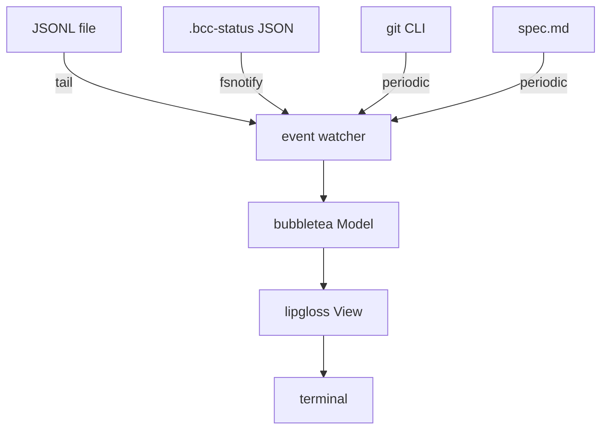

# Phase 2: TUI dashboard

## Summary

Implement `bcc watch <spec>`: a live status dashboard showing what the agent is doing now, loop health, plan progress, and what is at risk if the user closes the terminal. Built with bubbletea + lipgloss + bubbles, reading the JSONL stream produced by `bcc run` plus git state and the spec markdown.

## Context and motivation

Phase 1 makes the loop work but does not solve the original pain: when the user is awake and watching, the bash-style "phase done" black box is too coarse. The user needs to answer four questions in a glance:

1. Is it alive (or stuck)?
2. Is it looping in circles (or making real progress)?
3. Is it blocked by something external (rate limit, network)?
4. What is at risk if I close the laptop right now?

A streaming log is the wrong shape for these questions. A dashboard with fixed panels updating in place (htop style) is the right shape.

## Goals and non-goals

### Goals

- [ ] `bcc watch <spec>` opens in a separate terminal/pane and renders a 5-panel dashboard.
- [ ] Health panel: heartbeat (seconds since last event), tools/min, recent error count, rate-limit status, token/cost accumulator.
- [ ] Activity panel: current tool call, last agent message, time-in-current-action.
- [ ] Progress panel: plan checkboxes per phase, current phase highlighted.
- [ ] Risk panel ("if you close now"): committed vs uncommitted work, journal-entry status for current iteration.
- [ ] Sample stream: last 5-10 tool actions for context.
- [ ] Loop-suspect heuristic: flag when last 10 tool calls are dominated by repeated `(tool, primary_arg)` pairs.
- [ ] Graceful resize, Ctrl+C exits cleanly without corrupting the terminal.
- [ ] Auto-discovers the latest JSONL file for the given spec via the shared status file written by `bcc run`.

### Non-goals

- Embedding the dashboard inside `bcc run` foreground (separate terminal/pane is simpler and more flexible).
- Interactive controls beyond `q` (quit) and `?` (help). Phase 3+ may add `space` (pause), `r` (retry).
- Web dashboard.
- Historical view of past iterations (Phase 3+).
- Multi-spec view (Phase 3+).

## Proposal

### Shared state contract

`bcc run` writes a status file at `<spec_dir>/.bcc-status/<spec_slug>.json`, updated at iteration boundaries. `bcc watch` reads this to discover the active JSONL.

```json
{
  "spec_path": "docs/specs/foo.md",
  "spec_slug": "foo",
  "started_at": "2026-04-29T11:00:00Z",
  "iter_started_at": "2026-04-29T11:14:32Z",
  "iter_current": 3,
  "iter_max": 20,
  "jsonl_current": "/tmp/bcc-foo-iter3.jsonl",
  "last_result": "partial",
  "branch": "feat/foo"
}
```

### Layout

```
┌─ bcc watch ──────────────────────────────────────────────────┐
│ spec: docs/specs/foo.md         iter: 3/20   ●● 14m32s      │
│ branch: feat/foo  (5 commits ahead of main)                  │
└──────────────────────────────────────────────────────────────┘
┌─ now ───────────────────────────────────┐ ┌─ health ─────────┐
│ ▸ Edit internal/spec/plan.go            │ │ heartbeat: 3s ●  │
│   12s ago, thought 8s before            │ │ tools/min: 6     │
│                                         │ │ errors (5m): 0   │
│ » "Adjusting parser for empty cells..." │ │ rate: ok         │
│                                         │ │ tokens out: 2.3k │
│                                         │ │ cost: $1.23      │
└─────────────────────────────────────────┘ └──────────────────┘
┌─ progress ───────────────────────────────────────────────────┐
│ P1 ☑☑☑☑   P2 ☑☑☑   P3 ☑☑►☐☐☐☐ (current)   P4 ☐☐☐   P5 ☐☐☐   │
└──────────────────────────────────────────────────────────────┘
┌─ if you close now ───────────────────────────────────────────┐
│ ✓ committed:   P1, P2, 2/7 sub-items of P3 (12 commits)     │
│ ⚠ uncommitted: 3 files (last Edit 12s ago)                  │
│ ⚠ journal:       Result for iter 3 not yet written            │
└──────────────────────────────────────────────────────────────┘
┌─ recent actions ─────────────────────────────────────────────┐
│ 14:32:18  Bash  go test ./internal/spec                      │
│ 14:32:05  Edit  internal/spec/plan.go                        │
│ 14:31:47  Read  internal/spec/plan.go                        │
│ 14:31:32  Bash  git status                                   │
│ 14:31:19  Read  docs/specs/foo.md                            │
└──────────────────────────────────────────────────────────────┘
```

### Data sources and refresh cadence

| Source | Mechanism | Cadence |
|---|---|---|
| JSONL events | `tail -f` semantics via `os.File` + `bufio.Scanner` polling EOF | Continuous (event-driven) |
| `.bcc-status/<slug>.json` | `fsnotify` on the file | Event-driven |
| git state (`HEAD`, `status --porcelain`, `rev-list main..HEAD --count`) | `os/exec` | Every 2s |
| Spec markdown (plan checkboxes, journal latest result) | Parser from `internal/spec` | Every 5s |

### Heuristics

| Signal | Computation | Display |
|---|---|---|
| Heartbeat | `now - last_event_ts` | Green < 30s, yellow < 2min, red ≥ 2min |
| Loop-suspect | last 10 `tool_use` events: if ≥ 7 share `(name, primary_arg)`, flag | Warning row in health panel |
| Errors recent | count of `tool_result.is_error=true` in last 5min | Number with color (≥ 1 yellow, ≥ 5 red) |
| Rate limit | latest `rate_limit_event.status != "allowed"` | Red row in health |
| Tools/min | rolling 60s rate of `tool_use` | Number |
| Cost | sum of `result.total_cost_usd` across iterations of this spec | Currency |

### Architecture



### Package layout (additions)

```
internal/
├── watcher/
│   ├── watcher.go                # source aggregator, emits Msg into bubbletea
│   ├── jsonl.go                  # tail JSONL, parse events
│   ├── status.go                 # read/watch .bcc-status JSON
│   ├── git.go                    # periodic git probes
│   └── spec.go                   # periodic spec re-parse
└── tui/
    ├── tui.go                    # bubbletea Model/Update/View root
    ├── header.go                 # spec + iter + branch + heartbeat dot
    ├── now.go                    # current activity panel
    ├── health.go                 # health stats panel
    ├── progress.go               # plan checkboxes panel
    ├── risk.go                   # "if you close now" panel
    ├── actions.go                # recent actions panel
    └── theme.go                  # lipgloss styles
```

### CLI surface (Phase 2 additions)

```bash
bcc watch <spec> [flags]
  --jsonl <path>            # explicit JSONL override (skip status discovery)
  --refresh-git <ms>        # git probe interval, default 2000
  --refresh-spec <ms>       # spec re-parse interval, default 5000
  --no-color                # disable lipgloss colors
```

## Implementation Plan

### P2.1: status file producer in `bcc run`

1. [ ] Extend `internal/loop` to write/update `.bcc-status/<slug>.json` at iteration boundaries.
1. [ ] On `bcc run` exit (any path), write final status with terminal reason.
1. [ ] Tests: unit tests for status file writer; smoke test confirms file appears and updates.

### P2.2: watcher package (no UI)

1. [ ] `internal/watcher/jsonl.go`: tail JSONL, parse events into typed structs (Init, RateLimit, Thinking, ToolUse, ToolResult, AssistantText, Result).
1. [ ] `internal/watcher/status.go`: read status JSON, watch via fsnotify, emit on change.
1. [ ] `internal/watcher/git.go`: periodic `git rev-parse HEAD`, `git status --porcelain`, `git rev-list main..HEAD --count`. Use channels.
1. [ ] `internal/watcher/spec.go`: periodic re-parse of plan and latest journal `Result`.
1. [ ] `internal/watcher/watcher.go`: aggregate sources, expose channel of `Update` events.
1. [ ] Tests using a fake JSONL file and a temporary git repo.

### P2.3: bubbletea skeleton

1. [ ] `internal/tui/tui.go`: `Model` struct holding all panel state; `Init()`, `Update(msg)`, `View()`.
1. [ ] Bridge `watcher.Update` events into bubbletea via `tea.Cmd` reading from a channel.
1. [ ] Empty render with all 5 panels showing placeholders. `q`/Ctrl+C exits cleanly.
1. [ ] Window resize handled (`tea.WindowSizeMsg`).

### P2.4: panels

1. [ ] `internal/tui/header.go`: spec, iter, branch, heartbeat dot.
1. [ ] `internal/tui/now.go`: latest tool_use formatted per tool (Bash command, Edit file, etc.); time-since calculation; latest assistant text.
1. [ ] `internal/tui/health.go`: heartbeat seconds + color; tools/min; errors count; rate limit; token/cost.
1. [ ] `internal/tui/progress.go`: phase-by-phase checkbox rendering; current phase marker `►`.
1. [ ] `internal/tui/risk.go`: committed (parsed from spec checkboxes + git ahead count); uncommitted (`status --porcelain` files); journal status (latest `Result` parsed vs not parsed).
1. [ ] `internal/tui/actions.go`: last 5 tool calls with timestamps.

### P2.5: heuristics

1. [ ] Loop-suspect detector: last-10 ring buffer of `(tool, primary_arg)`; threshold ≥ 7/10 same key. Display warning row.
1. [ ] Error rate counter: 5-minute sliding window of `is_error=true` events.
1. [ ] Tools/min rate: 60-second sliding window.

### P2.6: theming and polish

1. [ ] `internal/tui/theme.go` with lipgloss styles. `--no-color` disables color via lipgloss `lipgloss.SetColorProfile`.
1. [ ] Help screen: `?` toggles a modal overlay listing keybindings.
1. [ ] Manual visual review at 80x24, 120x40, 200x60 terminal sizes.

### P2.7: end-to-end validation

1. [ ] Run `bcc run` on a real spec in one tmux pane and `bcc watch` in another. Confirm all panels update; heartbeat ticks; plan checkboxes change as agent commits.
1. [ ] Trigger loop-suspect by having the agent grep the same file 8 times; confirm warning appears.
1. [ ] Test rate-limit display by injecting a synthetic `rate_limit_event` into the JSONL.
1. [ ] Close `bcc run` mid-iteration; confirm `bcc watch` shows red heartbeat and the "journal not written" line in the risk panel.

## Autonomous execution

This spec follows the [Autonomous execution guide](../../guides/autonomous-execution.md) defaults.

### Done criteria

Default Go criteria (gofmt, go vet, go test, go build) plus:

1. Manual visual review at 3 terminal sizes confirms no overflow or clipping.
1. End-to-end test in P2.7 succeeds.

### Stop criteria

1. Success: P2.1 through P2.7 all `[x]` and end-to-end visual review passes.
1. Block: bubbletea API surprise (e.g., terminal restoration on Ctrl+C fails on macOS) that needs design rethink.
1. Human decision: layout choices that affect UX (e.g., panel ordering, color palette).

## Risks and mitigations

| Risk | Likelihood | Impact | Mitigation |
|---|---|---|---|
| bubbletea + fsnotify + goroutines = race conditions | Medium | Medium | Single source-of-truth `Model`; all updates funnel through `Update(msg)`; `-race` flag in tests |
| Terminal corruption on Ctrl+C / crash | Low | High | Always wrap in `tea.NewProgram(...).Start()` with deferred restore; manual SIGINT handler as backup |
| Heuristic false positives (loop-suspect on legitimate repetition) | Medium | Low | Tune thresholds during dogfooding; threshold tunable via `.bcc.toml` later |
| Status JSON race with `bcc run` writing it | Low | Medium | Atomic write (temp + rename) on the producer side |

## References

- bubbletea: `github.com/charmbracelet/bubbletea`
- lipgloss: `github.com/charmbracelet/lipgloss`
- bubbles: `github.com/charmbracelet/bubbles`
- fsnotify: `github.com/fsnotify/fsnotify`

## Execution Journal

(empty until Phase 2 is run)
