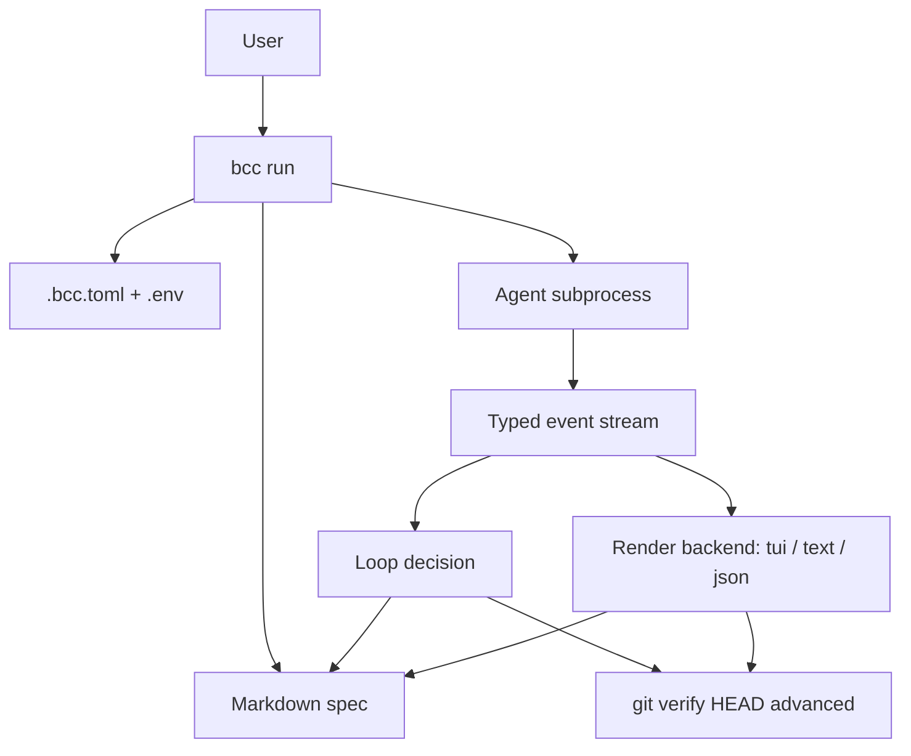
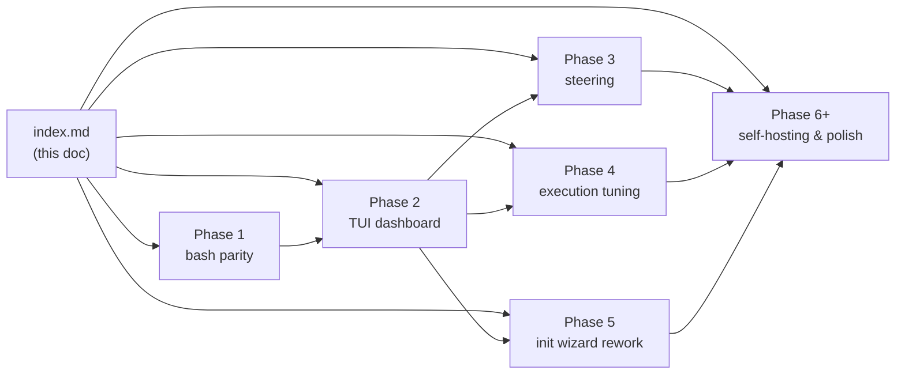

# buchecha MVP

## Summary

Build `bcc`, a Go CLI that replaces shell-script-based agentic loops (Ralph-style) with a single binary, a strict journal-based handoff contract, and a live status TUI. First user is the author (using it on `condo-fiscal`); long-term goal is open-sourcing it as an alternative to ad-hoc shell loops once the product validates.

## Context and motivation

The author runs a shell wrapper (`scripts/exec-spec.sh`, ~280 lines) on top of Claude Code to drive autonomous execution of spec-driven phases. It works, but has structural limits:

1. **No live observability**: invocation is a black box until each phase completes. Hard to tell whether the agent is making progress, looping in circles, or stuck on rate limits.
2. **No portability**: tied to bash, awk, and project-specific conventions in pt-BR.
3. **No distribution path**: can't be shared without users replicating the bash setup, the doc conventions, and the agent configuration manually.

`buchecha` keeps the spec contract that makes the loop work (Plan + Execution Journal, strict `**Result**` parsing, `[x]`/`[ ]` discipline) and rebuilds it as a Go single-binary CLI with:

- `bcc run`: phase-by-phase loop with a live TUI by default. Phase 1 ships parity with the shell script and structured agent-event capture. Phase 2 wraps the loop in a real-time dashboard answering "is it alive, looping, blocked, what is at risk if I close it?", plus `--output text|json` for headless and orchestrator use.
- `bcc init`: interactive wizard to create `.bcc.toml`, supporting localized vocabulary, multiple agent executors (Claude/Codex/Gemini), `.env` loading.
- Eventual self-hosting: once the basics work, new features ship as specs that `bcc` itself runs.

## Architecture overview

## Spec map

## Documents in this initiative

| Document | Type | Status | Summary |
|---|---|---|---|
| [index.md](./index.md) | initiative | draft | This big picture |
| [2026-04-29-phase-1-bash-parity.md](./2026-04-29-phase-1-bash-parity.md) | spec | draft | `bcc run` with full functional parity to `scripts/exec-spec.sh` |
| [2026-04-29-phase-2-tui-dashboard.md](./2026-04-29-phase-2-tui-dashboard.md) | spec | draft | Live TUI built into `bcc run` plus `--output text\|json` for headless / orchestrator use; normalized event model |
| [2026-04-29-phase-3-steering.md](./2026-04-29-phase-3-steering.md) | spec | draft | Mid-run user-to-agent steering via TUI input, capability-gated per executor |
| [2026-04-29-phase-4-execution-tuning.md](./2026-04-29-phase-4-execution-tuning.md) | spec | draft | Per-spec / per-phase tuning (model, effort, MCP scope, planner) resolved via directives + config |
| [2026-04-29-phase-5-init-wizard.md](./2026-04-29-phase-5-init-wizard.md) | spec | draft | `bcc init` rewritten on `huh.Form`: per-field validation, back navigation, review step, accessible fallback |
| Phase 6+ | (placeholder) | future | Self-hosting, multi-agent support, PRD→Spec→bcc flow, releases |
| [2026-04-29-spec-vendor-neutrality.md](./2026-04-29-spec-vendor-neutrality.md) | spec | draft | Carve `internal/spec/` out of the domain; signal-shaped `SpecReader` and `JournalStore` ports so other formats (open-spec, spec-kit, bmad) plug in as adapters. Floating priority. |
| [2026-04-29-skill-spec-authoring.md](./2026-04-29-skill-spec-authoring.md) | spec | draft | Author-side skill: active-phase scoping, `Relevant files` blocks, journal Context-summary block. Floating priority. |
| [2026-04-29-drop-raw-event-log.md](./2026-04-29-drop-raw-event-log.md) | spec | implemented | Drop the per-iteration raw event log file (`.bcc/logs/...`), `BCC_JSONL_PATH`, `ExecResult.LogPath`, and the unused `bcc watch` stub. |

## Cross-cutting decisions

1. **Language**: Go 1.24, managed via mise (`.mise.toml`). Single binary output (`bcc`).
2. **CLI framework**: cobra (mature, idiomatic, widely understood).
3. **Config format**: TOML (`.bcc.toml`), parsed with `github.com/BurntSushi/toml`.
4. **Env loading**: `.env` files via `github.com/joho/godotenv`, with explicit precedence (shell > `[env.vars]` > `.env` files).
5. **TUI framework** (Phase 2): `github.com/charmbracelet/bubbletea` + `lipgloss` + `bubbles`.
6. **License**: MIT.
7. **Dev language**: English for code, comments, docs, commit messages. Localization is a feature of `bcc` itself (specs in any language), not of the codebase.
8. **Stealth period**: repo stays local until the author has used `bcc` daily for at least 4 weeks on real work.
9. **Spec contract**: same as `condo-fiscal/docs/guias/execucao-autonoma.md`, ported to English at `docs/guides/autonomous-execution.md`. Vocabulary is localizable per project via `.bcc.toml`.

## Constraints and dependencies

- **Author availability**: side project, not full-time. Phases scoped to fit in evenings.
- **Agent availability**: requires `claude` (or other) on PATH. `bcc` does not embed agent binaries.
- **Dogfooding constraint**: `bcc` must be usable on `condo-fiscal` (pt-BR specs) without rewriting any spec. Localization is non-negotiable.
- **Stability bootstrap**: until a `bcc`-managed spec runs end-to-end on the `bcc` repo itself, the `condo-fiscal` shell script remains the authoritative tool. No flag day.

## Phases

### Phase 0: Bootstrap (this conversation)

Repo skeleton, templates, this initiative, Phase 1 and Phase 2 specs, first commit. Done by hand (no `bcc` to run yet).

1. [x] Create repo at `~/projects/buchecha` with mise (Go 1.24.2), `go.mod`, MIT license.
1. [x] Set up directory structure: `cmd/`, `internal/{config,spec,loop,executor,git}`, `docs/{specs,adrs,templates,guides}`, `testdata/`.
1. [x] Wire cobra root command and stubs for `run`, `init`. `bcc --help` works.
1. [x] Port doc templates (initiative, spec, prd, adr) to English.
1. [x] Port autonomous execution guide to English at `docs/guides/autonomous-execution.md`.
1. [x] Write this initiative document.
1. [x] Write Phase 1 detailed spec.
1. [x] Write Phase 2 detailed spec.
1. [x] First commit.

### Phase 1: Bash parity

Detailed plan in [2026-04-29-phase-1-bash-parity.md](./2026-04-29-phase-1-bash-parity.md).

Goal: `bcc run <spec>` reproduces the behavior of `scripts/exec-spec.sh` end-to-end, with the same exit codes and the same journal contract. JSONL stream from the agent is captured to a file. No TUI yet. `bcc init` wizard generates `.bcc.toml`. Config supports `[env]` with `.env` files and inline vars.

### Phase 2: TUI dashboard

Detailed plan in [2026-04-29-phase-2-tui-dashboard.md](./2026-04-29-phase-2-tui-dashboard.md).

Goal: `bcc run <spec>` opens a live TUI by default showing real-time activity, plan progress, health, and risk panels. Same process owns the loop and the dashboard. The `Executor` port is refactored to emit a normalized event stream so codex and gemini drop in without TUI changes. `--output text` falls back to structured slog on stderr; `--output json` emits a stable NDJSON event stream on stdout (verbosity-filtered) so a parent `bcc` or any tool can orchestrate child runs.

### Phase 3: Mid-run steering

Detailed plan in [2026-04-29-phase-3-steering.md](./2026-04-29-phase-3-steering.md).

Goal: user injects messages into the live agent conversation via the TUI; capability-gated per executor adapter.

### Phase 4: Execution tuning

Detailed plan in [2026-04-29-phase-4-execution-tuning.md](./2026-04-29-phase-4-execution-tuning.md).

Goal: per-spec and per-phase tuning of model, reasoning effort, MCP scope, and planner enablement, resolved via in-spec directives plus `.bcc.toml`. Surfaces in the TUI header and the `bcc init` wizard.

### Phase 5: Init wizard rework

Detailed plan in [2026-04-29-phase-5-init-wizard.md](./2026-04-29-phase-5-init-wizard.md).

Goal: `bcc init` rewritten on `huh.Form` with per-field validation, multi-group navigation, review step, and accessible fallback. The pure `WriteConfigTOML` writer stays unchanged; only the front-end is replaced. Phase 4's MCP / planner fields land here.

### Phase 6+: Future scope

Placeholders. Specs created when Phase 1 through 5 stabilize.

1. [ ] **Self-hosting validation**: run a `bcc`-managed spec end-to-end on the `bcc` repo itself.
1. [ ] **Multi-agent executor support**: codex, gemini, generic subprocess. Runtime selection via `[executor].agent`.
1. [ ] **PRD → Spec → bcc flow**: `bcc new prd <slug>`, `bcc new spec <slug>` scaffold from templates. Optional `bcc derive spec <prd>` that asks the agent to draft a spec from a PRD.
1. [ ] **Configurable spec/doc templates**: project can override `docs/templates/` defaults; `bcc new` reads them.
1. [ ] **goreleaser + GitHub Actions**: tag-driven releases (Linux, macOS, Windows; arm64 + x64); Homebrew formula auto-generated.
1. [ ] **Public release**: README polish, examples, blog post positioning as Behavior-driven Coding Cycle.

### Floating specs (not phase-numbered)

Specs whose priority is fluid and not part of the holistic phase plan. Pulled into a phase slot when the dogfooding signal calls for them.

- [Spec-format vendor neutrality](./2026-04-29-spec-vendor-neutrality.md): unwind `internal/spec/`'s coupling to bcc-markdown by introducing signal-shaped `SpecReader` / `JournalStore` ports. Pull forward when we want to run `bcc` on a non-bcc-markdown spec, or when a feature would otherwise deepen the coupling.
- [Skill: fast-iteration spec authoring](./2026-04-29-skill-spec-authoring.md): author-side guidance (Relevant files, scoped phases, journal Context summary) packaged as a Claude Code skill. Independent of the framework; can land any time.
- [Drop the per-iteration raw event log](./2026-04-29-drop-raw-event-log.md): remove the `.bcc/logs/<slug>-iter<n>.jsonl` artifact, the `BCC_JSONL_PATH` env var, `ExecResult.LogPath`, the `log_path` NDJSON field, and the unused `bcc watch` stub. Small, isolated; pull forward whenever.

## Open questions

- [ ] Naming of the journal contract keyword for "spec fully done": `done` (English), or `finished`? Picked `done` for brevity; revisit if it conflicts with something common.
- [ ] Plug-in surface for custom heuristics (e.g., "loop-suspect" detector) in Phase 3+. TBD.
- [ ] Handling of `.bcc.toml` discovery: walk up from cwd to find one (like `git`), or require `--config` flag? Lean toward walking up.

## References

- `condo-fiscal/scripts/exec-spec.sh`: source bash wrapper this initiative replaces.
- `condo-fiscal/docs/guias/execucao-autonoma.md`: source contract this initiative ports to English.
- Charm bubbletea: `github.com/charmbracelet/bubbletea`.
- Cobra: `github.com/spf13/cobra`.

## Execution Journal

Most recent entries on top. Contract in [Autonomous execution guide](../../guides/autonomous-execution.md#execution-journal).

### 2026-04-29 11:00, Phase 0: Bootstrap

- **Result**: ok
- **Summary**: Repo skeleton, cobra-wired CLI stubs (`run`, `init`, `watch`), English-adapted doc templates, autonomous-execution guide, this initiative, and detailed specs for Phase 1 and Phase 2 written. `bcc --help` builds and runs. Done by hand (no `bcc` to run yet).
- **Commits**: c203021 init: repo skeleton, cobra-wired CLI stubs, initiative and Phase 1/2 specs
- **Decisions**: Adopted cobra after initial preference for stdlib `flag` (3+ subcommands + interactive wizard make cobra the right call). Single binary output via `go build -o bcc .`; `cmd/bcc/main.go` arrangement deferred. License MIT. Dev language English; localization is a runtime feature via `.bcc.toml`. Repo stays local until 4-week dogfooding period passes.
- **Next**: Phase 1 (bash parity)
