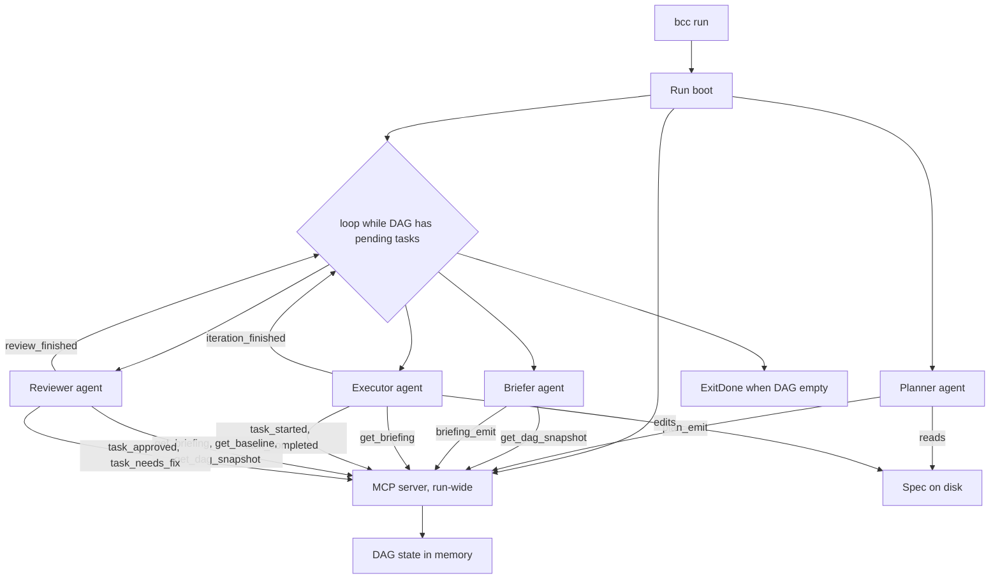

# PRD 5: Executable plan as a DAG, MCP-mediated communication

## Summary

The Director's plan is a directed acyclic graph of **phases and tasks**, where tasks are the atomic units of work and progress. Director roles (Planner, Briefer, Reviewer) are interactive read-only agents with the same tool envelope: `Read`, `Bash`, `Grep`, `Glob`, plus access to the bcc MCP server. The bcc MCP server is **run-wide**, has a **real handler** with per-method schema validation and per-connection authorization, and is the **single protocol of record** between agents and bcc. All agent output (plan emission, briefing emission, verdict emission, task progress) and all agent context queries (current briefing, pending tasks, DAG snapshot, diff, journal delta) flow through MCP method calls. The iteration loop is DAG-driven: it advances while pending tasks remain, picking sub-DAG slices per iteration, and terminates when the DAG has no pending tasks.

This PRD supersedes the original phase-only / parser-based design that an earlier iteration of the Director shipped. The phase-only granularity and parser-based wire protocol are the two design choices this document corrects.

## Context

### What PRD 2 left implicit

PRD 2 framed the unit of execution as the phase: each iteration of the loop runs the Executor on one phase, then the Reviewer on the same phase. `AcceptanceItem` was the finest grain. The Executor was instructed by a self-contained briefing, then evaluated against a self-contained verdict.

That framing makes two implicit assumptions that do not survive contact with realistic specs:

1. **Phases are an opaque unit of progress.** A phase that contains five tasks succeeds or fails together. If three pass and two need rework, the loop has no language to express "advance the three, retry the two." The Reviewer's verdict is whole-phase, and retry is whole-phase. The user pays for re-running the work that already passed.
2. **The work the spec describes is exactly the work the Executor needs to attempt.** In practice, the Executor benefits from a curated subset: which task right now, with which acceptance criteria, against which scope. PRD 2's Briefer attempts this per phase, but the unit of selection is still "the next phase," not "the next batch of tasks."

The fix is to make **tasks** the atomic DAG nodes, and let the Briefer pick a sub-DAG per iteration. Phases become containers that group tasks for human reading and high-level scope discipline.

### The parser-based wire protocol

The MVP shipped a wire protocol where the agent emits `tool_use` envelopes in stream-json carrying `mcp__bcc__task_started`, `mcp__bcc__task_completed`, and `mcp__bcc__iteration_result`: Bcc parses those envelopes (`internal/executor/claude/claude.go::parseAssistant` plus `internal/loop/agentcontract/agentcontract.go::FromToolCall`) and converts them to `BccEvent` values that drive the loop.

The MCP server (`internal/mcp/server.go`) was registered as a hook the agent's CLI accepts (`--mcp-config` plus `--strict-mcp-config`), but its handler is a stub: it responds `"ok"` to every `tools/call`. The server exists so the agent emits the tool envelope on the wire; the protocol of record is the parser.

This is fragile in three ways:

1. **Vendor-locked.** The parser depends on Claude's stream-json shape. Codex, Gemini, or any future adapter would each need a parallel parser.
2. **No server-side validation.** The agent can emit a malformed `iteration_result` and the parser will accept it; bcc has no place to reject early with a structured error the agent can read and correct.
3. **No bidirectional context.** The agent cannot ask bcc questions ("what is my current briefing?", "which tasks of mine are still pending?"). It works from the prompt content alone, which forces bcc to inline state at prompt-time.

A real MCP handler removes all three. The investment that already exists in the MCP server becomes the protocol; the parser becomes informational.

## Hypothesis

If bcc represents the plan as a DAG of tasks, runs Director roles as interactive agents with read-only tools, and routes every agent-to-bcc and bcc-to-agent communication through a real MCP handler, then:

1. The loop converges per task instead of per phase, with finer-grained retry and no wasted re-work on already-passing tasks.
2. The protocol is vendor-agnostic: any agent CLI that supports MCP can drive bcc unchanged.
3. The Director can audit and correct itself mid-run by polling MCP state, instead of carrying everything in the prompt.

## Architecture overview



bcc remains the orchestrator at the process and state layer: it owns the loop, persistence, UI, and the MCP server. The Director is the cognitive layer; the Executor does the work. Both communicate through the same MCP surface, scoped per role.

## Plan model

A `Plan` is the structured output of the Planner role, validated server-side by the MCP handler before it becomes the source of truth.

The plan is a **two-level DAG**: a phase-level DAG ordering coarse units of work, with each phase owning a task-level DAG of atomic units. **Tasks live inside phases.** Cross-phase task dependencies are not representable: if task `b1` in phase `B` depends on task `a1` in phase `A`, the right encoding is "phase B depends on phase A" plus the appropriate task-level dependencies inside each. This keeps the Executor's contract clear: every iteration's sub-DAG is drawn from a single phase, and the phase's `scope_in` / `scope_out` apply uniformly.

```
Plan
├── goal: string
├── success_criteria: []string         (high-level, derived from the spec; not checkable)
└── phases: []Phase
```

```
Phase
├── id: string                          (stable identifier)
├── title: string
├── intent: string                      (why this phase exists)
├── depends_on: []phase_id              (DAG edges between phases)
├── priority: int
├── scope_in: []string                  (paths or directories)
├── scope_out: []string                 (explicit guards)
└── tasks: []Task                       (the phase owns its tasks)
```

```
Task
├── id: string                          (stable identifier; unique within its phase)
├── title: string
├── intent: string
├── depends_on: []task_id               (DAG edges within the same phase only)
├── priority: int
├── acceptance: []AcceptanceItem        (checkable criteria for this task only)
├── status: TaskStatus                  (initial: pending)
└── retry_budget: int                   (defaults from config; can override per task)
```

```
TaskStatus = "pending" | "in_progress" | "done" | "needs_fix"
AcceptanceItem = { id, description, evidence }     evidence ∈ {diff, test, build, manual}
```

**Identifier scoping.** Phase ids are unique within the plan. Task ids are unique within their owning phase, not globally. When MCP methods reference a task, they use a tuple `(phase_id, task_id)` or a fully qualified id like `phase_id/task_id`; the handler accepts either and normalizes.

**Validation rules.** The handler rejects a `Plan` that:

1. Has no phases, or has a phase with no tasks.
2. Contains a phase whose `id` is duplicated, or a phase whose tasks have a duplicate `id`.
3. Contains a phase-level `depends_on` entry that does not resolve to an existing phase id.
4. Contains a task-level `depends_on` entry that does not resolve to a task id within the same phase.
5. Forms a cycle in the phase-level DAG.
6. Forms a cycle in any phase's internal task-level DAG.

When the handler rejects, it returns a structured error to the calling agent with the offending ids, and the agent is expected to correct and re-emit. The MCP method `plan_emit` is idempotent in its acceptance: a successful emit replaces any prior plan in the session; a rejected emit leaves the session in its previous state.

## Director role envelope

All three Director roles (Planner, Briefer, Reviewer) are invoked with the same execution envelope:

1. Tool allowlist: `Read`, `Bash`, `Grep`, `Glob`. No `Edit`, `Write`, `NotebookEdit`, `MultiEdit`. Enforced at the agent CLI layer.
2. Permission flag: `--dangerously-skip-permissions`, required for the agent to fire tools without an interactive prompt.
3. MCP wiring: `--mcp-config <per-role-config>` and `--strict-mcp-config`, pointing at the run-wide MCP server with a connection name keyed to the role.
4. No `--json-schema` flag. All structured output flows through MCP method calls, not stdout JSON.
5. Spec input: only the absolute `spec_path` is passed in the prompt. The role reads the spec via the `Read` tool. bcc never inlines spec content.
6. Absolute restrictions: the `absolute_restrictions` partial is composed into every Director prompt and remains non-negotiable.
7. **Agent identity.** Every spawned agent receives a unique `agent_id` (an opaque string assigned by bcc, e.g. `planner-001`, `briefer-007`, `reviewer-iter12`, `executor-iter12-shard0`). The agent_id is embedded in the role's prompt; the agent passes it back on every MCP call. The handler maintains an agent registry keyed by id and uses it to scope responses and enforce per-agent authorization.

The Executor role retains its existing envelope: full tool access via `--dangerously-skip-permissions`, and the run-wide MCP wiring with the `bcc-executor` connection name. The Executor also receives an `agent_id` per spawn, on the same contract.

The Director itself is **read-only on the codebase as a behavior contract**. The tool allowlist enforces no direct writes; `Bash` remains open under prompt and `absolute_restrictions` discipline.

### Why `agent_id` on every call

The `agent_id` parameter on every MCP method is a **forward compatibility hook for parallelism** (PRD 3). Today bcc runs one Director role and one Executor at a time, so a globally scoped handler would work; the registry is technically redundant. Tomorrow, when bcc runs `N` Executors in parallel against independent sub-DAGs of independent phases, the handler must know which agent is asking in order to:

1. Return only the asking Executor's briefing on `get_briefing(agent_id)`.
2. Return only the asking Executor's pending tasks on `get_pending_tasks(agent_id)`.
3. Reject mutations that target tasks outside the calling agent's assigned scope (`task_completed(agent_id, task_id)` rejects if `task_id` is not in `agent_id`'s sub-DAG).
4. Attribute audit log entries to the right agent.

Adding the parameter now costs one field per method call. Retrofitting it later would require a wire-protocol break on every existing integration.

## Run-wide MCP server

The MCP server is started once at the boot of `bcc run` and shared across every Director and Executor invocation in that run. It binds to `127.0.0.1:0` over HTTP loopback with a 32-byte hex bearer token.

The server's constructor takes a `Handler` that dispatches incoming `tools/call` requests by method name. Each method has a JSON Schema that the handler validates before calling the dispatch function. Validation errors are returned to the caller as structured MCP error objects, not 500s.

**Per-role connection authorization.** Each role connects with a distinct connection name configured in its `mcp-config` file: `bcc-planner`, `bcc-briefer`, `bcc-reviewer`, `bcc-executor`. The handler's dispatch table maps method names to the set of connection names allowed to call them. A Reviewer attempting to call `task_completed` (an Executor method) is rejected with an authorization error. A Planner attempting to call `briefing_emit` is likewise rejected.

The handler is the source of truth for the in-memory DAG state. Every mutation (`bcc_task_*`, `plan_emit`, `briefing_emit`) takes the DAG mutex, applies the change, releases the mutex, and (asynchronously) persists a snapshot to disk.

## MCP method surface

Each method has a JSON Schema in `internal/director/schemas/mcp/`. Inputs and outputs below are summary form; the schema is normative. Every method takes `agent_id: string` as its first parameter; the handler validates that the id is registered with the role indicated by the connection name and rejects mismatches with a structured error.

### Planner methods

- `task_started(agent_id, id: string)`: Reports a task start. The Planner uses this with `id: "planning"` so planning is tracked on the timeline as a regular task.
- `task_completed(agent_id, id: string, summary?: string)`: Reports a task finish. Same usage pattern.
- `plan_emit(agent_id, plan: Plan)`: Emits the Plan. The handler validates schema, validates the DAG (acyclic, ids resolve), persists the plan, initializes DAG state with all tasks set to `pending`, and returns `{ok: true}`. On invalid input, returns `{ok: false, error: {message, details}}`. The Planner is expected to read the error and re-emit a corrected plan.

### Briefer methods

- `get_dag_snapshot(agent_id)`: Returns the current DAG state including each phase's status and each task's `status` and `retry_budget`. The Briefer sees the full plan; it is the role responsible for choosing the next eligible phase and the sub-DAG of tasks within it.
- `briefing_emit(agent_id, briefing: Briefing)`: Emits the Briefing for the next iteration. The handler associates the emitted briefing with the Executor agent_id that bcc spawns next, so subsequent Executor queries return this briefing.

```
Briefing
├── iteration_id: string                (assigned by the handler on first emit per iteration)
├── phase_id: string                    (the single phase this iteration targets)
├── sub_dag_task_ids: []task_id         (tasks within the phase to attempt this iteration)
├── instructions: string                (free-form guidance for the Executor)
├── spec_path: string                   (absolute path)
└── prior_feedback: string?             (rendered from prior verdict feedback or user hint)
```

The handler validates: (1) `phase_id` resolves to an existing phase; (2) the phase is eligible (its phase-level `depends_on` are all satisfied; that is, every referenced phase has every task `done`); (3) every `sub_dag_task_ids` entry resolves to a task within `phase_id`; (4) those tasks have status `pending` or `needs_fix`; (5) within the sub-DAG, every intra-phase task dependency is either also in the sub-DAG or already `done`. A briefing that mixes tasks across phases is rejected with a structured error.

### Executor methods

- `get_briefing(agent_id)`: Returns the Briefing assigned to this Executor. The Executor calls this on entry to recover its assignment, and may re-call mid-run if it loses context. The handler looks up the briefing associated with `agent_id` in the registry.
- `get_pending_tasks(agent_id)`: Returns the subset of the Executor's `sub_dag_task_ids` whose current status is still `pending` or `needs_fix`. Useful in retry attempts where some tasks already succeeded. Scoped to the calling agent's sub-DAG only.
- `task_started(agent_id, id: string)`: Marks a task as `in_progress`. The handler rejects calls where `id` is not in `agent_id`'s assigned sub-DAG.
- `task_completed(agent_id, id: string, summary?: string)`: Marks a task as `done`. Scope-checked against `agent_id`'s sub-DAG.
- `iteration_finished(agent_id, signal: "review" | "done" | "blocked", summary?: string)`: Marks the end of this Executor's invocation. `done` is informational under the Director (the Director, not the Executor, declares the run complete); the Executor uses `review` at the natural end of its work.

### Reviewer methods

- `get_briefing(agent_id)`: Returns the Briefing the Reviewer is auditing. The handler associates each spawned Reviewer agent_id with the Executor's briefing it follows.
- `get_dag_snapshot(agent_id)`: Returns DAG state scoped to the phase the Reviewer is auditing.
- `get_baseline(agent_id)`: The phase-scoped baseline SHA and current HEAD for inspection. The handler returns `{phase_id, phase_baseline_sha, current_head_sha}`; the Reviewer uses Bash (git diff/log/show) to examine the cumulative work of the phase.
- `get_journal_delta(agent_id)`: Text appended to the spec's journal section during the audited iteration. The handler computes this from the spec format adapter on demand.
- `task_approved(agent_id, id: string, note?: string)`: Marks a task as `done` (post-review). Scope-checked against the audited sub-DAG. May be called multiple times during the review.
- `task_needs_fix(agent_id, id: string, feedback: string)`: Returns a task to `needs_fix` with a per-task feedback string. Scope-checked.
- `review_finished(agent_id, outcome: "approve" | "revise" | "escalate", reasoning?: string)`: Marks the end of this Reviewer's invocation. `approve` requires every task in the audited sub-DAG to be `done`. `revise` requires at least one task in `needs_fix`. `escalate` requires `reasoning` non-empty.

The handler enforces cross-method invariants on `review_finished`: outcome and per-task state must agree, otherwise the call is rejected.

### Internal loop methods

Some handler methods are not invoked by an agent at all; they are called by the bcc loop itself, on a dedicated `bcc-loop` connection. The loop's connection name is allow-listed for these methods only; agents cannot call them.

- `bcc_force_approve_pending(briefing_id: string)`: Synthesizes `done` for every task in the named briefing's sub-DAG that is not already `done`. Used by the loop when the user resolves an escalation with `force_approve`. The audit log records the call with `role: "user"` so the chain remains traceable.

### Agent registration and id assignment

bcc maintains an in-memory registry `agentID → {role, assignedBriefingID?, assignedSubDAG?, registeredAt}`. Lifecycle:

1. Before spawning an agent, bcc generates a fresh `agent_id` (e.g. `<role>-<iteration>-<shard>`), registers it with the appropriate role, and (for Executor and Reviewer) associates it with the briefing it will work on.
2. The id is embedded in the agent's prompt: a clear, prominent line like "Your agent_id is `executor-iter12-shard0`. Pass this on every MCP call."
3. The agent passes `agent_id` on every method call.
4. The handler validates: id exists in registry; the registered role matches the connection name (rejecting cross-role spoofing); for scope-checked methods, the requested resource lies within the agent's assignment.
5. When the agent invocation finishes (process exits), bcc deregisters the id. Subsequent calls with that id are rejected.

The registry is in-memory only; on resume, ids are regenerated for the next round of spawns. There is no need to persist agent_ids across runs.

## Polling protocol

The MCP transport is request-response, not push. bcc cannot interrupt the agent to inform it that state has changed. The polling pattern compensates: the prompt for each role instructs the agent to call MCP at specific moments.

Required polling per role:

1. **On entry**: every role calls a context-recovery method. Planner reads the spec via `Read`. Briefer calls `get_dag_snapshot`. Executor calls `get_briefing`. Reviewer calls `get_briefing` and `get_baseline`.
2. **At task boundaries**: Executor calls `task_started` before working on a task and `task_completed` after. Reviewer calls `task_approved` or `task_needs_fix` per task it audits.
3. **Before retry**: in retries within an iteration, Executor calls `get_pending_tasks` to see which sub-DAG tasks remain.
4. **On exit**: Executor calls `iteration_finished`. Reviewer calls `review_finished`. Planner calls `plan_emit`. Briefer calls `briefing_emit`.

The prompt template for each role enumerates these moments. Failure to call the required methods is detected by the loop driver: if the Executor exits without `iteration_finished`, the loop treats the iteration as `blocked`. If the Reviewer exits without `review_finished`, the loop treats the review as `escalate`.

## DAG iteration model

The loop is DAG-driven. Each iteration targets a sub-DAG drawn from a single eligible phase.

```
1. dag = current DAG state (initially: every task pending)
2. while dag.has_pending():
3.     iteration = new iteration id
4.     briefer_id = register("briefer-iter<n>")
5.     run Briefer with agent_id=briefer_id:
6.         get_dag_snapshot(briefer_id)
7.         pick the next eligible phase (deps satisfied, has pending tasks)
8.         pick a sub-DAG of tasks within that phase (intra-phase deps satisfied)
9.         briefing_emit(briefer_id, {phase_id, sub_dag_task_ids, ...})
10.    for attempt in 1..1+retry_budget:
11.        executor_id = register("executor-iter<n>-shard0", briefing=...)
12.        run Executor with agent_id=executor_id:
13.            get_briefing(executor_id), task_started/completed*(executor_id, task_id),
14.            iteration_finished(executor_id, review)
15.        reviewer_id = register("reviewer-iter<n>-shard0", briefing=executor_id's)
16.        run Reviewer with agent_id=reviewer_id:
17.            get_briefing(reviewer_id), get_baseline(reviewer_id), get_dag_snapshot(reviewer_id),
18.            task_approved/needs_fix*(reviewer_id, task_id, ...),
19.            review_finished(reviewer_id, outcome)
20.        if every sub-DAG task is done: break (advance iteration)
21.        if outcome is escalate or attempt == 1+retry_budget: pause for user
22.    on user resume / force_approve / skip / abort: act on DAG state
23.    advance to next iteration
24. terminate with ExitDone
```

In serial mode there is one Executor and one Reviewer per iteration; the `shard0` suffix is decorative. In parallel mode (PRD 3), the loop spawns multiple Executors per iteration with distinct agent_ids and distinct sub-DAGs in independent worktrees, then one or more Reviewers, then reconciles. The protocol is unchanged.

The retry budget is per task within a sub-DAG. A task that reaches `needs_fix` rewinds to `pending` and is included in the next attempt of the same iteration. The Executor (via `get_pending_tasks`) sees only the tasks still needing work. When the sub-DAG settles (every task `done`), the iteration advances. A phase is `done` when every one of its tasks is `done`; only then does the Briefer consider phases that depend on it eligible.

A phase whose tasks span multiple iterations is normal: the Briefer may choose a sub-DAG that covers only some of the phase's tasks, complete those, then return to the same phase on the next iteration to pick up the rest. Crossing into a different phase only happens after the current phase is fully `done`.

## Termination

`ExitDone` when `dag.has_pending() == false` and the last review outcome was not `escalate`. `ExitInvalid` if the Planner cannot produce a valid plan, or if the user aborts. Escalation pauses the loop and waits for user input; on `force_approve`, the handler synthesizes a `done` status for the still-pending sub-DAG tasks (no agent involvement) and the loop continues.

The four escalation options are: `resume_with_hint(hint)` (next iteration's briefing prepends the hint to `prior_feedback`), `force_approve` (DAG mutation; iteration advances), `skip` (mark the sub-DAG tasks as `done` without approval; final exit may be `ExitInvalid` if the run cannot prove every task done by approval), `abort`.

## UI contract

The TUI consumes the loop event stream. The handler emits a loop event for every successful MCP method call (with method name, role, and payload summary), and the TUI renders these as a timeline. The first task on the timeline is the Planner's `task_started("planning")` / `task_completed("planning")` pair; subsequent iterations show their sub-DAG slice in a dedicated panel with each task's status. Cumulative cost per role is reported from the agent's own cost-summary stream-json events (informational).

The TUI never reads the parser's `BccEvent` stream as the source of truth; it reads the handler's mutation log. If the parser observes a `tool_use` envelope and the handler has no corresponding call recorded, that is a bug, not a wire-protocol path.

## Persistence

Per-session layout (extending session isolation from corrections P1):

```
.bcc/sessions/<session-id>/
├── manifest.json                   Session{ID, SpecPath, CreatedAt, UpdatedAt, Status}
├── plan.json                        Plan as emitted by Planner
├── dag.json                         DAG state snapshot (rewritten per mutation)
├── briefings/<iteration-id>.json    Briefing per iteration
└── mcp-log.jsonl                    Append-only log of MCP calls (optional, on by default)
```

`dag.json` is rewritten atomically (write to tmp, rename) on every mutation. The DAG is small enough (kilobytes for hundreds of tasks) that this cost is negligible.

`mcp-log.jsonl` is the audit trail. Each line is a JSON record with timestamp, role, method, input, and result. Useful for post-run debugging, regression replays, and verifying that every tool_use observed in stream-json has a corresponding handler entry.

Resume reconstructs from `manifest.json` plus `dag.json` (current state) plus `plan.json` (canonical plan). `mcp-log.jsonl` is used for audit only, not for state reconstruction.

## Compatibility

The MVP wire protocol (`internal/loop/agentcontract/agentcontract.go::FromToolCall` plus `internal/executor/claude/claude.go::parseAssistant`) is **demoted to informational**. bcc continues to observe `tool_use` envelopes in stream-json for UI tracing and cost reporting. The protocol of record is the MCP handler.

The contract is: every `tool_use` observed in stream-json with the `mcp__bcc__` prefix must correspond to a successful (or rejected, recorded as such) handler call within a small time window. A divergence is a bug. A test in CI walks recent sessions and verifies the alignment.

The existing `wire_protocol.md` partial is rewritten as the user-facing manual for using MCP from inside the agent. It documents the per-role method surface and the polling pattern, not "emit JSON line on stdout."

## Risks and mitigations

| Risk | Mitigation |
|---|---|
| Concurrent mutations race in DAG state (Reviewer and Executor write the same task across roles) | Single mutex on the DAG state; every handler dispatch takes the mutex. Dispatch is short (no I/O during the critical section); the mutex is uncontended in practice. |
| Role spoofing across MCP connections (Reviewer pretends to be Executor) | Per-role connection name in `mcp-config`; handler validates connection name against the method's allowed set. The bearer token alone is not sufficient; the connection name is the role assertion. |
| Sub-DAG abandonment on escalation (tasks left in `in_progress`) | Resume reconciles every `in_progress` task back to `pending` on session reopen. The next iteration's Briefer sees the pending set and re-selects. |
| Excessive polling inflates cost | Prompts cap polling: at-entry, before-retry, on-exit. Documented in the wire-protocol partial. The handler can additionally rate-limit if observed in production. |
| Plan size grows unbounded for very large specs | The DAG state is small per-task; the Plan itself is bounded by spec size. If pathological, the Briefer can choose smaller sub-DAGs to keep iteration scope tight. |
| Schema evolution breaks ongoing sessions | Schemas live in `internal/director/schemas/mcp/`. Backward-incompatible changes require a session manifest version field; the handler rejects mismatched versions on resume. |

## Open questions

- [ ] **Per-role MCP authorization granularity.** Is per-method authz sufficient, or do some methods need argument-level authz (e.g., the Reviewer can only `task_approved` tasks within the active iteration's sub-DAG)? Proposal: argument-level invariants enforced in the handler, not in the connection-name authz layer.
- [ ] **Spec format adapter and journal delta.** `get_journal_delta` is format-specific. Where does the format adapter live? Proposal: it lives where Executor briefing already does (`internal/format/<adapter>/`) and the handler calls into it via a new port.
- [ ] **Polling fairness.** Should the handler enforce a minimum interval between polls of the same method by the same connection? Proposal: no; trust the prompt; observe and add if needed.
- [ ] **Force-approve audit shape.** How does the synthesized verdict on `force_approve` look in `mcp-log.jsonl`? Proposal: a synthetic record with `role: "user"` and method `bcc_force_approve` so the chain remains complete.
- [ ] **Resume after partial Briefer failure.** If the Briefer crashes between `get_dag_snapshot` and `briefing_emit`, the next session has DAG state but no briefing. Proposal: resume restarts the Briefer for the iteration; the snapshot read is idempotent.

## References

- [Initiative index](./index.md)
- [Spec: Reviewed execution corrections](./2026-05-02-reviewed-execution-corrections.md)
- Spec validation gate: tracked in [issue #1](https://github.com/fgmacedo/buchecha/issues/1)
- Parallel phase execution: tracked in [issue #2](https://github.com/fgmacedo/buchecha/issues/2)
- Capability-aware execution: tracked in [issue #3](https://github.com/fgmacedo/buchecha/issues/3)
- `internal/mcp/`: the MCP server that becomes the protocol substrate
- `internal/loop/agentcontract/wire_protocol.md`: rewritten as the MCP usage manual
