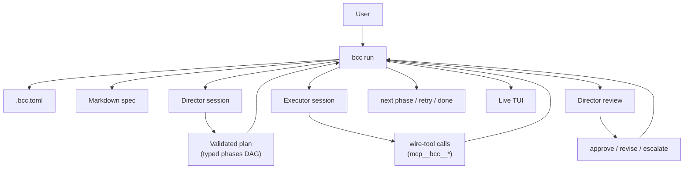
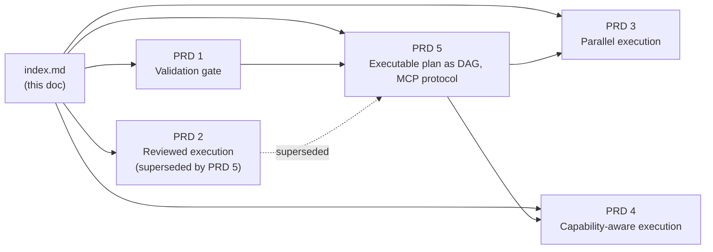

# Director: orchestrated planning and review

## Summary

bcc today runs one agent on a loop: read spec, do next phase, write journal, exit. Long, ambitious specs expose the limit of that model. A single agent session that has to plan, execute, and self-review accumulates context until it loses focus, drifts, declares "done" prematurely, or quietly skips requirements. The human picks up the supervision tax: tracking what is done vs. left, noticing drift, redirecting, ensuring quality. This initiative proposes a second AI role inside bcc, called the **Director**, that owns the supervision work the human is doing today. The Director plans, briefs, and reviews; the Executor does. bcc remains the host: it owns the loop, persistence, UI, and the protocol between roles.

The user-facing concept the author had in mind is the *orchestrator pattern*: a planning and supervising AI on top of executing AIs. We name the role **Director** in code and docs because bcc itself is already an orchestrator at the process layer; using a distinct word for the cognitive layer keeps both readable.

## Context and motivation

### The supervision tax

Running a multi-hour spec on Claude Code (or Codex, or Gemini) reveals a pattern. The first iterations are crisp: the agent reads the spec, picks the next phase, makes a focused commit. After hour two or three, behavior degrades. Scope expands to "while I'm here, let me also". Acceptance criteria get reinterpreted. The agent declares a phase complete when half the criteria slipped. The journal entry says `ok` but the diff says otherwise. None of this is malice; it is the natural decay of one context window asked to hold the full state of an ambitious project.

The human compensates. They re-read the spec to remember what was promised. They diff each commit. They paste corrective feedback. They cancel and restart with a tighter scope. The pattern is identifiable: the human becomes the planner and reviewer the agent cannot reliably be for itself.

### Why a single agent cannot be its own supervisor

Bigger context windows are not the answer. The problem is one attention budget asked to hold both the ground-level "what am I editing right now" and the bird's-eye "are we still on track for the goal". Anchoring effects, recency bias, and the agent's reasonable preference for closing the loop in front of it push toward "ship it" rather than "did this actually meet the criteria". A separate session, with a different prompt and a different scope of context, can ask the question the executor cannot ask itself.

This is not a Claude limitation. It is structural to autoregressive agents working a long task.

### Why bcc is the right place to solve it

bcc already separates the loop from the agent. The MVP introduces the wire protocol, the journal contract, and the TUI. Adding a Director is an additive change to the existing architecture: a new port, a new adapter, a new prompt template. No vendor we depend on needs to change. The Director can run on the same model as the Executor, on a cheaper one, on a more capable one, or on a different vendor entirely. Vendor neutrality is preserved by construction.

### Why now (and what stays out)

The Director loop is post-MVP. The MVP delivers parity, observability, and the wire protocol. The Director assumes those primitives work. We do not block MVP on this initiative; we set the direction so that MVP decisions do not foreclose it.

This initiative is **not** a multi-agent framework. It is one extra role with a narrow brief: plan, brief, review. We resist the urge to add planner sub-agents, critic sub-agents, or arbitrary tool-use surfaces. The discipline that keeps bcc small stays.

## Hypothesis

If bcc runs a Director session alongside the Executor, with the Director responsible for:

1. **Validating** the spec is executable before the loop starts (acceptance criteria are concrete, cross-cutting concerns are addressed, open questions are flagged),
2. **Planning** execution as a typed graph of phases with explicit dependencies and acceptance criteria, replacing "go do the next item" with "go do these tasks, with this scope, against these criteria",
3. **Reviewing** each phase's output against the criteria the Director itself set, with the authority to send the phase back for another pass with concrete feedback,

then the human supervision time per session drops, the rate of premature `ok` declarations drops, and the loop converges on real specs that today require the human to babysit.

The same machinery, once it works serially, unlocks **parallel** execution: independent phases in the planning graph can run in separate worktrees with independent Executor sessions and a single reconciliation pass.

## Architecture overview

bcc is still the orchestrator at the process layer. The Director is the cognitive layer above the Executor: it decides what to attempt, what to check, when to escalate. The Executor is unchanged in shape; it gets a sharper, smaller brief per session.

### Director responsibilities (and non-responsibilities)

The Director:

1. Reads the user's spec.
1. Produces a **validation report** (issues, suggested patches, confidence to proceed).
1. On user approval (or auto-proceed), produces a **canonical plan** as a typed DAG of phases.
1. For each phase, **assigns an executor configuration** (model tier, reasoning effort, optionally agent family) drawn from the capability registries published by the configured Executor adapters.
1. For each phase, packages a **briefing**: scope, files of interest, acceptance criteria, out-of-scope guard, distilled context from prior phases, plus the executor assignment.
1. After the Executor completes a phase, produces a **review verdict**: approve, revise (with feedback), escalate (to user).
1. On revise, the same phase runs again with feedback bundled, and the Director may upgrade the executor assignment if the failure mode points to capability rather than misunderstanding. After N revises, escalates.
1. Maintains the plan state: which phases are done, which are queued, which depend on which.

The Director does **not**:

1. Edit user files. The Executor does the editing.
1. Run `git` operations that mutate state. bcc owns those.
1. Talk to the user freely. It produces structured outputs that bcc renders in the TUI.
1. Re-read the codebase per iteration. It works from the spec, the plan, and the prior verdicts. Code-level investigation is the Executor's job.

### Protocol with bcc

The Director communicates with bcc through a **structured tool surface** owned by bcc, in the same spirit as MCP tool calls. bcc gives the Director a small, controlled set of tools:

- `propose_validation_report(report)`
- `propose_plan(plan)` (each phase carries an `executor_assignment`)
- `propose_phase_briefing(phase_id, briefing)`
- `propose_review(phase_id, verdict, feedback, next_assignment?)`
- `request_user_input(question, options)` (escalation only)

The Director does not free-form. Every meaningful output is a typed payload bcc can validate, render, and persist. This mirrors the existing wire-tool discipline on the Executor side (the agent reports progress and signal by calling `mcp__bcc__*` tools served by bcc's in-process MCP server) and gives the TUI exactly what it needs to display Director state.

### Capability registry on the Executor side

Each Executor adapter (claude, codex, gemini, future) publishes a typed **capability registry** that lists its available models with structured metadata: tier, reasoning-effort levels, capability flags, cost tier, and a short description. bcc merges the registries of configured adapters and passes them to the Director at planning time. The Director assigns per-phase executor configuration (tier, effort, optionally family) drawn from the merged registry; the adapter is responsible for translating those abstract values into vendor-native flags. This keeps vendor specifics on the adapter side and lets the Director reason in framework-owned terms. Full mechanism in [PRD 4](./2026-04-30-capability-aware-execution.md).

## Spec map

PRDs are ordered by ambition and dependency. PRD 1 ships value alone (no execution-time changes). PRD 5 introduces the steered loop with a DAG executable plan and MCP-mediated communication, superseding the phase-only / parser-based design originally proposed in PRD 2. PRD 3 and PRD 4 are siblings building on PRD 5: parallelism on the time axis, capability assignment on the resource axis. Either can ship first.

## Documents in this initiative

| Document | Type | Status | Summary |
|---|---|---|---|
| [index.md](./index.md) | initiative | draft | This vision document |
| [2026-04-30-spec-validation-gate.md](./2026-04-30-spec-validation-gate.md) | prd | draft | Pre-flight Director pass that scores a spec for executability and proposes patches |
| [2026-04-30-reviewed-execution.md](./2026-04-30-reviewed-execution.md) | prd | superseded | The original Director loop proposal (phase-only granularity, parser-based wire protocol). Superseded by PRD 5. |
| [2026-04-30-parallel-phase-execution.md](./2026-04-30-parallel-phase-execution.md) | prd | draft | Independent phases run in parallel worktrees with a Director-driven reconciliation |
| [2026-04-30-capability-aware-execution.md](./2026-04-30-capability-aware-execution.md) | prd | draft | Executor adapters publish capability registries; Director assigns per-phase model and effort |
| [2026-04-30-research-claude-integration-surfaces.md](./2026-04-30-research-claude-integration-surfaces.md) | reference | draft | Claude Code integration surfaces (hooks, plugins, channels, tools, CLI) mapped to PRD opportunities |
| [2026-05-02-reviewed-execution-implementation.md](./2026-05-02-reviewed-execution-implementation.md) | spec | superseded | The original implementation spec executed against PRD 2. Superseded by the corrections spec below. |
| [2026-05-02-executable-plan-dag.md](./2026-05-02-executable-plan-dag.md) | prd | draft | PRD 5: plan is a DAG of phases and tasks; all communication flows through a real MCP handler; loop is DAG-driven |
| [2026-05-02-reviewed-execution-corrections.md](./2026-05-02-reviewed-execution-corrections.md) | spec | draft | Migration spec from the current implementation to PRD 5: sessions, DAG types, run-wide MCP, all-roles tools, MCP method surface, DAG-driven loop, four-option escalation, wire-protocol partial rewrite |

## Cross-cutting decisions

1. **Default: on.** Under PRD 5 the Director loop is the default behavior of `bcc run`. The MVP one-shot loop is no longer reachable from the CLI; the Director plans, briefs, executes, and reviews on every invocation.
1. **Per-component opt-in.** Validation (PRD 1), parallelism (PRD 3), and capability assignment (PRD 4) are independently toggleable. The reviewed-execution loop itself (PRD 5) is always on.
1. **Vendor agnostic.** The Director runs against any bcc adapter (claude, codex, gemini). Director prompt and tool surface live in `internal/director/`, not in any executor adapter.
1. **Director model is configurable separately from Executor.** Common deployments will pair a stronger Director with a cheaper Executor, but the framework does not assume that pairing.
1. **Capability registry as adapter contract.** Every Executor adapter publishes a typed registry of its available models and capabilities. The Director reasons in framework-owned abstractions (tier, effort, capability flags); the adapter translates to vendor-native flags. Adding a new model is a one-file change in the adapter.
1. **No silent overrides.** When the Director changes scope (e.g., re-orders the plan after a review) or escalates the executor assignment on retry, bcc records the change in the journal and surfaces it in the TUI. The user can always trace why a phase ran and on which model.
1. **Plan persistence.** The canonical plan plus the in-memory DAG state are persisted under `.bcc/sessions/<session-id>/` (`plan.json` and `dag.json`) so `--resume <session-id>` recovers state without re-planning. Each `bcc run` is a discrete session.
1. **Spec is normative, plan is derived.** When the user wants to replan against an edited spec, they end the current run and start a fresh one (or resume with `--resume`, which detects spec-hash divergence and triggers the replan flow). bcc does not watch the spec mid-run.
1. **User overrides win.** Per-spec directives (MVP Phase 4) and CLI flags trump the Director's executor assignment. The Director is the smart default, not the boss.
1. **Director never relaxes [absolute_restrictions](../../../internal/loop/agentcontract/absolute_restrictions.md).** No `git push`, no force operations, no credential access. The Director cannot grant the Executor permissions the framework forbids, regardless of which model it assigns.

## Risks and mitigations

| Risk | Mitigation |
|---|---|
| Cost: 2-3x token spend per phase (validate + brief + review) | Cost reporting in the TUI; per-spec budget in config; staged opt-in (start with validation only, the cheapest layer); capability assignment (PRD 4) tends to lower the per-phase floor by routing trivial phases to smaller models |
| Latency: extra round-trips before/after each phase | Director runs concurrently with bcc bookkeeping where possible; user can disable review for fast iteration |
| The Director itself drifts on long plans | Director is stateless across phases. It re-reads the (small) plan state and the (small) prior verdict per call. It does not accumulate session context. |
| Parallel worktrees produce merge conflicts | Reconciliation phase is a Director-led merge step with explicit conflict criteria; falls back to serial on unresolvable conflicts |
| Plan diverges from a moving codebase | Director re-validates against the current spec before each tick; user-visible warning when re-planning |
| User loses confidence ("what is the Director doing?") | TUI panel dedicated to Director state; every Director call logged to the journal with verdict, assignment, and reasoning summary |
| Capability registries become stale (vendors release new models faster than PRs land) | Treat registries as best-effort metadata, updated per release; CLI flag override always available as escape hatch |
| Director becomes a feature creep magnet | This initiative scopes four PRDs and stops there. Additional roles (critic, refactor agent, etc.) are explicitly out of scope. |

## Success metrics

Measured against representative long specs (the bcc repo itself, condo-fiscal phases, future trial users).

| Metric | Today (MVP) | Target with Director enabled |
|---|---|---|
| Human supervision time per spec hour | full attention | <= 25% attention |
| Premature `ok` rate (phases marked done that need rework) | qualitative; high on long specs | < 10% |
| Mean iterations to converge on a phase | varies | reduced; reviews catch drift before next phase |
| Wall-clock for parallelizable specs (PRD 3) | linear in phase count | sub-linear; bound by longest critical path + reconciliation cost |
| Token cost per representative long spec (PRD 4) | high (single-model floor) | reduced 30-50% via tier-aware routing of trivial phases |

These are directional targets; concrete instruments are defined per PRD.

## Open questions

- [ ] Director model defaults: do we ship a recommended pairing (stronger Director + cheaper Executor), or stay neutral?
- [ ] When Director and Executor disagree on whether a phase is done, who wins by default? (Proposed: Director, with override flag.)
- [ ] Mid-phase sampling: does the Director peek at the Executor's stream during long phases, or only at boundaries? (Proposed: boundaries only by default; sampling is a follow-up question for PRD 2.)
- [ ] How the Director declares "the whole spec is done" vs. handing back to the user. (Proposed: Director can only signal `done` when every phase in the plan has an approved review.)
- [ ] Failure escalation UX: a single user-prompt blocks the loop. Do we batch escalations, or always interrupt?
- [ ] Director and Executor running on different vendors: any sharp edge in the wire protocol or briefing format that breaks?
- [ ] Capability assignment trust: by default, does the Director get to escalate to a more expensive model on retry without confirmation, or only within a configured cap? (Proposed: free below cap, prompt above.)

## References

- [buchecha MVP initiative](../buchecha-mvp/index.md): the platform this builds on.
- [Spec-format vendor neutrality](../buchecha-mvp/2026-04-29-spec-vendor-neutrality.md): wire protocol the Director-Executor channel reuses.
- [Skill: fast-iteration spec authoring](../buchecha-mvp/2026-04-29-skill-spec-authoring.md): author-side complement to the validator (PRD 1).
- `internal/loop/agentcontract/`: canonical wire protocol shared by Executor and (forthcoming) Director adapters.
