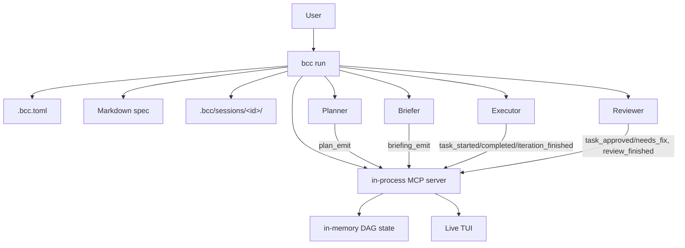
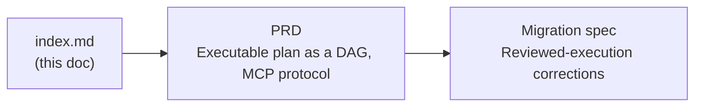

# Director: orchestrated planning and review

## Summary

`bcc run` invokes a Director that plans, briefs, and reviews on top of a per-task Executor. The Director owns the supervision work that a single agent on a long spec performs poorly: tracking what is done versus what remains, noticing drift, redirecting, ensuring quality. The Executor does the work. bcc is the host: it owns the loop, the per-session state, the UI, and the MCP-mediated protocol between roles.

The user-facing concept is the orchestrator pattern, a planning and supervising AI on top of executing AIs. We use the name **Director** in code and docs because bcc itself is already an orchestrator at the process layer; using a distinct word for the cognitive layer keeps both readable.

## Context and motivation

### The supervision tax

Running a multi-hour spec on Claude Code (or Codex, or Gemini) reveals a pattern. The first iterations are crisp: the agent reads the spec, picks the next item, makes a focused commit. After hour two or three, behavior degrades. Scope expands to "while I'm here, let me also". Acceptance criteria get reinterpreted. The agent declares an item complete when half the criteria slipped. None of this is malice; it is the natural decay of one context window asked to hold the full state of an ambitious project.

Without a Director the human compensates: re-reading the spec, diffing each commit, pasting corrective feedback, canceling and restarting with a tighter scope. The pattern is identifiable: the human becomes the planner and reviewer the agent cannot reliably be for itself.

### Why a single agent cannot be its own supervisor

Bigger context windows are not the answer. The problem is one attention budget asked to hold both the ground-level "what am I editing right now" and the bird's-eye "are we still on track for the goal". Anchoring effects, recency bias, and the agent's reasonable preference for closing the loop in front of it push toward "ship it" rather than "did this actually meet the criteria". A separate session, with a different prompt and a different scope of context, can ask the question the executor cannot ask itself.

### Why bcc is the right place to solve it

bcc owns the loop, persistence, and the MCP server that mediates communication between roles. Adding a Director is an additive change to that architecture: a new role with its own prompt, registered through the same MCP method surface every other role uses. Vendor neutrality is preserved by construction.

This initiative is **not** a multi-agent framework. It is a small set of well-defined roles (Planner, Briefer, Executor, Reviewer) that share one in-memory DAG of tasks and one audit log. Additional roles (critic, refactor agent, etc.) are out of scope.

## Architecture overview

bcc is still the orchestrator at the process layer. The Director roles are the cognitive layer above the Executor: they decide what to attempt, what to check, when to escalate. The Executor is the role that edits files, runs commands, and commits. Roles communicate exclusively through the run-wide MCP handler; bcc never inlines spec content into prompts (each role reads the spec via the Read tool with the `SpecPath` it received).

### Role responsibilities

The **Planner** reads the spec and emits a typed Plan via `plan_emit`: phases, tasks, dependencies, per-task acceptance criteria, retry budgets. The Plan is a DAG, not a list.

The **Briefer** picks the next sub-DAG inside an eligible phase, packages a Briefing (instructions, sub-DAG task ids, prior feedback if retrying), and emits it via `briefing_emit`. The Reviewer's previous feedback rides into the next briefing as `prior_feedback`; on user escalation, the user's hint is prepended.

The **Executor** consumes the Briefing through MCP queries (`get_briefing`, `get_pending_tasks`), edits the working tree, calls `task_started`/`task_completed` per task, and reports the iteration outcome via `iteration_finished`.

The **Reviewer** audits each task in the sub-DAG against its acceptance criteria using `get_baseline`, `get_journal_delta`, and `get_dag_snapshot`. It reports outcomes via `task_approved` / `task_needs_fix` and closes with `review_finished` (`approve` / `revise` / `escalate`).

bcc itself does not edit files, does not run `git` mutations beyond the head reads, does not talk to the user freely, and does not re-read the spec at runtime. It runs the MCP server, persists DAG state and audit log to `.bcc/sessions/<id>/`, drives the loop, and renders the TUI.

### Sessions

Each `bcc run` is a session with a stable id. State lives at `.bcc/sessions/<id>/`: `manifest.json`, `plan.json`, `dag.json`, `briefings/<iteration_id>.prompt.md`, `mcp-log.jsonl`. `bcc sessions list` and `bcc sessions show <id>` surface session state. `--resume` rebuilds DAG state from `dag.json` and continues; on spec hash divergence, the user is offered a re-plan.

### Escalation

Four options, surfaced in the TUI and stdin gate:

- `resume_with_hint`: retry the iteration; the hint propagates as `prior_feedback`.
- `force_approve`: the still-pending sub-DAG tasks are marked `done` synthetically; the audit log records `role: "user", method: "bcc_force_approve"`.
- `skip`: advance past the unapproved phase; the run cannot end with `ExitDone` if any phase was skipped.
- `abort`: terminate with `ExitInvalid`.

## Spec map

The PRD describes the normative model; the migration spec describes the eight phases that brought the implementation to that model. Both are kept here as the canonical reference.

## Documents in this initiative

| Document | Type | Status | Summary |
|---|---|---|---|
| [index.md](./index.md) | initiative | approved | This vision document |
| [2026-05-02-executable-plan-dag.md](./2026-05-02-executable-plan-dag.md) | prd | approved | Plan is a DAG of phases and tasks; all communication flows through a real MCP handler; loop is DAG-driven |
| [2026-05-02-reviewed-execution-corrections.md](./2026-05-02-reviewed-execution-corrections.md) | spec | done | Implementation spec executed in eight phases (P1-P8): sessions, DAG types, run-wide MCP, all-roles tools, MCP method surface, DAG-driven loop, four-option escalation, wire-protocol partial rewrite |
| [2026-05-03-capability-aware-execution.md](./2026-05-03-capability-aware-execution.md) | prd | done | Per-phase capability assignments: each adapter publishes its model registry; the Planner attributes model+effort to Briefer/Executor/Reviewer per phase, and may emit a `prepared_briefing` to skip the Briefer agent on mechanical phases |

## Cross-cutting decisions

1. **Director is the only loop.** `bcc run` plans, briefs, executes, and reviews on every invocation. There is no opt-out.
1. **Vendor agnostic.** The Director runs against any bcc executor adapter (claude, codex, gemini). Director prompts and tool surface live in `internal/director/`, not in any executor adapter.
1. **Director model is configurable separately from Executor.** Common deployments will pair a stronger Director with a cheaper Executor, but the framework does not assume that pairing.
1. **No silent overrides.** When the Director changes scope (e.g., re-orders the plan after a review) or escalates on retry, bcc records the change in the audit log and surfaces it in the TUI. The user can always trace why an iteration ran the way it did.
1. **Plan persistence.** The canonical plan plus the in-memory DAG state are persisted under `.bcc/sessions/<session-id>/` (`plan.json` and `dag.json`) so `--resume <session-id>` recovers state without re-planning.
1. **Spec is normative, plan is derived.** When the user wants to replan against an edited spec, they end the current run and start a fresh one (or resume with `--resume`, which detects spec-hash divergence and triggers the replan flow). bcc does not watch the spec mid-run.
1. **Director never relaxes [absolute_restrictions](../../../internal/loop/agentcontract/absolute_restrictions.md).** No `git push`, no force operations, no credential access. The Director cannot grant the Executor permissions the framework forbids, regardless of which model it assigns.

## Risks and mitigations

| Risk | Mitigation |
|---|---|
| Cost: extra round-trips per iteration (plan + brief + review) | Cost reporting in the TUI; per-spec budget in config; capability-aware assignment (future) routes trivial tasks to smaller models |
| Latency: extra calls before/after each iteration | Roles run in sequence; the Briefer and Reviewer are stateless across iterations and do not accumulate context |
| The Director itself drifts on long plans | Director is stateless across iterations. It re-reads the (small) DAG state and the (small) prior verdict per call. It does not accumulate session context. |
| Audit log size grows large for long runs | Single-file JSONL with per-line records; `[director].mcp_audit = false` disables auditing for very long runs |
| User loses confidence ("what is the Director doing?") | TUI panel dedicated to Director state; every MCP call recorded in `mcp-log.jsonl` with role, method, and result |

## Future work

Tracked as enhancement issues:

- **Spec validation gate**: pre-flight pass that scores a spec for executability before the Planner runs.
- **Parallel phase execution**: independent phases run in parallel worktrees with a Director-driven reconciliation.

## References

- `internal/director/`: Plan, Phase, Task, Briefing types; Planner / Briefer / Reviewer ports.
- `internal/director/dag/`: in-memory DAG state, agent registry, MCP handler dispatch.
- `internal/director/prompts/`: per-role embedded prompts.
- `internal/director/schemas/mcp/`: per-method JSON schemas validated server-side.
- `internal/loop/agentcontract/wire_protocol.md`: per-role MCP usage manual composed into prompts.
- `internal/mcp/`: stdlib HTTP MCP server with per-connection authorization.
