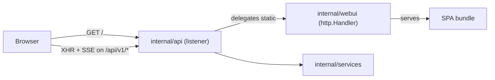

# PRD: Embedded web dashboard

## Summary

`bcc run --webui` enables a single-page application embedded in the binary, mounted on the bcc HTTP API's listener at `/` and `/assets/*`. The dashboard is the bcc presentation surface for browsers, peer to the bubbletea TUI in the terminal.

The dashboard is a pure presentation adapter. It owns no listener, no authentication, no business logic, no domain services. It contributes one `http.Handler` that serves the embedded SPA bundle. Every data call from the SPA goes to the bcc HTTP API on the same origin. Business operations the dashboard exposes to the user are HTTP calls to the API, which routes them through `internal/services/`.

The dashboard depends on the bcc HTTP API (PRD at `docs/specs/api/2026-05-04-http-api.md`). The API depends on `internal/services/`. Neither imports `internal/webui/`.

## Roadmap

| Version | Capability |
| --- | --- |
| **V1** | Read-only inspection: DAG view, Activity Gantt, RightPane (Timeline + Inspector views), CostMeter header component, briefing and prompt rendering, sessions sidebar. The observability surface (spawn events, per-spawn prompt inspection, cost aggregation) is specified in [`docs/specs/webui/2026-05-05-observability-redesign.md`](./2026-05-05-observability-redesign.md). |
| **V2** | Write parity with the TUI: task approval and rejection, escalation reply, phase skip, run abort. Available when API V2 mutating endpoints ship. |
| **V3+** | Extended manipulation: edit tasks, edit prompts, replan from here, manage archived sessions. Available when API V3+ endpoints ship. |

The dashboard's roadmap tracks the API's. Every dashboard capability is an SPA composition over an API endpoint. The dashboard introduces no Go-side endpoint of its own at any version.

## Layering

The dashboard sits in the presentation layer. See `docs/specs/api/2026-05-04-http-api.md` for the full layering diagram (presentation, protocol, application services, domain core, resource adapters).



The browser loads the SPA from the API listener. Subsequent requests from the SPA hit `/api/v1/*` on the same origin: same listener, same port, same cookie, no CORS.

## Position in the architecture

`internal/webui/` is a top-level package. It:

- Exposes `New() http.Handler` returning a handler that serves the embedded SPA bundle at `/` and `/assets/*`.
- Embeds `web/dist/` via `//go:embed`.
- Imports stdlib only.
- Does not import `internal/api/`, `internal/services/`, or any domain or resource adapter.

The composition root in `internal/cli/` instantiates the webui handler and passes it to the API server, which mounts it at `/` on the API's listener. The dashboard does not own a listener. It does not configure a bind, host, port, or authentication.

## Package layout

```
internal/webui/
├── handler.go       # New() http.Handler; serves /, /assets/*; mountable on any mux
├── embed.go         # //go:embed web/dist/*
├── proxy.go         # reverse proxy to Vite dev server (--webui-dev mode)
└── web/
    ├── package.json
    ├── package-lock.json
    ├── vite.config.ts
    ├── tsconfig.json
    ├── tailwind.config.ts
    ├── index.html
    ├── public/
    │   └── fonts/
    └── src/
        ├── main.tsx
        ├── app.tsx
        ├── routes/
        │   ├── live.tsx
        │   └── archived.tsx
        ├── components/
        │   ├── header/
        │   ├── dag-view/
        │   ├── activity-view/
        │   ├── timeline-panel/
        │   ├── briefing-panel/
        │   └── sessions-sidebar/
        ├── hooks/
        │   ├── use-snapshot.ts
        │   └── use-events.ts
        ├── lib/
        │   ├── api-client.ts   # generated from internal/api/openapi.json at SPA build time
        │   └── events.ts
        └── styles/
            └── tokens.css
```

The Vite plugin reads `internal/api/openapi.json` at SPA build time and generates `lib/api-client.ts`. Contract changes that break the SPA fail the build.

The SPA uses relative URLs (`/api/v1/*`). The browser attaches the API's authentication cookie automatically. There is no API base URL to discover and no token to inject.

## CLI and configuration

| Flag | Short | Argument | Default |
| --- | --- | --- | --- |
| `--webui` | `-w` | none | off |
| `--webui-open` | `-W` | none | off |

`--webui` enables the dashboard. It implicitly enables `--api` if the user has not enabled it explicitly. The implicit API uses its default bind (`127.0.0.1:0`). To customize the bind, the user passes `--api` with the desired address.

`--webui-open` launches the user's default browser at the API's URL once the listener is up.

`.bcc.toml`:

```toml
[webui]
enabled = true   # default false. Implicitly enables [api] if not already set.
open    = false  # default false. Auto-open browser on startup.
```

There is no `bind` under `[webui]`. Bind belongs to `[api]`. CLI flags override TOML.

### Combinations

- Neither flag, nothing in TOML: no HTTP listener (only MCP).
- `--api` only: API listens; `/api/v1/*` responds; `/` returns `404`.
- `--webui` only: API auto-starts on default bind; SPA mounts at `/`; `/api/v1/*` responds.
- Both set: honored as configured.

### Compatibility with `--output`

Orthogonal. Any combination is supported. The API documents the startup banner; the dashboard adds nothing to it.

## Frontend stack

### Build

- **Vite** with the React plugin.
- **React 19** with TypeScript.
- **Tailwind v4** for utility classes, configured CSS-first with design tokens in CSS variables.

### UI primitives

- **Radix UI primitives** (tooltip, dialog, scroll area, select, popover) for accessibility, styled by the project.
- **No shadcn/ui.**

### Visualizations

- **`@xyflow/react`** for the DAG view. Custom node types for `Phase` (container) and `Task` (leaf). Edges for phase-level and task-level dependencies. Layout via `dagre`. User position overrides preserved per session in `localStorage`.
- **Visx** for the Activity Gantt and the header sparkline. Imports limited to `@visx/scale`, `@visx/axis`, `@visx/shape`, `@visx/group`, `@visx/text`, `@visx/responsive`. Recharts, Nivo, and Tremor are rejected.

### Animation

**Motion** for state transitions: task status changes, panel reveals, timeline entry insertion. Animation as legibility, not decoration.

### Markdown and code

- **`react-markdown`** for briefings, prompts, and reviewer feedback.
- **`shiki`** for syntax highlighting. Languages included: `go`, `markdown`, `json`, `bash`, `toml`, `typescript`.

### Typography

- **Geist Sans** for body and UI labels.
- **Geist Mono** for code, identifiers, paths, hashes.
- **Instrument Serif** (alternative: **Fraunces**) for display moments.

Fonts self-hosted in `web/public/fonts/`.

### Theme

Dark only in V1. Palette:

- **Background**: warm near-black, approximately `oklch(15% 0.01 60)`.
- **Foreground**: warm off-white, approximately `oklch(96% 0.01 80)`.
- **Accent**: a single signature hue.
- **Status palette**: derived from the same color system as the accent.

### API client

`src/lib/api-client.ts` is generated from `internal/api/openapi.json` at SPA build time. Hand-written request/response types are forbidden. When the API ships breaking changes under `/api/v2/`, the SPA bumps to v2 by regenerating the client and adapting calls.

Mutating endpoints (V2+) are called through the same generated client. The dashboard does not implement any business logic for mutations; it sends the documented request and renders the response.

## Build pipeline

```makefile
.PHONY: webui webui-clean

webui:
	cd internal/webui/web && npm ci && npm run build

webui-clean:
	rm -rf internal/webui/web/dist internal/webui/web/node_modules

build: webui
	go build -o bcc ./cmd/bcc
```

`make webui` reads `internal/api/openapi.json` to generate the TypeScript client. The full chain is `api-openapi → webui → go build` (defined in the API PRD).

`internal/webui/web/dist/` is gitignored. A `web/dist/.gitkeep` placeholder keeps `//go:embed web/dist/*` valid on a fresh clone. CI runs `make webui` before `go build`.

Node version pinned via `.mise.toml`.

`--webui-dev` flag swaps the embedded SPA handler for a reverse proxy to the Vite dev server on `127.0.0.1:5173`. The API still serves `/api/v1/*` from in-process state; everything else proxies to Vite. Same-origin discipline preserved. Documented in the contributor guide; not advertised in `bcc run --help`.

Bundle target: 250 to 400 KB gzipped for `web/dist/`. CI fails the build if the gzipped total exceeds 600 KB.

## V1 panel content

### Header

- **Left**: session title (display serif), session id (mono), spec path (mono, copy-to-clipboard).
- **Center**: status pill (`running` / `paused` / `done` / `failed`), iteration counter (`7 / 50`), elapsed wall-clock time.
- **Right**: throughput sparkline (Visx, ~120px), view toggle (`DAG` | `Activity`), settings menu.

### Stage central, view 1: DAG

Phases are containers with header band carrying phase id and title. Tasks are nodes inside the container. Phase-to-phase edges between container headers. Task-to-task edges between task nodes inside their containers. Status color fills each task node. Hover on a task reveals a popover with acceptance criteria, retry budget, current attempt, `depends_on`. Click on a task scrolls the timeline to its first event and opens the briefing drawer to its enclosing iteration.

### Stage central, view 2: Activity

Horizontal Gantt:

- **X-axis**: wall-clock time of the run, with iteration boundaries as light vertical rules.
- **Y-axis**: phases as horizontal lanes, in plan order.
- **Bars**: one per `(task, attempt)`. Width is the duration. Fill is the final status color. Badge identifies the role (briefer, executor, reviewer).
- **Retry markers**: vertical tick at the start of each attempt after the first.
- **Hover tooltip**: phase id, task id, attempt number, role, model and effort, duration, status, optional reviewer feedback.

Sources: `IterationStarted`, `IterationFinished`, `TaskStarted`, `TaskCompleted`, `TaskApproved`, `TaskNeedsFix`, `PhaseBriefed`.

### Right panel: timeline

Editorial list of `loop.Event` records (received via SSE), grouped by iteration, newest at top. Each entry: type, one-line summary, relative timestamp. Click expands to show raw JSON in a syntax-highlighted block. Type filter at the top. Auto-scroll to follow new events unless user has scrolled up.

### Bottom panel: briefings and prompts (collapsible)

- **Tab "Briefing"**: current iteration's briefing markdown, fetched via `GET /api/v1/sessions/{id}/briefings/{phase}/{attempt}`.
- **Tab "Prompts"**: per-role sections (Planner, Briefer, Executor, Reviewer). Each section loads its system prompt via `GET /api/v1/sessions/{id}/prompts/{role}`.
- **Tab "Reviewer notes"**: per-task review feedback from `TaskNeedsFix` events.

### Left sidebar: sessions

Sessions returned by `GET /api/v1/sessions`. Each row: session id, spec name, start time, final status (or `running`), iteration count. Click on a historical session navigates to `/archived/{id}`; the SPA refetches snapshot and event log via the same API endpoints.

## V2 panel additions

When API V2 mutating endpoints ship, the dashboard adds:

- **Task popover (DAG and Activity)**: Approve and Reject buttons for tasks in `needs_fix` or under reviewer audit. Reject opens a feedback textarea.
- **Escalation banner**: when a `DirectorEscalation` event arrives, a top banner offers Resume, Force Approve, Skip, Abort actions matching the TUI's escalation gate.
- **Phase header**: Skip Phase action for phases the user wants to bypass.
- **Run header**: Abort Run action.

All actions are HTTP calls through the generated client to V2 endpoints. The dashboard does not validate domain rules; it shows the API's response (success, conflict, or error) and refreshes affected views.

## V3+ panel additions

When API V3+ endpoints ship, the dashboard adds:

- **Task editor**: inline edit of acceptance criteria, retry budget, scope.
- **Prompt editor**: per-role prompt override with diff against the embedded default.
- **Replan-from-here**: action that cuts the DAG below a chosen task and submits a replan request.
- **Session manager**: archive/delete operations on `.bcc/sessions/<id>/` directories.

## Persistence and state

The dashboard owns no persistent state.

- **Live runs**: `index.html` loaded from the API. The API's authentication cookie is set on first visit. SPA bootstraps from `GET /api/v1/sessions/{current_id}/snapshot` and opens an SSE connection to `/events`. Reload safe; reconnects via `Last-Event-ID`.
- **Archived runs**: `/archived/{id}` route. SPA fetches snapshot and event log via the same API endpoints. The API serves persisted state.
- **SPA-side preferences (DAG layout, panel sizes)**: browser `localStorage`, keyed by session id. Not exposed through the API.

## Risks and mitigations

| Risk | Mitigation |
| --- | --- |
| Node toolchain raises build complexity | Node version pinned via `.mise.toml`. `make webui` is a discrete step. CI runs Node setup before Go. Contributors who edit only Go are unaffected. |
| TUI and dashboard drift in capability | Drift accepted by design; parity is not a goal. A surface coverage table in user docs records which features live in which surface. |
| Dashboard accretes business logic | All mutations go through the generated API client to `internal/api/`, which routes through `internal/services/`. Code review rejects any SPA logic that duplicates a service-layer rule. |
| Bundle inflates the binary | Target 250 to 400 KB gzipped, hard cap 600 KB enforced in CI. Visx imports scoped to modules used. Shiki languages limited to those the project uses. |
| `web/dist/` placeholder makes a stale binary | `web/dist/.gitkeep` keeps `//go:embed` valid on a fresh clone. `make build` always rebuilds the bundle first. Releases via `goreleaser` run the Make target as a hook. |
| SPA introduces drift from the API contract | TypeScript API client generated from `internal/api/openapi.json` at SPA build time. Contract changes that break the SPA fail the build. |
| LAN bind exposes the dashboard | Inherits the API's bind. The API's LAN warning covers the dashboard. |

## Open questions

1. **Embed-on-clean-clone strategy.** `web/dist/.gitkeep` is the current plan. Alternative: require contributors to run `make webui` once after clone, with `go build` failing fast. Decide based on first-build experience.
2. **SPA route prefix.** V1 mounts at `/`. Future iterations may move under `/ui/` or `/dashboard/` if the API host needs `/` for something else.

## Out of scope (V1)

- **Mutating actions.** Ship in V2 (write parity with TUI) over API V2 endpoints.
- **Plan editing, prompt overrides, replan-from-here, session archive management.** Ship in V3+ over API V3+ endpoints.
- **Multi-tenant or multi-session servers.** One `bcc run` invocation; one live session and read-only views of archived ones.
- **External persistence.** The dashboard does not write to disk.
- **Localization.** TUI localizes via `project.language`. The dashboard ships in English.
- **Light theme.**
- **Advanced analytics.** Cumulative cost in USD, tokens by role, duration histograms, retry heatmaps. V1 ships with the Activity Gantt and the throughput sparkline.
- **HTTP endpoints owned by the dashboard.** New data needs a new API endpoint; the dashboard consumes it.
- **A dashboard-owned listener.** The dashboard mounts on the API's listener. Bind, port, host, and authentication belong to the API.

## References

- `docs/specs/api/2026-05-04-http-api.md`: bcc HTTP API PRD. The dashboard depends on it for every data call.
- `docs/specs/director/index.md`: Director initiative.
- `docs/specs/director/2026-05-02-executable-plan-dag.md`: DAG model the dashboard visualizes.
- `internal/services/`: application services layer the API routes through. The dashboard never calls services directly.
- `internal/api/openapi.json`: OpenAPI document the SPA's TypeScript client is generated from.
- `internal/loop/events.go`: `loop.Event` union the API streams.
- `internal/director/dag/handler.go`: source of DAG snapshots.
- `internal/cli/run.go`: composition root for `bcc run`. Wires `--webui` and mounts the dashboard handler on the API listener.
- `internal/config/config.go`: `[webui]` block.
- React Flow (`@xyflow/react`), Visx, Motion, Radix UI: SPA dependencies.
- Geist, Instrument Serif, Fraunces: typefaces bundled with the SPA.
