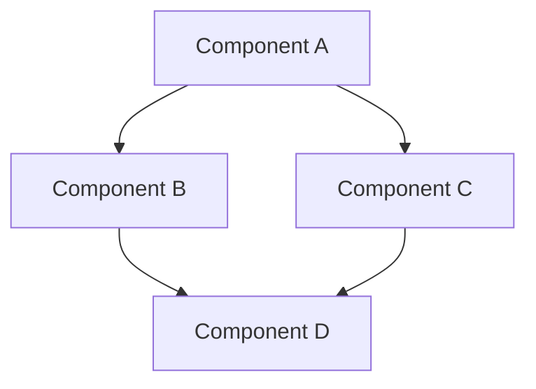
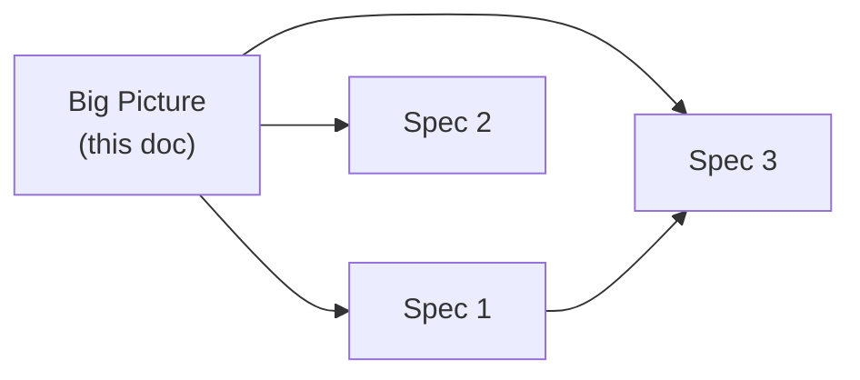

# Template: Initiative (Big Picture)

Use this template to create the `index.md` of an initiative at `docs/specs/<initiative-name>/index.md`.

An initiative groups multiple related specs under the same theme. The `index.md` serves as the big picture: overview, map of relationships between specs, and status tracker.

---

````markdown
---
title: "Initiative Name"
type: initiative
status: draft
authors:
  - Your Name
reviewers: []
created: YYYY-MM-DD
decision-date:
superseded-by:
supersedes:
review-by:
area:                  # optional
team:                  # optional
tags: []
comments: true
---

# Initiative Name

## Summary

One to three sentences explaining the overall goal of this initiative.

## Context and motivation

- Why does this initiative exist?
- What business or technical problem are we solving?
- What is the overall scope?

## Architecture overview

High-level diagram showing how components relate:



## Spec map

How the specs in this initiative connect:



## Documents in this initiative

| Document | Type | Status | Summary |
|---|---|---|---|
| ... | ... | ... | ... |

## Cross-cutting decisions

Decisions that affect multiple specs in this initiative:

- ...

## Constraints and dependencies

- External dependencies (other teams, systems, third parties)
- Deadline, compliance, or infrastructure constraints

## Open questions

- [ ] ...

## References

- Links to related ADRs, issues, external documents
````

## Expected directory structure

```
docs/specs/initiative-name/
├── index.md                          # This big picture
├── YYYY-MM-DD-spec-1.md             # Child specs (use spec.md or prd.md templates)
├── YYYY-MM-DD-spec-2.md
├── YYYY-MM-DD-spec-3.md
└── assets/                           # Images and diagrams
    ├── architecture-overview.png
    └── flow-diagram.png
```

## Tips

- **The index.md does not replace the specs**: it is an overview. Technical detail lives in the child specs.
- **Keep the status tracker up to date**: when a child spec changes status, update the table here.
- **Start with the index**: before writing child specs, write the big picture to align scope with stakeholders.
