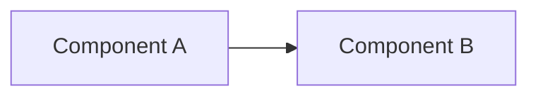

# Template: Specification

Copy the content below to create a new spec at `docs/specs/YYYY-MM-DD-title-slug.md` (standalone) or `docs/specs/<initiative>/YYYY-MM-DD-title-slug.md` (inside an initiative).

Adapt sections to context. Not all are required.

---

````markdown
---
title: "Spec title"
type: spec
status: draft
authors:
  - Your Name
reviewers: []
created: YYYY-MM-DD
decision-date:
superseded-by:
supersedes:
review-by:             # next review date (default: 6 months after approval)
area:                  # optional
team:                  # optional
tags: []
comments: true
---

# Spec title

## Summary

One to three sentences explaining what this document proposes and why.

## Context and motivation

- What problem are we solving?
- Why now?
- What is the impact of not solving it?

## Goals and non-goals

### Goals

- [ ] What is in scope

### Non-goals

- What is **out of scope** (and why)

## Proposal

Describe the proposed solution. Include diagrams, flows, and examples as needed.

### Architecture / Design



### API / Interface

If applicable, describe the public interface (endpoints, schemas, contracts).

### Data model

If applicable, describe entities and relationships.

## Alternatives considered

### Alternative 1: Name

- **Description**: ...
- **Pros**: ...
- **Cons**: ...
- **Why discarded**: ...

## Implementation Plan

If applicable, break implementation into phases or milestones. Use checkboxes on every item (the autonomous execution agent marks `[x]` as it completes them).

### Phase 1: <short title>

1. [ ] Specific item
1. [ ] Another item

### Phase 2: <short title>

1. [ ] ...

## Autonomous execution

This spec can be executed by an agent without human supervision. Default workflow in [Autonomous execution guide](../guides/autonomous-execution.md). Document here only what **diverges** from the default or is specific to this spec.

### Parallelism

Define boundaries (which phases can run in parallel, how many workers, what unit each worker takes). Example:

1. Phase 2: up to 4 workers in parallel, one per <bounded context / subsystem / item>.
1. Phase 3: up to 3 workers, each picking the next item from the queue when done.

If there is no parallelism, omit this subsection.

### Done criteria

Default technical criteria in [Autonomous execution guide](../guides/autonomous-execution.md). Add here any additional criteria specific to this spec (e.g., smoke test on endpoint X, binary output comparison, p95 within N ms).

### Stop criteria

Define the exact point where the agent stops for human review. Examples:

1. Success: Phase 1 + Phase 2 complete. Do not advance to Phase 3 without review.
1. Block: 3 consecutive validation failures after `git revert`.
1. Human decision: <describe specific case>.

## Security and compliance

Security, privacy, and compliance considerations. If not applicable, state explicitly.

## Observability

How will we know it works? Metrics, alerts, dashboards.

## Risks and mitigations

| Risk | Likelihood | Impact | Mitigation |
|---|---|---|---|
| ... | High/Medium/Low | High/Medium/Low | ... |

## References

- Links to related documents, ADRs, issues, etc.

## Execution Log

Most recent entries on top. Contract (`**Result**`, `**Decisions**`, etc.) defined in the [Autonomous execution guide](../guides/autonomous-execution.md#execution-log). The outer loop parses this block; keep the format exact.

(empty until first execution)
````

## Tips

- **Tone**: normative, not narrative. Subject is the system; verb is declarative present tense.
- **Detail**: routes, modules, parameters, and defaults appear literally with values. Real ambiguity goes to "Open questions", never prose like "maybe", "configurable", "should".
- **Inside an initiative**: place the spec inside the corresponding subdirectory.
- **Images**: place in `assets/` of the initiative subdirectory, or `docs/specs/assets/` for standalone specs.
